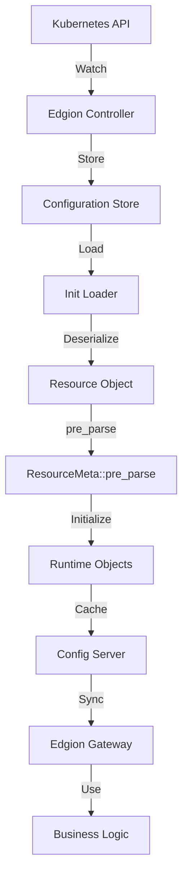

# Edgion 添加新资源类型完整指南

本文档记录如何在 Edgion 中添加一个新的 Kubernetes 资源类型。以 `EdgionStreamPlugins` 的实现为例，详细说明每个步骤。

## 概述

在 Edgion 中添加新资源需要修改多个模块，包括类型定义、配置管理、业务逻辑等。本指南提供完整的清单和详细步骤。

## 完整清单

### 1. 类型定义层（`src/types/`）

- [ ] **`src/types/resources/your_resource/`** - 创建资源定义目录
  - [ ] `mod.rs` - 使用 `kube::CustomResource` 宏定义 CRD
  - [ ] 相关子模块（如配置、插件定义等）
  
- [ ] **`src/types/resource_kind.rs`** - 添加资源类型枚举
  - [ ] 在 `ResourceKind` enum 中添加新变体
  - [ ] 在 `from_kind_name()` 方法中添加映射

- [ ] **`src/types/resource_meta_traits/your_resource.rs`** - 实现 ResourceMeta trait
  - [ ] 实现 `get_version()`、`resource_kind()`、`kind_name()`、`key_name()`
  - [ ] 实现 `pre_parse()` 用于资源预处理

- [ ] **`src/types/resources/mod.rs`** - 导出新模块
- [ ] **`src/types/resource_meta_traits/mod.rs`** - 导出 trait 实现

### 2. 配置管理层（`src/core/conf_mgr/`、`conf_sync/`）

- [ ] **`src/core/conf_sync/conf_server/config_server.rs`**
  - [ ] 在 `ResourceItem` enum 中添加新变体
  - [ ] 在 `ConfigServer` struct 中添加 `ServerCache<YourResource>` 字段
  - [ ] 在 `new()` 方法中初始化缓存

- [ ] **`src/core/conf_mgr/conf_store/init_loader.rs`**
  - [ ] 在 `load_all_resources_from_store()` 中添加加载逻辑
  - [ ] 添加 `ResourceKind::YourResource` 分支
  - [ ] 反序列化并调用 `apply_change()`

- [ ] **`src/core/cli/config/mod.rs`**
  - [ ] 在 `ConfSyncConfig` 中添加容量配置字段
  - [ ] 设置默认值

### 3. 业务逻辑层（`src/core/`）

根据资源类型实现具体的业务逻辑：
- 路由资源：在 `src/core/routes/` 中实现路由匹配和处理
- 插件资源：在 `src/core/plugins/` 中实现插件系统
- 配置资源：在相应模块中实现配置应用逻辑

### 4. 配置文件

- [ ] **`config/crd/edgion-crd/your_resource_crd.yaml`** - Kubernetes CRD 定义
- [ ] **`config/edgion-controller.toml`** - 添加容量配置
- [ ] **`examples/conf/`** - 添加示例配置文件

### 5. 文档和测试

- [ ] **`docs/`** - 用户指南和使用文档
- [ ] **`examples/testing/`** - 集成测试用例

---

## 详细步骤（以 EdgionStreamPlugins 为例）

### 步骤 1: 定义资源类型

#### 1.1 创建资源定义

在 `src/types/resources/` 下创建新目录：

```rust
// src/types/resources/edgion_stream_plugins/mod.rs
use kube::CustomResource;
use schemars::JsonSchema;
use serde::{Deserialize, Serialize};

#[derive(CustomResource, Serialize, Deserialize, Debug, Clone, JsonSchema)]
#[kube(
    group = "edgion.io",
    version = "v1",
    kind = "EdgionStreamPlugins",
    plural = "edgionstreamplugins",
    shortname = "esplugins",
    namespaced,
    status = "EdgionStreamPluginsStatus"
)]
#[serde(rename_all = "camelCase")]
pub struct EdgionStreamPluginsSpec {
    pub plugins: Option<Vec<StreamPluginEntry>>,
    
    #[serde(skip)]
    #[schemars(skip)]
    pub stream_plugin_runtime: Arc<StreamPluginRuntime>,
}
```

#### 1.2 注册资源类型

```rust
// src/types/resource_kind.rs
pub enum ResourceKind {
    // ... 现有类型 ...
    EdgionStreamPlugins = 16,  // 使用下一个可用的数字
}

impl ResourceKind {
    pub fn from_kind_name(kind_str: &str) -> Option<Self> {
        match kind_str.to_lowercase().as_str() {
            // ... 现有映射 ...
            "edgionstreamplugins" => Some(ResourceKind::EdgionStreamPlugins),
            _ => None,
        }
    }
}
```

#### 1.3 实现 ResourceMeta trait

```rust
// src/types/resource_meta_traits/edgion_stream_plugins.rs
use crate::types::resource_kind::ResourceKind;
use crate::types::resources::EdgionStreamPlugins;
use super::traits::{extract_version, ResourceMeta};

impl ResourceMeta for EdgionStreamPlugins {
    fn get_version(&self) -> u64 {
        extract_version(&self.metadata)
    }
    
    fn resource_kind() -> ResourceKind {
        ResourceKind::EdgionStreamPlugins
    }
    
    fn kind_name() -> &'static str {
        "EdgionStreamPlugins"
    }
    
    fn key_name(&self) -> String {
        if let Some(namespace) = &self.metadata.namespace {
            format!("{}/{}", namespace, self.metadata.name.as_deref().unwrap_or(""))
        } else {
            self.metadata.name.as_deref().unwrap_or("").to_string()
        }
    }

    fn pre_parse(&mut self) {
        // 在这里进行资源预处理
        self.init_stream_plugin_runtime();
    }
}
```

### 步骤 2: 配置管理层集成

#### 2.1 更新 ConfigServer

```rust
// src/core/conf_sync/conf_server/config_server.rs

// 1. 添加到 ResourceItem enum
pub enum ResourceItem {
    // ... 现有类型 ...
    EdgionStreamPlugins(EdgionStreamPlugins),
}

// 2. 在 ConfigServer 中添加缓存
pub struct ConfigServer {
    // ... 现有字段 ...
    pub edgion_stream_plugins: ServerCache<EdgionStreamPlugins>,
}

// 3. 在 new() 中初始化
impl ConfigServer {
    pub fn new(base_conf: GatewayBaseConf, conf_sync_config: &ConfSyncConfig) -> Self {
        Self {
            // ... 现有初始化 ...
            edgion_stream_plugins: ServerCache::new(
                conf_sync_config.edgion_stream_plugins_capacity
            ),
        }
    }
}
```

#### 2.2 添加加载逻辑

```rust
// src/core/conf_mgr/conf_store/init_loader.rs

match kind {
    // ... 现有分支 ...
    Some(ResourceKind::EdgionStreamPlugins) => {
        match serde_yaml::from_str::<EdgionStreamPlugins>(&resource.content) {
            Ok(stream_plugins) => {
                config_server.edgion_stream_plugins.apply_change(
                    ResourceChange::InitAdd, 
                    stream_plugins
                );
                Ok::<(), anyhow::Error>(())
            }
            Err(e) => Err(e.into()),
        }
    }
    // ...
}
```

#### 2.3 添加配置项

```rust
// src/core/cli/config/mod.rs

pub struct ConfSyncConfig {
    // ... 现有字段 ...
    
    #[arg(skip)]
    #[serde(default = "default_capacity")]
    pub edgion_stream_plugins_capacity: u32,
}

impl Default for ConfSyncConfig {
    fn default() -> Self {
        Self {
            // ... 现有字段 ...
            edgion_stream_plugins_capacity: default_capacity(),
        }
    }
}
```

### 步骤 3: 业务逻辑实现

根据资源类型实现相应的业务逻辑。对于 EdgionStreamPlugins：

```rust
// src/core/plugins/edgion_stream_plugins/mod.rs

// 1. 定义插件 trait
#[async_trait]
pub trait StreamPlugin: Send + Sync {
    fn name(&self) -> &str;
    async fn on_connection(&self, ctx: &StreamContext) -> StreamPluginResult;
}

// 2. 实现插件运行时
pub struct StreamPluginRuntime {
    plugins: Vec<Arc<dyn StreamPlugin>>,
}

impl StreamPluginRuntime {
    pub fn from_stream_plugins(entries: &[StreamPluginEntry]) -> Self {
        // 根据配置创建插件实例
    }
    
    pub async fn run(&self, ctx: &StreamContext) -> StreamPluginResult {
        // 按顺序执行所有插件
    }
}
```

### 步骤 4: 创建 CRD 和示例

#### 4.1 Kubernetes CRD 定义

```yaml
# config/crd/edgion-crd/edgion_stream_plugins_crd.yaml
apiVersion: apiextensions.k8s.io/v1
kind: CustomResourceDefinition
metadata:
  name: edgionstreamplugins.edgion.io
spec:
  group: edgion.io
  names:
    kind: EdgionStreamPlugins
    plural: edgionstreamplugins
    shortNames:
    - esplugins
  scope: Namespaced
  versions:
  - name: v1
    served: true
    storage: true
    schema:
      openAPIV3Schema:
        type: object
        properties:
          spec:
            type: object
            # ... 详细的 schema 定义
```

#### 4.2 示例配置

```yaml
# examples/conf/EdgionStreamPlugins_default_example-stream-ip.yaml
apiVersion: edgion.io/v1
kind: EdgionStreamPlugins
metadata:
  name: example-stream-ip
  namespace: default
spec:
  plugins:
    - enable: true
      type: IpRestriction
      config:
        ipSource: remoteAddr
        allow:
          - "192.168.1.0/24"
        deny:
          - "192.168.1.100"
        defaultAction: deny
```

#### 4.3 更新配置文件

```toml
# config/edgion-controller.toml
[conf_sync]
# ... 现有配置 ...
edgion_stream_plugins_capacity = 200
```

---

## 资源流转路径



## 关键设计原则

### 1. 分离关注点

- **类型定义层**：只关注数据结构和序列化
- **配置管理层**：负责资源的存储、加载和分发
- **业务逻辑层**：实现具体的功能逻辑

### 2. 运行时字段

使用 `#[serde(skip)]` 和 `#[schemars(skip)]` 标记运行时字段：

```rust
#[serde(skip)]
#[schemars(skip)]
pub runtime_field: Arc<SomeRuntime>,
```

这些字段在反序列化后通过 `pre_parse()` 初始化。

### 3. 预处理机制

`ResourceMeta::pre_parse()` 在资源加载后立即调用，用于：
- 初始化运行时对象
- 验证配置
- 构建索引或缓存

### 4. 容量配置

所有资源缓存都应该有可配置的容量：
- 在 `ConfSyncConfig` 中定义
- 在 `edgion-controller.toml` 中配置
- 使用合理的默认值

---

## 常见问题

### Q: 何时需要实现 pre_parse()？

A: 当资源需要在加载后进行预处理时，例如：
- 初始化运行时对象（如插件运行时）
- 构建查找表或索引
- 验证配置的一致性

### Q: ResourceKind 的数字如何分配？

A: 按顺序递增，避免与现有类型冲突。查看 `resource_kind.rs` 中最大的数字，使用下一个。

### Q: 如何处理资源之间的引用？

A: 使用 `extensionRef` 或类似机制：
1. 在资源定义中使用 `LocalObjectReference`
2. 在 pre_parse 或运行时查找引用的资源
3. 缓存引用以提高性能

### Q: 如何测试新资源？

A: 
1. 创建示例 YAML 文件
2. 使用 `edgion-ctl` 工具加载配置
3. 编写集成测试验证功能
4. 检查日志确认资源正确加载

---

## 检查清单

在提交代码前，确保：

- [ ] 所有文件都已创建和修改
- [ ] 代码编译通过（`cargo build`）
- [ ] 运行 `cargo clippy` 无警告
- [ ] 运行 `cargo fmt` 格式化代码
- [ ] CRD 定义语法正确
- [ ] 示例配置可以正常加载
- [ ] 添加了必要的文档
- [ ] 更新了相关的 README 或用户指南

---

## 参考资源

- [Kubernetes Custom Resources](https://kubernetes.io/docs/concepts/extend-kubernetes/api-extension/custom-resources/)
- [kube-rs Documentation](https://docs.rs/kube/latest/kube/)
- [Gateway API Specification](https://gateway-api.sigs.k8s.io/)

---

**最后更新**: 2025-12-25  
**示例版本**: EdgionStreamPlugins v1

