# Edgion 架构概览

本文档提供 Edgion 系统的整体架构视图，帮助开发者理解各模块的职责和资源流转路径。

## 系统架构

Edgion 采用 Controller-Gateway 分离架构，Controller 负责配置管理，Gateway 负责流量处理。

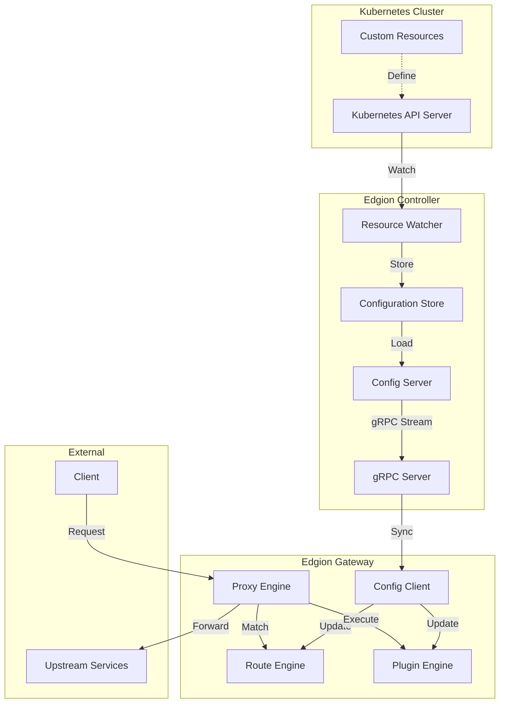

## 核心模块

### 1. 类型定义层 (`src/types/`)

定义所有资源类型和数据结构。

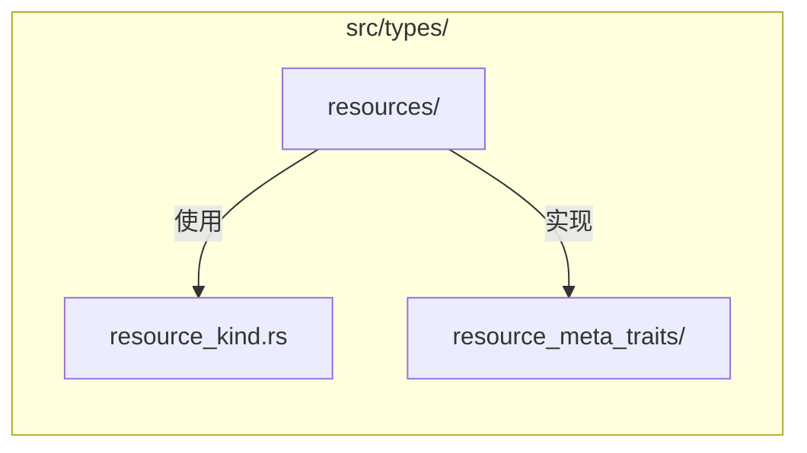

**职责**：
- 定义 Kubernetes CRD 结构
- 实现序列化/反序列化
- 提供资源元数据接口

**关键文件**：
- `resources/` - 各类资源定义
- `resource_kind.rs` - 资源类型枚举
- `resource_meta_traits/` - ResourceMeta trait 实现

### 2. 配置管理层 (`src/core/conf_mgr/`, `conf_sync/`)

管理配置的存储、加载和同步。

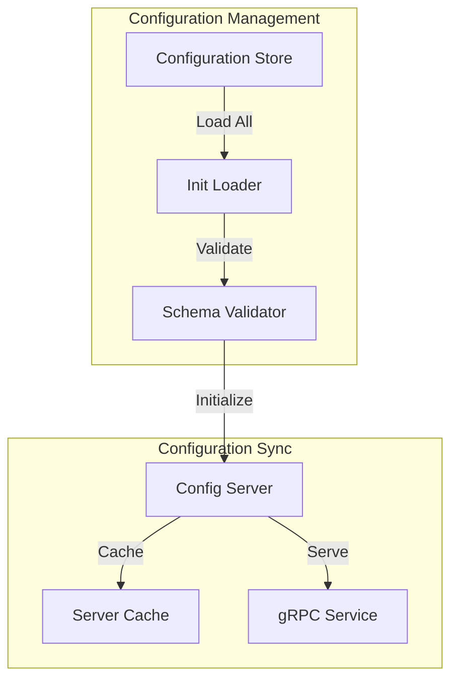

**职责**：
- 从存储加载配置（文件系统/etcd）
- 维护资源缓存
- 通过 gRPC 同步到 Gateway

**关键组件**：
- `ConfStore` - 配置存储抽象
- `ConfigServer` - 配置服务器，维护所有资源缓存
- `InitLoader` - 启动时加载所有资源

### 3. 路由引擎 (`src/core/routes/`)

处理不同协议的路由匹配和转发。

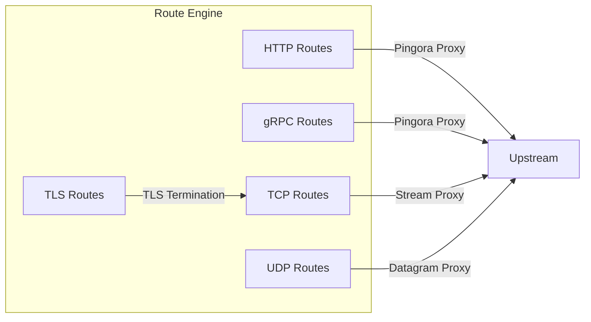

**职责**：
- 根据请求特征匹配路由
- 选择后端服务
- 执行协议特定的转发逻辑

**协议支持**：
- HTTP/HTTPS - 基于 Pingora HTTP Proxy
- gRPC - 基于 HTTP/2
- TCP - 原始 TCP 流转发
- UDP - 数据报转发
- TLS - TLS 终止后转发到 TCP

### 4. 插件引擎 (`src/core/plugins/`)

提供可扩展的请求/响应处理能力。

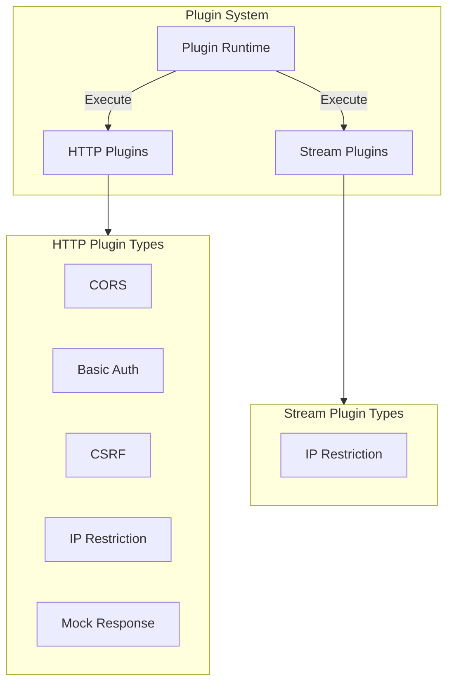

**职责**：
- 在请求/响应生命周期中执行插件
- 管理插件配置和状态
- 提供插件扩展接口

**插件类型**：
- **HTTP 插件** - 处理 HTTP 请求/响应
- **Stream 插件** - 处理 TCP/UDP 连接

### 5. 负载均衡 (`src/core/lb/`)

实现多种负载均衡策略。

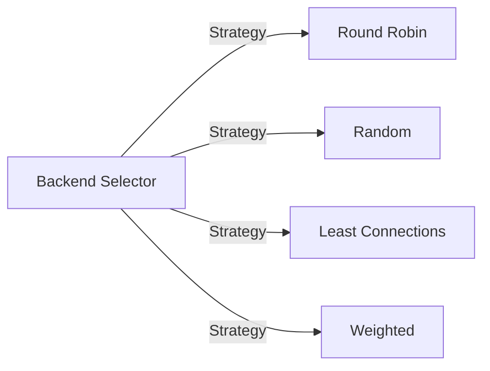

**职责**：
- 从后端列表中选择目标
- 实现不同的选择策略
- 支持权重和健康检查

### 6. 后端管理 (`src/core/backends/`)

管理后端服务的发现和状态。

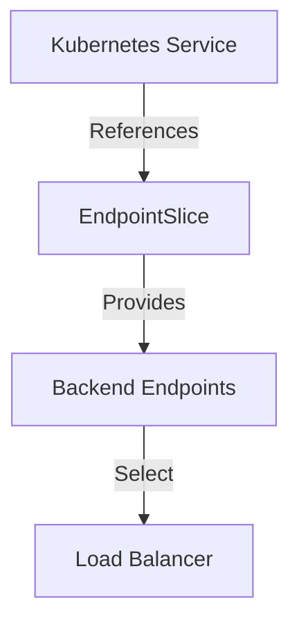

**职责**：
- 监听 Service 和 EndpointSlice 变化
- 维护可用后端列表
- 提供后端选择接口

---

## 资源流转详解

### 资源加载流程

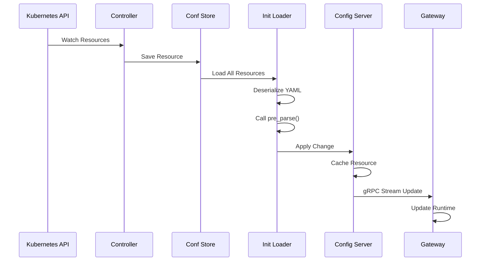

### 请求处理流程（HTTP）

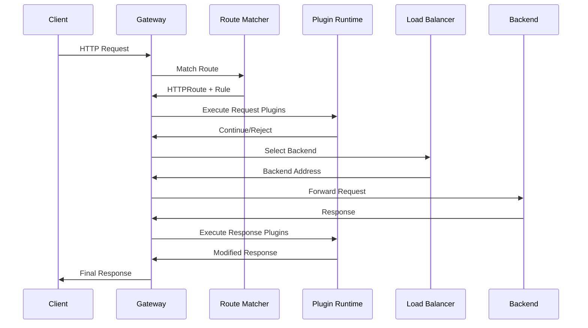

### 请求处理流程（TCP/UDP Stream）

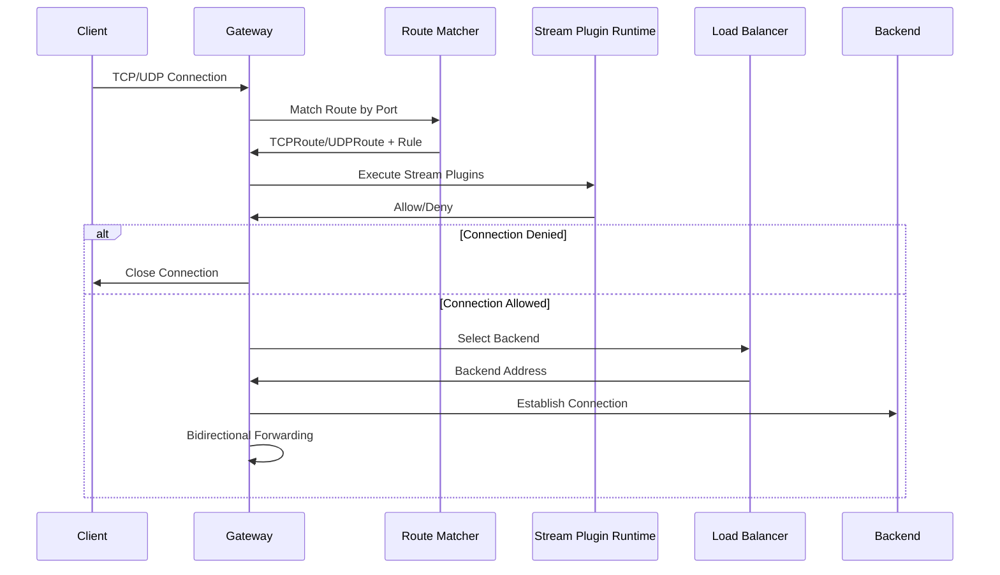

---

## 资源类型和关系

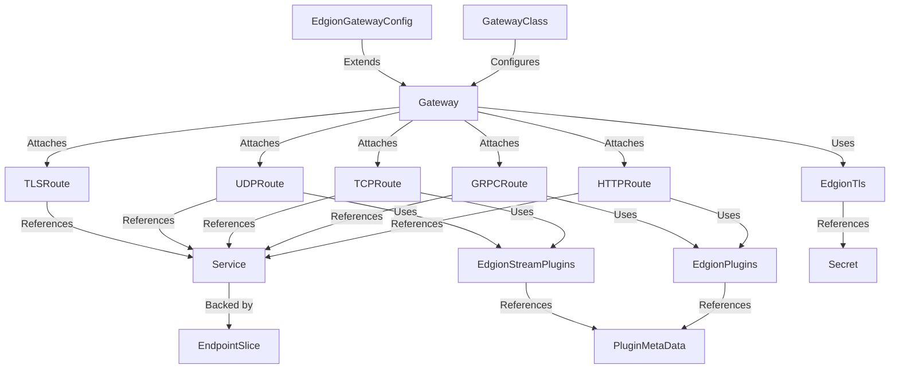

### 资源说明

| 资源类型 | API Group | 用途 |
|---------|-----------|------|
| GatewayClass | gateway.networking.k8s.io | 定义 Gateway 类型 |
| Gateway | gateway.networking.k8s.io | 定义监听器和配置 |
| EdgionGatewayConfig | edgion.io | Edgion 特定配置 |
| HTTPRoute | gateway.networking.k8s.io | HTTP 路由规则 |
| GRPCRoute | gateway.networking.k8s.io | gRPC 路由规则 |
| TCPRoute | gateway.networking.k8s.io | TCP 路由规则 |
| UDPRoute | gateway.networking.k8s.io | UDP 路由规则 |
| TLSRoute | gateway.networking.k8s.io | TLS 路由规则 |
| EdgionPlugins | edgion.io | HTTP/gRPC 插件配置 |
| EdgionStreamPlugins | edgion.io | TCP/UDP 插件配置 |
| EdgionTls | edgion.io | TLS 证书配置 |
| PluginMetaData | edgion.io | 插件元数据（IP 列表等） |
| LinkSys | edgion.io | 外部数据源链接 |
| Service | core/v1 | Kubernetes Service |
| EndpointSlice | discovery/v1 | 后端端点 |
| Secret | core/v1 | 敏感数据 |

---

## 模块依赖关系

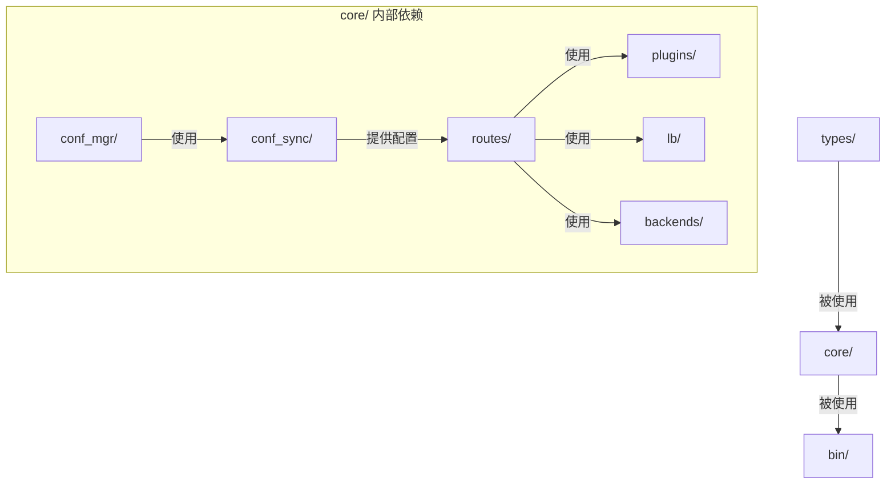

---

## 关键设计模式

### 1. 运行时初始化模式

资源在反序列化后通过 `pre_parse()` 初始化运行时对象：

```rust
impl ResourceMeta for MyResource {
    fn pre_parse(&mut self) {
        // 初始化运行时字段
        self.spec.runtime = Arc::new(Runtime::from_config(&self.spec));
    }
}
```

### 2. 缓存更新模式

使用 `ServerCache` 管理资源版本和变更通知：

```rust
config_server.my_resources.apply_change(
    ResourceChange::InitAdd,
    resource
);
```

### 3. 插件链模式

插件按顺序执行，任何插件可以终止请求：

```rust
for plugin in &self.plugins {
    match plugin.run(session).await {
        PluginRunningResult::GoodNext => continue,
        PluginRunningResult::ErrTerminateRequest => return,
    }
}
```

### 4. 策略模式

负载均衡使用策略模式支持多种算法：

```rust
pub trait BackendSelectionPolicy {
    fn select(&self, backends: &[Backend]) -> Option<&Backend>;
}
```

---

## 性能考虑

### 1. 零拷贝转发

TCP/UDP 流量使用零拷贝技术直接转发，避免不必要的内存分配。

### 2. 异步 I/O

基于 Tokio 的异步运行时，高效处理并发连接。

### 3. 缓存优化

- 路由匹配结果缓存
- 后端选择缓存
- 插件配置缓存

### 4. 内存管理

使用 `Arc` 共享不可变数据，避免克隆大对象。

---

## 扩展点

### 添加新协议

1. 在 `src/core/routes/` 下创建新模块
2. 实现路由匹配逻辑
3. 实现协议特定的代理逻辑
4. 在 Gateway 中注册新的监听器

### 添加新插件

1. 在 `src/core/plugins/` 下创建插件模块
2. 实现 `Plugin` 或 `StreamPlugin` trait
3. 在插件运行时中注册
4. 更新插件配置类型

### 添加新负载均衡策略

1. 在 `src/core/lb/` 下实现新策略
2. 实现 `BackendSelectionPolicy` trait
3. 在 `BackendSelector` 中注册

---

## 监控和可观测性

```mermaid
graph LR
    Gateway[Gateway] -->|Metrics| Prometheus[Prometheus Metrics]
    Gateway -->|Access Logs| Logger[Access Logger]
    Gateway -->|Traces| Tracing[Distributed Tracing]
    
    Prometheus -->|Expose| MetricsAPI[/metrics API]
    Logger -->|Write| LogFile[Log Files]
    Tracing -->|Export| Collector[Trace Collector]
```

### 指标

- 请求计数和延迟
- 连接数和带宽
- 插件执行时间
- 后端健康状态

### 日志

- 访问日志（每个请求）
- 系统日志（事件和错误）
- 插件日志（调试信息）

---

## 参考文档

- [添加新资源指南](./add-new-resource-guide.md)
- [Gateway API 规范](https://gateway-api.sigs.k8s.io/)
- [Pingora 文档](https://github.com/cloudflare/pingora)

---

**最后更新**: 2025-12-25  
**版本**: Edgion v0.1.0

