# Edgion Complete Guide to Adding New Resource Types

This document records how to add a new Kubernetes resource type in Edgion. With the unified macro system, adding new resources becomes much simpler.

## Overview

Edgion uses a **single source of truth + macro generation** architecture:

- `resource_defs.rs` - Metadata definitions for all resource types (single source of truth)
- `impl_resource_meta!` macro - Automatically generates ResourceMeta trait implementations
- Helper functions - Unified handling of resource loading, listing, querying, etc.

### CRD Version and Compatibility Strategy (Must Follow)

- Always use the "latest/most stable version" as the storage version. Old versions serve only as input formats, uniformly converting to the new version/internal model. "Downgrading" writes back to old versions is prohibited.
- Gateway API GA resources (Gateway/GatewayClass/HTTPRoute/GRPCRoute, etc.) stay at `v1` unless upstream publishes a new major version with a clear migration path.
- Resources in Alpha/Beta (e.g., BackendTLSPolicy currently at `v1alpha3`, needing compatibility with historical `v1alpha2`) are recommended to:
  - CRD multi-version: storage = latest, old versions marked as served.
  - Use Conversion Webhook when possible, with API Server handling unified conversion; otherwise watch multiple versions in the controller and convert to a single internal model.
  - New fields should have safe defaults when converting from old versions; renames/type changes need explicit mapping with logging.
- Upgrade procedure: First update the CRD (add new version and set as storage), then deploy the controller with conversion capability; keep the old version served for a period, then consider removing it after confirming no old objects remain.

---

## Quick Checklist

Adding a new resource type requires modifying only a few core locations:

### Must Modify

1. **`src/types/resources/your_resource/mod.rs`** - Define resource struct (CustomResource)
2. **`src/types/resources/mod.rs`** - Export new module
3. **`src/types/resource_defs.rs`** - Add resource definition in the `define_resources!` macro
4. **`src/types/resource_meta_traits/impls.rs`** - Implement trait using `impl_resource_meta!` macro
5. **`src/core/conf_sync/conf_server/config_server.rs`** - Add `ServerCache<T>` field
6. **`src/core/conf_sync/conf_client/config_client.rs`** - Add `ClientCache<T>` field
7. **`src/core/cli/config/mod.rs`** - Add capacity config field and `get_capacity()` branch

### Modify as Needed

8. **`src/core/conf_mgr/conf_store/init_loader.rs`** - Add loading branch
9. **`src/core/api/controller/common.rs`** - Update helper macros (e.g., `list_all_resources!`)
10. **`src/core/api/gateway/mod.rs`** - Update Gateway Admin API macros
11. **Configuration files** - CRD definitions, example configurations

---

## Detailed Steps

### Step 1: Define Resource Type

#### 1.1 Create Resource Struct

Create a new directory and module under `src/types/resources/`:

```rust
// src/types/resources/your_resource/mod.rs
use kube::CustomResource;
use schemars::JsonSchema;
use serde::{Deserialize, Serialize};

#[derive(CustomResource, Serialize, Deserialize, Debug, Clone, JsonSchema)]
#[kube(
    group = "edgion.io",
    version = "v1",
    kind = "YourResource",
    plural = "yourresources",
    shortname = "yr",
    namespaced,  // Remove this line for cluster-scoped resources
    status = "YourResourceStatus"
)]
#[serde(rename_all = "camelCase")]
pub struct YourResourceSpec {
    pub some_field: String,
    // ... other fields
}

#[derive(Serialize, Deserialize, Debug, Clone, JsonSchema, Default)]
pub struct YourResourceStatus {
    // Status fields
}
```

#### 1.2 Export Module

```rust
// src/types/resources/mod.rs
pub mod your_resource;
pub use your_resource::*;
```

### Step 2: Register in the Unified Resource System

#### 2.1 Add Definition in `resource_defs.rs`

This is the **most critical step**; all resource metadata is centralized here:

```rust
// src/types/resource_defs.rs
define_resources! {
    // ... existing resources ...
    
    // Add new resource (grouped by category)
    YourResource {
        kind_id: 20,                      // Use the next available ID
        kind_name: "YourResource",
        api_group: "edgion.io",
        api_version: "v1",
        plural: "yourresources",
        is_namespaced: true,              // or false (cluster-scoped)
        is_k8s_native: false,             // Whether it's a k8s native resource
    }
}
```

#### 2.2 Implement ResourceMeta Trait Using Macro

```rust
// src/types/resource_meta_traits/impls.rs
use crate::types::resources::YourResource;

// Standard implementation (suitable for most resources)
impl_resource_meta!(YourResource);

// If custom pre_parse is needed, use the version with closure:
impl_resource_meta!(YourResource, |resource| {
    // Custom preprocessing logic
    resource.init_runtime();
});
```

### Step 3: Configuration Sync Layer Integration

#### 3.1 Update ConfigServer

```rust
// src/core/conf_sync/conf_server_old/config_server.rs

pub struct ConfigServer {
    // ... existing fields ...
    pub your_resources: ServerCache<YourResource>,
}

impl ConfigServer {
    pub fn new(base_conf: GatewayBaseConf, conf_sync_config: &ConfSyncConfig) -> Self {
        Self {
            // ... existing initialization ...
            your_resources: ServerCache::new(
                conf_sync_config.get_capacity(ResourceKind::YourResource) as usize
            ),
        }
    }
    
    // Add list/watch methods
    pub fn list_your_resources(&self) -> ListData<YourResource> {
        self.your_resources.list()
    }
    
    pub fn watch_your_resources(
        &self,
        client_id: String,
        client_name: String,
        from_version: u64,
    ) -> mpsc::Receiver<WatchResponse<YourResource>> {
        self.your_resources.watch(client_id, client_name, from_version)
    }
}
```

#### 3.2 Update ConfigClient

```rust
// src/core/conf_sync/conf_client/config_client.rs

pub struct ConfigClient {
    // ... existing fields ...
    pub your_resources: ClientCache<YourResource>,
}
```

#### 3.3 Add Capacity Configuration

```rust
// src/core/cli/config/mod.rs

pub struct ConfSyncConfig {
    // ... existing fields ...
    
    #[arg(skip)]
    #[serde(default = "default_capacity")]
    pub your_resources_capacity: u32,
}

impl ConfSyncConfig {
    pub fn get_capacity(&self, kind: ResourceKind) -> u32 {
        match kind {
            // ... existing branches ...
            ResourceKind::YourResource => self.your_resources_capacity,
        }
    }
}
```

### Step 4: Add Loading Logic

```rust
// src/core/conf_mgr/conf_store/init_loader.rs

// For simple resources, use the load_simple function:
Some(ResourceKind::YourResource) => {
    load_simple::<YourResource>(
        content, name, "YourResource", 
        &config_server.your_resources, &mut stats
    );
}

// For route resources requiring validation, use load_route_with_validation:
Some(ResourceKind::YourRoute) => {
    load_route_with_validation::<YourRoute, _>(
        content, name, "YourRoute", 
        &config_server.your_routes, &mut stats,
        |r| validate_your_route_if_enabled(r),
    );
}
```

### Step 5: Update Admin API Macros

#### 5.1 Controller Admin API

```rust
// src/core/api/controller/common.rs

#[macro_export]
macro_rules! list_all_resources {
    ($server:expr, $kind:expr) => {{
        match $kind {
            // ... existing branches ...
            ResourceKind::YourResource => list_to_json!($server.your_resources.list().data),
        }
    }};
}

// Also update other macros: list_namespaced_resources!, get_namespaced_resource!, resource_exists_namespaced!
```

#### 5.2 Gateway Admin API

```rust
// src/core/api/gateway/mod.rs

macro_rules! list_client_resources {
    ($client:expr, $kind:expr) => {{
        match $kind {
            // ... existing branches ...
            ResourceKind::YourResource => to_json_vec($client.your_resources.list()),
        }
    }};
}

// Also update get_client_resource! macro
```

### Step 6: Configuration Files

#### 6.1 Kubernetes CRD

```yaml
# config/crd/edgion-crd/your_resource_crd.yaml
apiVersion: apiextensions.k8s.io/v1
kind: CustomResourceDefinition
metadata:
  name: yourresources.edgion.io
spec:
  group: edgion.io
  names:
    kind: YourResource
    plural: yourresources
    shortNames:
    - yr
  scope: Namespaced
  versions:
  - name: v1
    served: true
    storage: true
    schema:
      openAPIV3Schema:
        type: object
        properties:
          spec:
            type: object
            # ... schema definition
```

#### 6.2 Example Configuration

```yaml
# examples/conf/YourResource_default_example.yaml
apiVersion: edgion.io/v1
kind: YourResource
metadata:
  name: example
  namespace: default
spec:
  someField: "value"
```

#### 6.3 Controller Configuration

```toml
# config/edgion-controller.toml
[conf_sync]
your_resources_capacity = 200
```

---

## Architecture Explanation

### Resource Metadata Flow

```mermaid
graph TD
    subgraph SingleSource[Single Source of Truth]
        RD[resource_defs.rs<br/>define_resources!]
    end
    
    RD --> RK[ResourceKind enum]
    RD --> REG[ResourceRegistry]
    RD --> META[ResourceTypeMetadata]
    
    subgraph TraitImpl[Trait Implementation]
        IMPLS[impls.rs<br/>impl_resource_meta!]
    end
    
    IMPLS --> RM[ResourceMeta trait]
    
    subgraph Runtime[Runtime Usage]
        CS[ConfigServer]
        CC[ConfigClient]
        API[Admin API]
        LOADER[InitLoader]
    end
    
    RK --> CS
    RK --> CC
    RK --> API
    RK --> LOADER
    RM --> CS
    RM --> CC
```



### Key Macros and Functions

| Name | Location | Purpose |
|------|----------|---------|
| `define_resources!` | `resource_defs.rs` | Define all resource metadata |
| `impl_resource_meta!` | `resource_meta_traits/impls.rs` | Auto-implement ResourceMeta trait |
| `load_simple()` | `init_loader.rs` | Load simple resources |
| `load_route_with_validation()` | `init_loader.rs` | Load route resources with validation |
| `list_all_resources!` | `api/controller/common.rs` | List all resources |
| `list_client_resources!` | `api/gateway/mod.rs` | List resources from ConfigClient |

---

## Compile-Time Protection

After adding a new resource, if you miss certain `match` branches, the compiler will report an error:

```
error[E0004]: non-exhaustive patterns: `ResourceKind::YourResource` not covered
```

This ensures the new resource type is correctly handled in all places that need to process it.

---

## FAQ

### Q: How is the ResourceKind kind_id assigned?

A: Check the maximum ID of existing resources in `resource_defs.rs` and use the next number. The ID is used for serialization and enum values.

### Q: When is custom pre_parse() needed?

A: When a resource needs preprocessing after loading:
- Initializing runtime objects (e.g., plugin runtimes)
- Building lookup tables or indexes
- Validating configuration consistency

Use the closure version of the `impl_resource_meta!` macro:

```rust
impl_resource_meta!(YourResource, |resource| {
    resource.init_something();
});
```

### Q: How to distinguish between namespaced and cluster-scoped resources?

A: Set `is_namespaced` in `resource_defs.rs`:
- `true` - Resource belongs to a specific namespace
- `false` - Resource is cluster-level (e.g., GatewayClass)

### Q: What happens if I forget to modify a file?

A: The Rust compiler will report errors in most cases:
- Forgot `resource_defs.rs` -> Missing `ResourceKind` variant
- Forgot `impls.rs` -> ResourceMeta trait not implemented
- Forgot `match` branch -> Non-exhaustive pattern matching error

---

## Checklist

Confirm before submitting:

- [ ] `src/types/resources/your_resource/mod.rs` - Resource definition
- [ ] `src/types/resources/mod.rs` - Module export
- [ ] `src/types/resource_defs.rs` - `define_resources!` macro
- [ ] `src/types/resource_meta_traits/impls.rs` - `impl_resource_meta!` macro
- [ ] `src/core/conf_sync/conf_server/config_server.rs` - ServerCache field
- [ ] `src/core/conf_sync/conf_client/config_client.rs` - ClientCache field
- [ ] `src/core/cli/config/mod.rs` - Capacity config and `get_capacity()`
- [ ] `src/core/conf_mgr/conf_store/init_loader.rs` - Loading branch
- [ ] Admin API macro updates (if needed)
- [ ] `cargo build` compiles successfully
- [ ] `cargo test` tests pass
- [ ] Integration tests pass

---

## References

- [Kubernetes Custom Resources](https://kubernetes.io/docs/concepts/extend-kubernetes/api-extension/custom-resources/)
- [kube-rs Documentation](https://docs.rs/kube/latest/kube/)
- [Gateway API Specification](https://gateway-api.sigs.k8s.io/)

---

**Last updated**: 2026-01-11  
**Document version**: v2.0 (Unified macro system)
