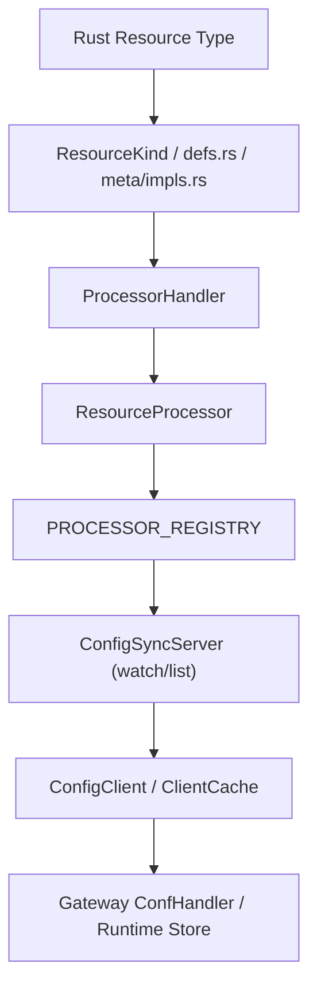

# Edgion Complete Guide to Adding New Resource Types

This document records how to add a new Kubernetes resource type in Edgion. With the unified macro system, adding new resources becomes much simpler.

> The primary AI / agent workflow now lives in [../../../skills/01-architecture/01-controller/09-add-new-resource/00-guide.md](../../../skills/01-architecture/01-controller/09-add-new-resource/00-guide.md).
> This document remains the human-facing background guide and manual checklist.
> For classified examples, use the references linked from that workflow: `route-like`, `controller-only`, `plugin-like`, and `cluster-scoped`.

## Overview

Edgion uses a **single source of truth + macro generation** architecture:

- `resource_defs.rs` - Metadata definitions for all resource types (single source of truth)
- `impl_resource_meta!` macro - Automatically generates ResourceMeta trait implementations
- Helper functions - Unified handling of resource loading, listing, querying, etc.

### Important Difference From Older Documentation

- The Controller now uses `ResourceProcessor<T> + ServerCache<T> + PROCESSOR_REGISTRY`.
- `ConfigSyncServer` no longer keeps one manual field per resource.
- Resources are exposed to config sync by processor registration, so the old "add a controller ConfigServer field" workflow is outdated for this repository.

### CRD Version and Compatibility Strategy (Must Follow)

- Always use the "latest/most stable version" as the storage version. Old versions serve only as input formats, uniformly converting to the new version/internal model. "Downgrading" writes back to old versions is prohibited.
- Gateway API GA resources (Gateway/GatewayClass/HTTPRoute/GRPCRoute, etc.) stay at `v1` unless upstream publishes a new major version with a clear migration path.
- Resources in Alpha/Beta (e.g., BackendTLSPolicy currently at `v1alpha3`, needing compatibility with historical `v1alpha2`) are recommended to:
  - CRD multi-version: storage = latest, old versions marked as served.
  - Use Conversion Webhook when possible, with API Server handling unified conversion; otherwise watch multiple versions in the controller and convert to a single internal model.
  - New fields should have safe defaults when converting from old versions; renames/type changes need explicit mapping with logging.
- Upgrade procedure: First update the CRD (add new version and set as storage), then deploy the controller with conversion capability; keep the old version served for a period, then consider removing it after confirming no old objects remain.

---

## Quick Checklist

Adding a new resource type usually requires touching these core locations:

### Must Modify

1. **`src/types/resources/<resource>.rs`** - Define the resource type
2. **`src/types/resources/mod.rs`** - Export the new module
3. **`src/types/resource/kind.rs`** - Add the `ResourceKind` variant and name mapping
4. **`src/types/resource/defs.rs`** - Add metadata in `define_resources!`
5. **`src/types/resource/meta/impls.rs`** - Implement `ResourceMeta` via `impl_resource_meta!`
6. **`src/core/controller/conf_mgr/sync_runtime/resource_processor/handlers/<resource>.rs`** - Implement `ProcessorHandler`
7. **`src/core/controller/conf_mgr/sync_runtime/resource_processor/handlers/mod.rs`** - Re-export the handler
8. **`src/core/controller/conf_mgr/conf_center/file_system/controller.rs`** - Register the FileSystem-mode processor
9. **`src/core/controller/conf_mgr/conf_center/kubernetes/controller.rs`** - Register the Kubernetes-mode processor

### Modify as Needed

10. **`src/core/gateway/conf_sync/conf_client/config_client.rs`** - If the resource syncs to Gateway, add `ClientCache<T>` wiring and change dispatch
11. **`src/core/gateway/.../conf_handler*.rs`** - If Gateway runtime needs to consume it
12. **`src/core/controller/api/namespaced_handlers.rs`** or **`cluster_handlers.rs`** - If Controller Admin API CRUD should support it
13. **`src/core/gateway/api/mod.rs`** - If Gateway Admin API should expose it
14. **`src/core/controller/conf_mgr/conf_center/kubernetes/storage.rs`** - If Kubernetes-mode dynamic CRUD should support it
15. **`config/crd/`** - CRD manifests or upstream CRD updates
16. **Tests and example configs** - `examples/test/`, YAML fixtures, integration tests

---

## Detailed Steps

### Step 1: Classify The Resource First

Before editing code, decide which family the new resource belongs to:

- `route-like`: similar to `TLSRoute` / `HTTPRoute`, attaches to `Gateway`, references `Service`, and syncs to Gateway runtime
- `controller-only`: similar to `ReferenceGrant`, used only for validation, policy, or requeue behavior on the control plane
- `plugin-like`: similar to `EdgionPlugins`, reusable runtime configuration that may also depend on `Secret`
- `cluster-scoped`: similar to `GatewayClass` / `EdgionGatewayConfig`, part of global base configuration

If you are unsure, trace the closest existing resource end to end instead of designing from scratch.

### Step 2: Define The Resource Type And Export It

Usually update:

- `src/types/resources/<resource>.rs` or `src/types/resources/<resource>/mod.rs`
- `src/types/resources/mod.rs`

Key things to align:

- `group / version / kind / plural`
- namespaced vs cluster-scoped
- status type
- any runtime-derived fields that should be skipped from serialization

### Step 3: Register It In The Unified Resource System

These are the core files for all new resources:

- `src/types/resource/kind.rs`
- `src/types/resource/defs.rs`
- `src/types/resource/meta/impls.rs`

Current responsibilities:

- `kind.rs`: `ResourceKind`, `as_str()`, and `from_kind_name()`
- `defs.rs`: single source of truth for cache fields, capacity fields, scope, and registry / no-sync behavior
- `meta/impls.rs`: `impl_resource_meta!` integration

Important note:

- This repository now uses `enum_value`, `cache_field`, `capacity_field`, and `cluster_scoped` in `defs.rs`
- Do not follow older examples that describe `kind_id` or `is_namespaced`
- If the resource should stay controller-only by default, also evaluate whether it belongs in `DEFAULT_NO_SYNC_KINDS`

### Step 4: Wire The Controller Processing Pipeline

The controller-side architecture is now based on:

- `ProcessorHandler<T>`
- `ResourceProcessor<T>`
- `PROCESSOR_REGISTRY`

Usually update:

- `src/core/controller/conf_mgr/sync_runtime/resource_processor/handlers/<resource>.rs`
- `src/core/controller/conf_mgr/sync_runtime/resource_processor/handlers/mod.rs`
- `src/core/controller/conf_mgr/conf_center/file_system/controller.rs`
- `src/core/controller/conf_mgr/conf_center/kubernetes/controller.rs`

Inside the handler, consider:

- `filter()`
- `validate()`
- `preparse()`
- `parse()`
- `on_change()`
- `on_delete()`
- `update_status()`

If `parse()` looks up `Gateway`, `Service`, `Secret`, or `ReferenceGrant`, you also need to wire the corresponding dependency registration and requeue behavior.

### Step 5: Decide Whether It Should Sync To Gateway

This is the main architectural split.

If the resource must exist on Gateway:

- update `src/core/gateway/conf_sync/conf_client/config_client.rs`
- add `ClientCache<T>`
- wire `get_dyn_cache()`, `list()`, and `apply_resource_change()`
- add a `ConfHandler<T>` if Gateway runtime needs to consume it

Typical Gateway-side locations:

- `src/core/gateway/routes/*/conf_handler_impl.rs`
- `src/core/gateway/plugins/http/conf_handler_impl.rs`
- `src/core/gateway/tls/store/conf_handler.rs`
- `src/core/gateway/config/*/conf_handler_impl.rs`

If the resource should not sync to Gateway:

- do not add Gateway cache wiring
- explicitly make Gateway skip it instead of leaving the behavior ambiguous

### Step 6: Wire Controller And Gateway Admin APIs

These paths are explicit in the current repository.

Controller side:

- namespaced resources: `src/core/controller/api/namespaced_handlers.rs`
- cluster-scoped resources: `src/core/controller/api/cluster_handlers.rs`

Gateway read-only inspection:

- `src/core/gateway/api/mod.rs`

If you skip these files, the resource may work internally but still be invisible to operators.

### Step 7: Wire Kubernetes Dynamic CRUD

If the resource should support create/update/delete in Kubernetes mode, update:

- `src/core/controller/conf_mgr/conf_center/kubernetes/storage.rs`

Make sure:

- `group / version / kind` are correct
- scope is correct
- namespaced vs cluster-scoped API selection is correct

### Step 8: Update CRDs Or Upstream API Manifests

Custom Edgion CRDs usually live under:

- `config/crd/edgion-crd/`

Gateway API standard or experimental resources should follow:

- `config/crd/gateway-api/`

Keep these aligned with the Rust type:

- group / version / kind
- scope
- schema
- status structure

### Step 9: Add Tests

At minimum, cover:

- Rust unit tests
- integration tests under `examples/test/`
- controller / gateway API validation when new endpoints are exposed

For route-like, plugin-like, or dependency-heavy resources, integration tests are usually the most important safety net.

---

## Architecture Explanation

### Current End-To-End Path For A New Resource

The most common missing segments are:

- `kind.rs + defs.rs + meta/impls.rs`
- processor registration in both controller modes
- Gateway `ClientCache<T>` / `ConfHandler<T>` wiring

### Key Extension Points

| Name | Location | Purpose |
|------|----------|---------|
| `ResourceKind` | `src/types/resource/kind.rs` | Enum entry point and string mapping for the new resource |
| `define_resources!` | `src/types/resource/defs.rs` | Single source of truth for scope, cache fields, capacities, and registry behavior |
| `impl_resource_meta!` | `src/types/resource/meta/impls.rs` | Integrates the resource into `ResourceMeta` |
| `ProcessorHandler<T>` | `src/core/controller/conf_mgr/sync_runtime/resource_processor/handler.rs` | Controller-side filter / validate / parse / status / requeue logic |
| `ConfHandler<T>` | `src/core/common/conf_sync/traits.rs` | Gateway-side full-set / partial-update logic |
| `ConfigClient` | `src/core/gateway/conf_sync/conf_client/config_client.rs` | Gateway cache wiring and change dispatch |

---

## Compile-Time And Runtime Protection

The current architecture catches some omissions at compile time, but not all:

- missing `kind.rs` or `defs.rs`: often fails compilation
- missing a `match` arm: often fails with non-exhaustive pattern errors
- missing controller spawn: may compile, but the resource never becomes ready
- missing Gateway cache wiring: controller works, Gateway sees no data, usually caught only by runtime checks or integration tests

So “it compiles” is not enough to prove the resource is fully wired.

---

## FAQ

### Q: How is `enum_value` assigned?

A: Check the highest value currently used in `src/types/resource/kind.rs` and `src/types/resource/defs.rs`, then add the next consistent value in both places.

### Q: When is `preparse()` needed?

A: Use it when the resource needs derived structures or expensive validation before runtime, for example:

- plugin runtime initialization
- regex / lookup table / index construction
- configuration consistency checks

### Q: How do I distinguish namespaced and cluster-scoped resources?

A: Do not rely on CRD schema alone. You must also align:

- the Rust type declaration
- `cluster_scoped` in `defs.rs`
- controller API path (`namespaced_handlers.rs` vs `cluster_handlers.rs`)
- Kubernetes storage mapping

### Q: If a resource is controller-only, can I ignore Gateway completely?

A: Not entirely. You should explicitly make Gateway skip it and ensure dependent resources are revalidated correctly on the controller side.

---

## Checklist

Before submitting, verify:

- [ ] resource type is defined and exported
- [ ] `kind.rs`, `defs.rs`, and `meta/impls.rs` are all updated
- [ ] `ProcessorHandler<T>` is implemented
- [ ] the processor is registered in both FileSystem and Kubernetes controller flows
- [ ] if Gateway sync is needed, `ConfigClient` and the relevant `ConfHandler<T>` are wired
- [ ] controller / gateway admin APIs are updated if needed
- [ ] Kubernetes storage dynamic CRUD is updated if needed
- [ ] CRD or upstream API manifests are updated
- [ ] unit tests and integration tests cover at least one primary path

---

## References

- [Kubernetes Custom Resources](https://kubernetes.io/docs/concepts/extend-kubernetes/api-extension/custom-resources/)
- [kube-rs Documentation](https://docs.rs/kube/latest/kube/)
- [Gateway API Specification](https://gateway-api.sigs.k8s.io/)
- [../../../skills/01-architecture/01-controller/09-add-new-resource/00-guide.md](../../../skills/01-architecture/01-controller/09-add-new-resource/00-guide.md)

---

**Last updated**: 2026-03-18  
**Document version**: v3.0 (aligned with ResourceProcessor / ConfigClient architecture)
