# Edgion Architecture Overview

This document provides an overall architecture view of the Edgion system, helping developers understand the responsibilities of each module and resource flow paths.

## System Architecture

Edgion adopts a Controller-Gateway separated architecture, where the Controller handles configuration management and the Gateway handles traffic processing.

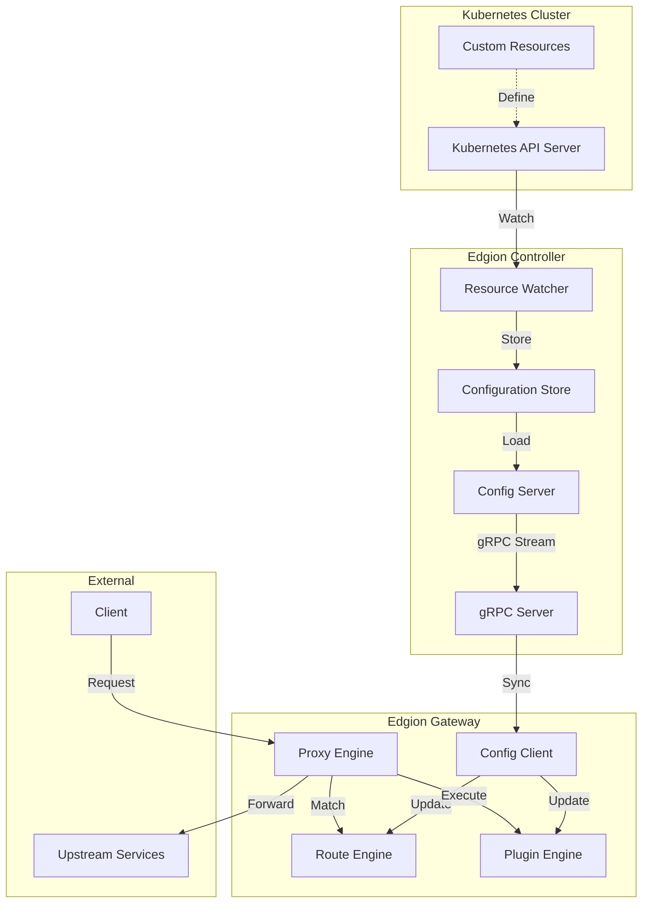

## Core Modules

### 1. Type Definition Layer (`src/types/`)

Defines all resource types and data structures.

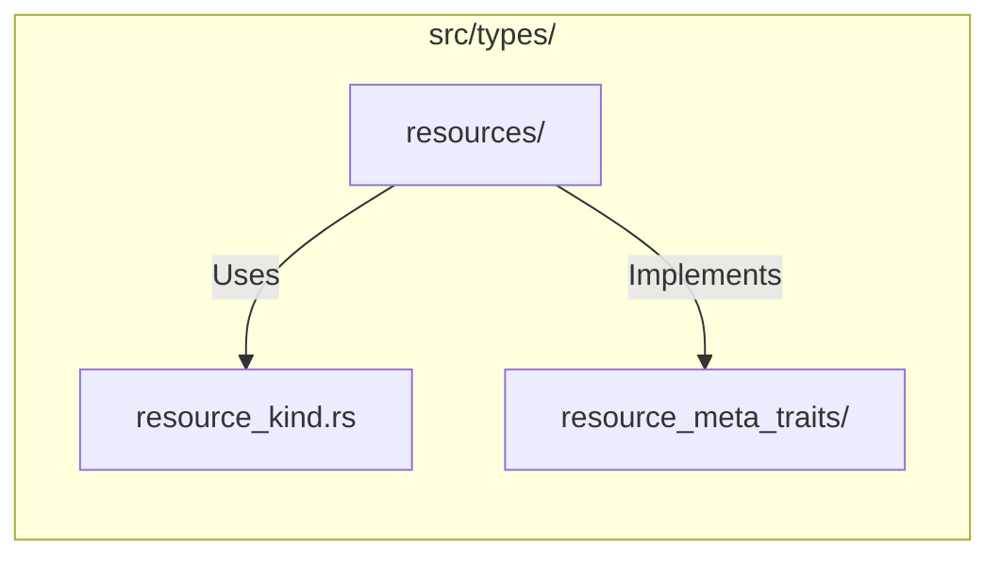

**Responsibilities**:
- Define Kubernetes CRD structures
- Implement serialization/deserialization
- Provide resource metadata interfaces

**Key files**:
- `resources/` - Various resource definitions
- `resource_kind.rs` - Resource type enum
- `resource_meta_traits/` - ResourceMeta trait implementations

### 2. Configuration Management Layer (`src/core/conf_mgr/`, `conf_sync/`)

Manages configuration storage, loading, and synchronization.

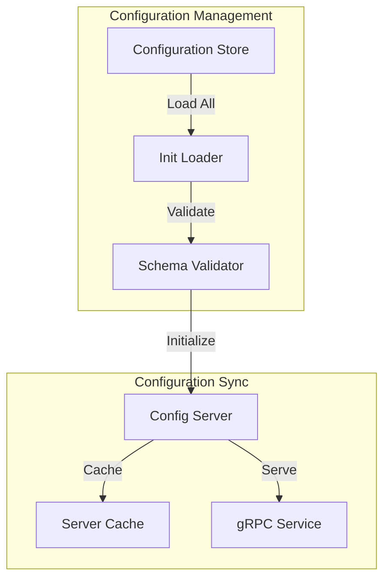

**Responsibilities**:
- Load configuration from storage (file system/etcd)
- Maintain resource cache
- Synchronize to Gateway via gRPC

**Key components**:
- `ConfStore` - Configuration storage abstraction
- `ConfigServer` - Configuration server, maintains all resource caches
- `InitLoader` - Loads all resources at startup

### 3. Route Engine (`src/core/routes/`)

Handles route matching and forwarding for different protocols.

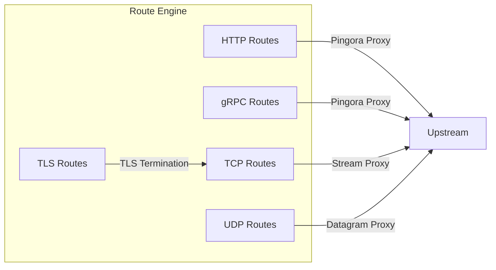

**Responsibilities**:
- Match routes based on request characteristics
- Select backend services
- Execute protocol-specific forwarding logic

**Protocol support**:
- HTTP/HTTPS - Based on Pingora HTTP Proxy
- gRPC - Based on HTTP/2
- TCP - Raw TCP stream forwarding
- UDP - Datagram forwarding
- TLS - TLS termination followed by TCP forwarding

### 4. Plugin Engine (`src/core/plugins/`)

Provides extensible request/response processing capabilities.

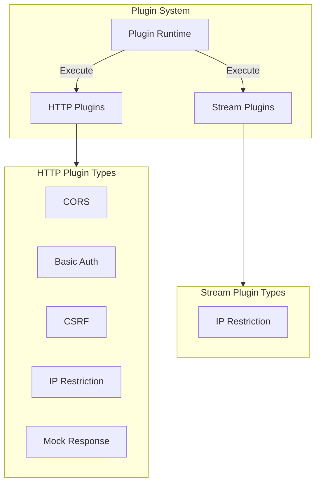

**Responsibilities**:
- Execute plugins during request/response lifecycle
- Manage plugin configuration and state
- Provide plugin extension interfaces

**Plugin types**:
- **HTTP Plugins** - Process HTTP requests/responses
- **Stream Plugins** - Process TCP/UDP connections

### 5. Load Balancing (`src/core/lb/`)

Implements multiple load balancing strategies.

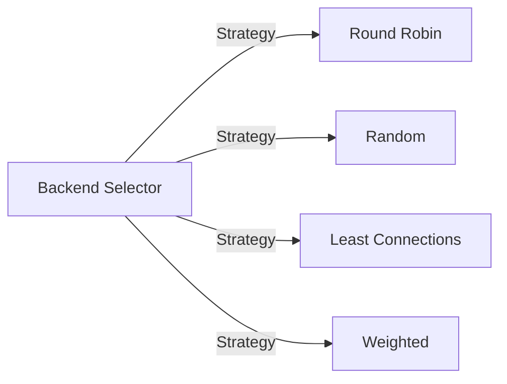

**Responsibilities**:
- Select targets from backend lists
- Implement different selection strategies
- Support weights and health checks

### 6. Backend Management (`src/core/backends/`)

Manages backend service discovery and state.

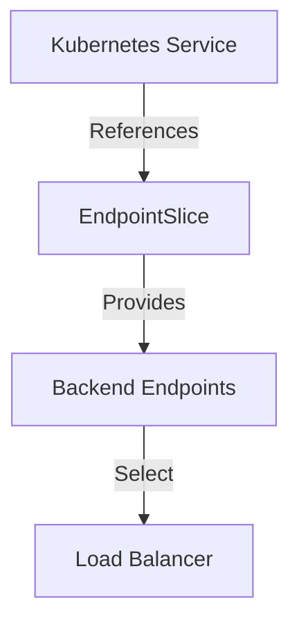

**Responsibilities**:
- Watch Service and EndpointSlice changes
- Maintain available backend lists
- Provide backend selection interfaces

---

## Resource Flow Details

### Resource Loading Flow

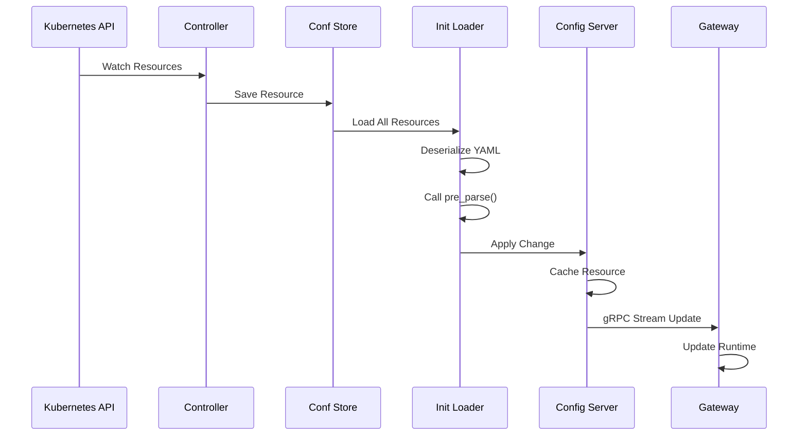

### Request Processing Flow (HTTP)

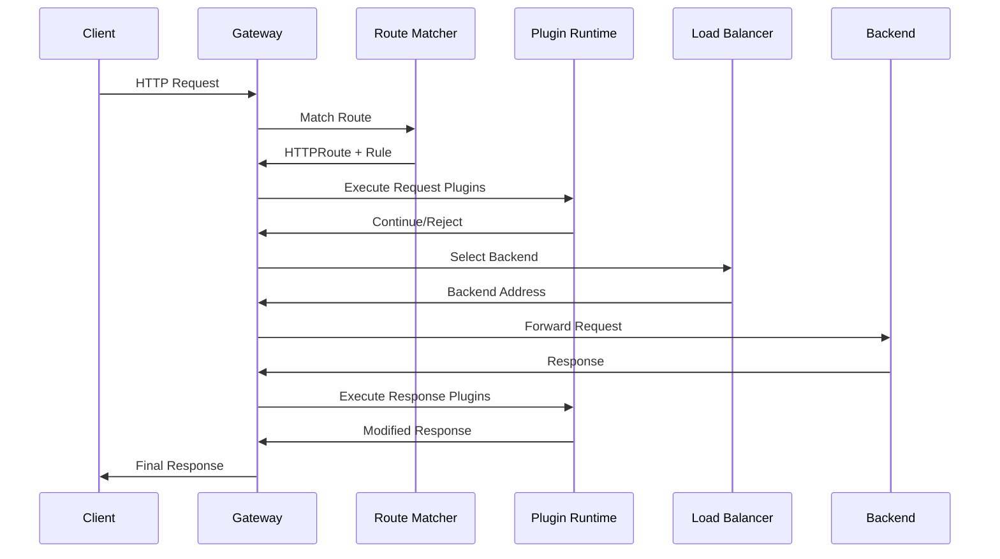

### Request Processing Flow (TCP/UDP Stream)

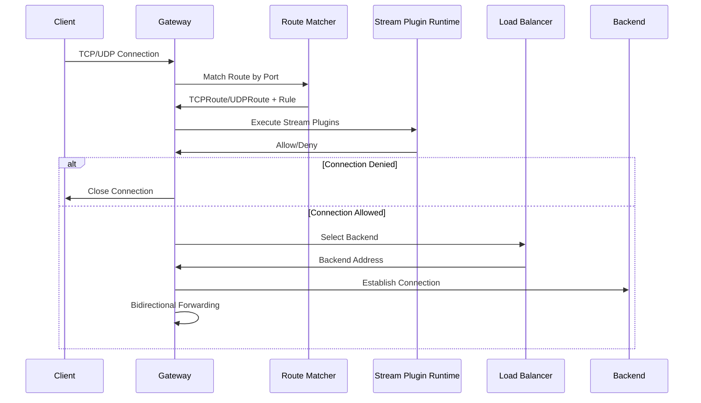

---

## Resource Types and Relationships

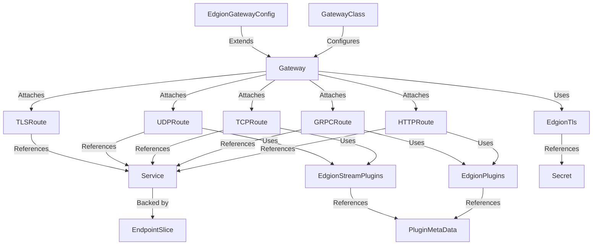

### Resource Descriptions

| Resource Type | API Group | Purpose |
|--------------|-----------|---------|
| GatewayClass | gateway.networking.k8s.io | Define Gateway type |
| Gateway | gateway.networking.k8s.io | Define listeners and configuration |
| EdgionGatewayConfig | edgion.io | Edgion-specific configuration |
| HTTPRoute | gateway.networking.k8s.io | HTTP routing rules |
| GRPCRoute | gateway.networking.k8s.io | gRPC routing rules |
| TCPRoute | gateway.networking.k8s.io | TCP routing rules |
| UDPRoute | gateway.networking.k8s.io | UDP routing rules |
| TLSRoute | gateway.networking.k8s.io | TLS routing rules |
| EdgionPlugins | edgion.io | HTTP/gRPC plugin configuration |
| EdgionStreamPlugins | edgion.io | TCP/UDP plugin configuration |
| EdgionTls | edgion.io | TLS certificate configuration |
| PluginMetaData | edgion.io | Plugin metadata (IP lists, etc.) |
| LinkSys | edgion.io | External data source links |
| Service | core/v1 | Kubernetes Service |
| EndpointSlice | discovery/v1 | Backend endpoints |
| Secret | core/v1 | Sensitive data |

---

## Module Dependencies

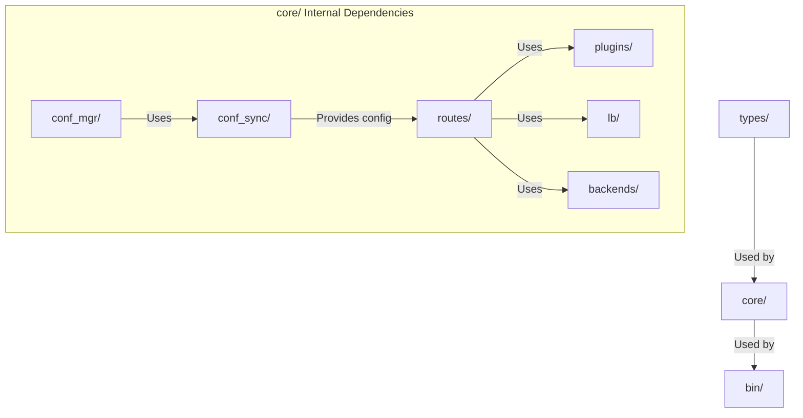

---

## Key Design Patterns

### 1. Runtime Initialization Pattern

Resources are initialized with runtime objects via `pre_parse()` after deserialization:

```rust
impl ResourceMeta for MyResource {
    fn pre_parse(&mut self) {
        self.spec.runtime = Arc::new(Runtime::from_config(&self.spec));
    }
}
```

### 2. Cache Update Pattern

Uses `ServerCache` to manage resource versions and change notifications:

```rust
config_server.my_resources.apply_change(
    ResourceChange::InitAdd,
    resource
);
```

### 3. Plugin Chain Pattern

Plugins execute in order, and any plugin can terminate the request:

```rust
for plugin in &self.plugins {
    match plugin.run(session).await {
        PluginRunningResult::GoodNext => continue,
        PluginRunningResult::ErrTerminateRequest => return,
    }
}
```

### 4. Strategy Pattern

Load balancing uses the strategy pattern to support multiple algorithms:

```rust
pub trait BackendSelectionPolicy {
    fn select(&self, backends: &[Backend]) -> Option<&Backend>;
}
```

---

## Performance Considerations

### 1. Zero-Copy Forwarding

TCP/UDP traffic uses zero-copy techniques for direct forwarding, avoiding unnecessary memory allocations.

### 2. Async I/O

Based on the Tokio async runtime, efficiently handling concurrent connections.

### 3. Cache Optimization

- Route matching result caching
- Backend selection caching
- Plugin configuration caching

### 4. Memory Management

Uses `Arc` to share immutable data, avoiding cloning large objects.

---

## Extension Points

### Adding New Protocols

1. Create a new module under `src/core/routes/`
2. Implement route matching logic
3. Implement protocol-specific proxy logic
4. Register new listeners in the Gateway

### Adding New Plugins

1. Create a plugin module under `src/core/plugins/`
2. Implement the `Plugin` or `StreamPlugin` trait
3. Register in the plugin runtime
4. Update plugin configuration types

### Adding New Load Balancing Strategies

1. Implement a new strategy under `src/core/lb/`
2. Implement the `BackendSelectionPolicy` trait
3. Register in `BackendSelector`

---

## Monitoring and Observability

```mermaid
graph LR
    Gateway[Gateway] -->|Metrics| Prometheus[Prometheus Metrics]
    Gateway -->|Access Logs| Logger[Access Logger]
    Gateway -->|Traces| Tracing[Distributed Tracing]
    
    Prometheus -->|Expose| MetricsAPI[/metrics API]
    Logger -->|Write| LogFile[Log Files]
    Tracing -->|Export| Collector[Trace Collector]
```

### Metrics

- Request counts and latency
- Connection counts and bandwidth
- Plugin execution times
- Backend health status

### Logs

- Access logs (per request)
- System logs (events and errors)
- Plugin logs (debug information)

---

## Reference Documentation

- [Adding New Resource Guide](./add-new-resource-guide.md)
- [Gateway API Specification](https://gateway-api.sigs.k8s.io/)
- [Pingora Documentation](https://github.com/cloudflare/pingora)

---

**Last updated**: 2025-12-25  
**Version**: Edgion v0.1.0
