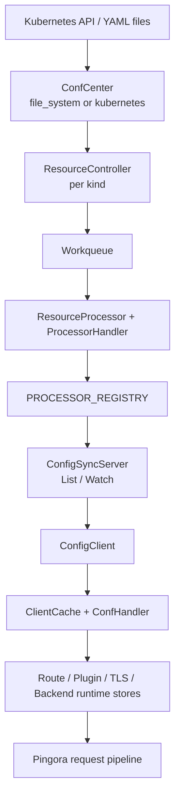

# Edgion Architecture Overview

> Human-facing overview of the current Edgion architecture.
> For AI tools, the repository entry is `AGENTS.md`, then `skills/SKILL.md`.

## System View

Edgion uses a Controller/Gateway split:

- The **Controller** watches configuration sources, validates resources, builds controller-side state, and exposes sync streams.
- The **Gateway** receives synced resources, builds runtime stores, and serves traffic through Pingora.

## Module Boundaries

### `src/types/`

Shared data definitions live here.

- `src/types/resources/`: concrete resource structs such as `Gateway`, `HTTPRoute`, `EdgionTls`, `EdgionPlugins`
- `src/types/resource/`: resource system core, including `kind.rs`, `defs.rs`, `meta/`, and `registry.rs`
- `src/types/ctx.rs`: request-scoped `EdgionHttpContext`
- `src/types/constants/`: annotations, labels, header keys, secret keys

### `src/core/controller/`

Control-plane logic lives here.

- `conf_mgr/conf_center/`: file-system mode and Kubernetes mode
- `conf_mgr/sync_runtime/workqueue.rs`: per-kind queueing and retry
- `conf_mgr/sync_runtime/resource_processor/`: per-kind handlers and cross-resource requeue
- `conf_mgr/processor_registry.rs`: global processor registry
- `conf_sync/conf_server/`: gRPC sync server, backed by registered watch objects
- `api/`: controller admin API

### `src/core/gateway/`

Data-plane logic lives here.

- `conf_sync/conf_client/`: gRPC sync client
- `conf_sync/cache_client/`: per-kind `ClientCache<T>`
- `routes/`: HTTP/gRPC/TCP/TLS/UDP runtime
- `plugins/`: HTTP and stream plugin runtime
- `tls/`: certificate store and TLS runtime
- `backends/`: service discovery, health check, backend policy
- `api/`: gateway admin API

### `src/core/common/`

Cross-binary shared modules.

- `common/conf_sync/`: proto, shared traits, sync types
- `common/config/`: startup-time shared config
- `common/matcher/`: hostname/IP matching helpers
- `common/utils/`: metadata, duration, network, and request utilities

## Control Plane Pipeline

The current controller-side processing model is:

1. A `ConfCenter` implementation watches a source and persists objects into center storage.
2. A per-kind `ResourceController` emits keys into a `Workqueue`.
3. `ResourceProcessor<T>` dequeues keys and drives the per-kind `ProcessorHandler`.
4. The handler validates, preparses, parses, registers references, triggers requeue, and updates status.
5. Each processor exposes a `WatchObj`.
6. `PROCESSOR_REGISTRY` collects all registered processors and their watch objects.
7. `ConfigSyncServer` serves `List` and `Watch` from those registered watch objects.

This is why the current architecture no longer depends on manually adding one controller-side cache field per resource to a monolithic server struct.

## Data Plane Pipeline

The current gateway-side processing model is:

1. `ConfigClient` creates one `ClientCache<T>` per synced kind.
2. Each cache registers a domain-specific `ConfHandler`.
3. Incoming `List`/`Watch` data is deserialized and applied to the relevant cache.
4. The handler updates runtime stores such as route managers, plugin stores, TLS stores, backend stores, or base-conf stores.
5. Pingora request handling reads those runtime stores during:
   - listener and TLS selection
   - route matching
   - plugin execution
   - backend selection and load balancing
   - access logging

## Practical Debugging Entry Points

- Controller CRUD and server cache:
  - `src/core/controller/api/namespaced_handlers.rs`
  - `src/core/controller/api/cluster_handlers.rs`
  - `src/core/controller/api/configserver_handlers.rs`
- Controller processing pipeline:
  - `src/core/controller/conf_mgr/sync_runtime/resource_processor/`
  - `src/core/controller/conf_mgr/processor_registry.rs`
- Gateway sync and runtime:
  - `src/core/gateway/conf_sync/conf_client/config_client.rs`
  - `src/core/common/conf_sync/traits.rs`
- CLI inspection:
  - `edgion-ctl --target center`
  - `edgion-ctl --target server`
  - `edgion-ctl --target client`

Comparing `server` and `client` views is often the fastest way to tell whether a problem lives in controller parsing, sync, or gateway runtime.

## Related Docs

- [Resource Architecture Overview](./resource-architecture-overview.md): per-resource flow from type registration to runtime
- [Resource Registry Guide](./resource-registry-guide.md): the unified registry model under `src/types/resource/`
- [Adding New Resource Types Guide](./add-new-resource-guide.md): contributor-facing workflow
- [AI Collaboration and Skill Usage Guide](./ai-agent-collaboration.md): how humans and AI tools should enter this knowledge tree
