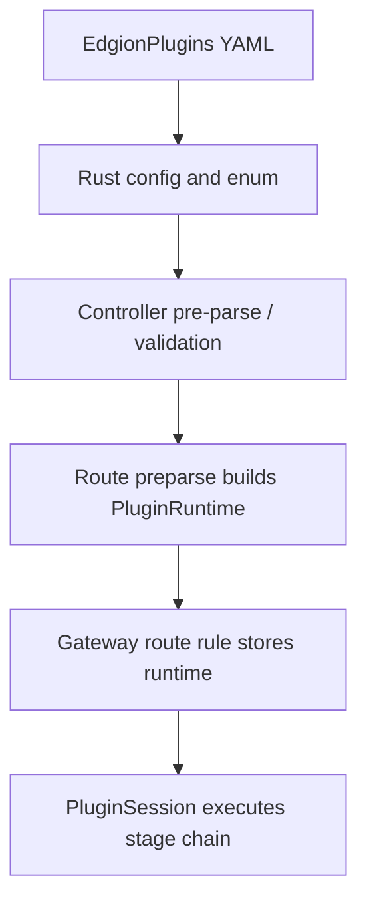

# HTTP Plugin Development Guide

This document is for contributors who need to extend `EdgionPlugins`. It explains the execution stages used by HTTP plugins in Edgion, how the resource-to-runtime wiring works, and which segments are most often missed during implementation.

> The primary AI / agent workflow now lives in [../../../skills/01-architecture/02-gateway/12-edgion-plugin-dev.md](../../../skills/01-architecture/02-gateway/12-edgion-plugin-dev.md).
> This document remains the human-facing background guide, implementation-boundary explanation, and manual review checklist.

## What This Plugin Family Is For

`EdgionPlugins` is Edgion's HTTP-layer extension mechanism. It mainly serves L7 traffic processing for resources such as `HTTPRoute` and `GRPCRoute`.

Compared with stream plugins, HTTP plugins:

- run inside the HTTP request/response lifecycle
- can access richer session context such as headers, paths, cookies, ctx variables, and upstream responses
- can return HTTP errors, terminate requests directly, or alter upstream/downstream behavior

If the requirement depends on:

- headers / cookies / query params
- auth, rate limiting, rewriting, or mirroring
- upstream response headers or body processing

it usually belongs in an HTTP plugin rather than a stream plugin.

## The Current Execution Model

Edgion currently keeps four main plugin stages:

1. `RequestFilter`
2. `UpstreamResponseFilter`
3. `UpstreamResponseBodyFilter`
4. `UpstreamResponse`

A simple way to read them:

- before sending the request upstream
- when upstream response headers arrive
- while upstream response body chunks stream through
- after the upstream response is fully complete

`RequestFilter` is still the most common entry point.  
If the requirement can be solved before the upstream call, start there instead of defaulting to a later stage.

## Key Architecture Path

The usual misses are:

- a config type was added, but the plugin variant was never connected to runtime construction
- a plugin implementation exists, but route preparse never actually builds a `PluginRuntime`
- the plugin itself works, but conditional execution, ctx passing, or PluginLog integration is incomplete

## Relevant Code Areas

When adding or extending an HTTP plugin, you usually touch these areas.

### Resource and config

- `src/types/resources/edgion_plugins/`
- `src/types/resources/edgion_plugins/plugin_configs/`
- `src/types/resources/edgion_plugins/edgion_plugin.rs`

These own:

- config schema
- the plugin enum
- resource exports and shared types

### Runtime and traits

- `src/core/gateway/plugins/runtime/traits/`
- `src/core/gateway/plugins/runtime/plugin_runtime.rs`
- `src/core/gateway/plugins/runtime/conditional_filter.rs`
- `src/core/gateway/plugins/runtime/log.rs`

These own:

- the stage-specific traits
- `PluginRuntime` construction and execution
- `skip` / `run` condition wrapping
- PluginLog recording

### Plugin implementation

- `src/core/gateway/plugins/http/`

Each plugin usually lives in its own directory, for example:

- `basic_auth/`
- `rate_limit/`
- `jwt_auth/`
- `real_ip/`

## How To Choose A Stage

### `RequestFilter`

Good for:

- authentication
- rate limiting
- path/host rewrite
- request mirroring
- direct rejection before upstream

This should be the default starting point.

### `UpstreamResponseFilter`

Good for:

- response-header modification
- fast decisions based on returned upstream headers

### `UpstreamResponseBodyFilter`

Good for:

- streaming body throttling or inspection
- logic that must operate chunk by chunk

### `UpstreamResponse`

Good for:

- work that depends on the full response being complete

This is not the most common entry point in the current repo, so do not default to it unless the requirement truly needs it.

## Conditional Execution And Cross-Plugin Data Passing

The current implementation does not execute a raw flat plugin list. It wraps plugins with condition-aware adapters such as:

- `ConditionalRequestFilter`
- `ConditionalUpstreamResponseFilter`
- matching conditional wrappers for other stages

That means plugin execution depends on more than “is the plugin present”:

- route/plugin entry `skip` / `run` conditions also matter

Another common pattern is passing data through `PluginSession` ctx variables. A typical flow is:

- an earlier plugin writes derived context
- a later plugin reads it

For example:

- RealIp writes normalized client information
- RateLimit or auth-style plugins consume that context

If your plugin depends on earlier plugin results, prefer ctx variables instead of reparsing the whole request repeatedly.

## Preparse And Runtime Construction

One important fact:

- `PluginRuntime` is not assembled on every incoming request
- it is built during route preparse from `EdgionPlugins` and Gateway API filters

So when implementing a new plugin, it is not enough to write the trait implementation. You also need to confirm:

- the plugin enum can be instantiated by the runtime
- config changes rebuild the runtime with the route
- validation errors surface during preparse

## Recommended Development Order

1. Choose the stage, usually starting with `RequestFilter`.
2. Define the config type and separate user-configured fields from runtime-derived fields.
3. Add the type to the `EdgionPlugin` enum.
4. Implement the plugin under `src/core/gateway/plugins/http/<plugin>/`.
5. Register it in `PluginRuntime` construction.
6. Confirm whether it needs conditional execution, ctx passing, and PluginLog output.
7. Add tests and user-facing docs last.

If you want an AI tool to implement it, start from the skill entry:

- [../../../skills/01-architecture/02-gateway/12-edgion-plugin-dev.md](../../../skills/01-architecture/02-gateway/12-edgion-plugin-dev.md)

## Testing And Verification

At minimum, cover four categories.

### 1. Config and preparse

- config validity
- whether validation errors surface during status / parse handling

### 2. Runtime behavior

- whether the plugin modifies request/response behavior as intended
- whether error paths return the correct termination result

### 3. Conditional execution

- whether `skip` / `run` conditions behave as expected

### 4. Composition behavior

- whether ordering and ctx passing still work when the plugin runs with existing plugins

## Manual Review Checklist

- is the chosen plugin stage correct
- are config, enum, runtime registration, and module exports all wired
- does the implementation use `PluginSession` instead of bypassing the shared abstraction
- does PluginLog capture the important outcome
- are conditional execution and ctx dependencies handled
- do tests cover success, failure, skip, and composition cases

## Related Docs

- [Architecture Overview](./architecture-overview.md)
- [Stream Plugin Development Guide](./stream-plugin-development.md)
- [HTTPRoute Filters User Guide](../user-guide/http-route/filters/overview.md)
- [AI Collaboration and Skill Usage Guide](./ai-agent-collaboration.md)
- [Knowledge Source Map and Maintenance Rules](./knowledge-source-map.md)
