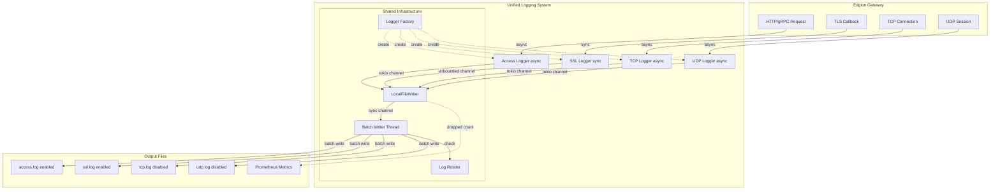

# Edgion Logging System Architecture

This document introduces Edgion's unified logging system architecture, including the design and implementation of Access Log, SSL Log, TCP Log, and UDP Log.

## Overview

Edgion provides a unified logging infrastructure supporting four log types:
- **Access Log**: Records all HTTP/HTTPS/gRPC requests (enabled by default)
- **SSL Log**: Records all TLS handshake and certificate callback events (enabled by default)
- **TCP Log**: Records all TCP connections and data transfers (disabled by default)
- **UDP Log**: Records all UDP sessions and data transfers (disabled by default)

### Core Features

- **Unified configuration**: All log types use the same configuration pattern (enabled + output + rotation)
- **Batch writing**: Reduces system calls, improves performance
- **Log rotation**: Auto-rotate by time or size
- **Multiple outputs**: Local file, Elasticsearch, Kafka (future support)
- **Metrics integration**: Track dropped log counts
- **Flexible control**: Each log type can be independently enabled/disabled

## Architecture Design

### Overall Architecture



### Log Type Comparison

| Log Type | Default State | API Type | Purpose | Typical Scenario |
|---------|--------------|----------|---------|-----------------|
| **Access Log** | Enabled | Async | HTTP/gRPC traffic analysis | Request tracing, performance analysis, auditing |
| **SSL Log** | Enabled | Sync | TLS handshake diagnostics | Certificate issue troubleshooting, mTLS debugging |
| **TCP Log** | Disabled | Async | TCP connection analysis | Low-level network debugging, connection troubleshooting |
| **UDP Log** | Disabled | Async | UDP session analysis | DNS/QUIC and other UDP protocol debugging |

**Default enable strategy**:
- Access Log and SSL Log are enabled by default as they are critical for production observability
- TCP Log and UDP Log are disabled by default as they are low-level protocol logs, only needed for deep network debugging

### Key Features

#### 1. Non-Blocking Guarantee

- **Access/TCP/UDP Log**: Use async API, do not block the tokio runtime
- **SSL Log**: Uses unbounded channel bridging, guaranteeing TLS callbacks never block (TLS callbacks must be synchronous)

```rust
// SSL Log - Synchronous API, internally uses unbounded channel
#[inline]
pub fn log_ssl(entry: &SslLogEntry) {
    if let Some(logger) = SSL_LOGGER.get() {
        // UnboundedSender::send() never blocks
        let _ = logger.tx.send(entry.to_json());
    }
}
```

#### 2. Batch Writing

LocalFileWriter implements batch writing logic:

```rust
// Block waiting for the first log entry
while let Ok(first_line) = rx.recv() {
    let _ = writeln!(file, "{}", first_line);
    
    // Batch process remaining logs (up to 999 more, 1000 total)
    for _ in 0..999 {
        match rx.try_recv() {
            Ok(line) => {
                let _ = writeln!(file, "{}", line);
            }
            Err(_) => break,
        }
    }
    
    // Single flush
    file.flush();
}
```

**Performance benefits**:
- ~1000x reduction in `write()` system calls
- ~1000x reduction in `flush()` system calls
- Significantly reduced I/O pressure

#### 3. Log Rotation

Three rotation strategies are supported:

| Strategy | Description | Use Case |
|----------|-------------|----------|
| `Size` | Rotate by file size | High-traffic scenarios, avoid oversized files |
| `Daily` | Rotate daily (at midnight) | Daily archiving for analysis |
| `Hourly` | Rotate hourly | Frequent archiving for real-time analysis |
| `Never` | No rotation | Development/test environments |

Rotation file naming:
- **Time rotation**: `access.log.2025-01-05` or `access.log.2025-01-05-14`
- **Size rotation**: `access.log.1`, `access.log.2`, `access.log.3`

Automatic cleanup of old files, keeping the most recent N (configurable via `max_files`).

#### 4. Metrics Integration

When queue-full causes log drops, metrics are automatically recorded:

```rust
async fn send(&self, data: String) -> Result<()> {
    if let Some(sender) = &self.sender {
        if sender.try_send(data).is_err() {
            // Record drop metric
            global_metrics().access_log_dropped();
        }
    }
    Ok(())
}
```

Monitor the `access_log_dropped` metric via Prometheus to detect issues promptly.

## Module Details

### Access Logger

**Location**: `src/core/observe/access_log/`

**Architecture**:

```rust
pub struct AccessLogger {
    senders: Vec<Box<dyn DataSender<String>>>,
}
```

- Supports multiple output targets (currently uses the first healthy sender)
- Plugin-based design for easy extension with new output types

**Initialization flow**:

1. Read `AccessLogConfig`
2. Create the appropriate `DataSender` based on `StringOutput` type
3. Call `sender.init()` to initialize (create files, connect to databases, etc.)
4. Register with the global `AccessLogger`

### SSL Logger

**Location**: `src/core/observe/ssl_log.rs`

**Architecture**:

```rust
pub struct SslLogger {
    // Uses unbounded channel to bridge async LocalFileWriter
    tx: mpsc::UnboundedSender<String>,
}
```

**Design points**:

1. **Synchronous API**: `log_ssl()` is a sync function, safe to call from TLS callbacks
2. **Async bridging**: Internally uses tokio unbounded channel to forward to async `LocalFileWriter`
3. **Backward compatible**: Retains `SslLogEntry` struct, API unchanged

**Initialization flow**:

```rust
// 1. Create LocalFileWriter
let writer = LocalFileWriter::new(ssl_cfg);

// 2. Initialize SSL Logger (starts a tokio task internally)
init_ssl_logger(writer).await?;

// 3. Use in TLS callback
log_ssl(&entry);  // Synchronous call, never blocks
```

### TCP Logger

**Location**: `src/core/observe/tcp_log.rs`

**Architecture**:

```rust
static TCP_LOGGER: OnceLock<Arc<AccessLogger>> = OnceLock::new();

pub struct TcpLogEntry {
    pub ts: i64,
    pub listener_port: u16,
    pub client_addr: String,
    pub client_port: u16,
    pub upstream_addr: Option<String>,
    pub duration_ms: u64,
    pub bytes_sent: u64,
    pub bytes_received: u64,
    pub status: String,
    pub connection_established: bool,
}
```

**Usage**:

```rust
// Log when TCP connection ends
let log_entry = TcpLogEntry::from_context(&tcp_context);
log_tcp(&log_entry).await;
```

**Logging timing**:
- Only logs after connection is successfully established (`connection_established = true`)
- Records complete connection lifecycle: establishment, data transfer, closure

**Log content**:
- Client info (address, port)
- Upstream info (address, port)
- Connection duration
- Byte transfer statistics (sent/received)
- Connection status (Success, UpstreamConnectionFailed, ReadError, WriteError, etc.)

### UDP Logger

**Location**: `src/core/observe/udp_log.rs`

**Architecture**:

```rust
static UDP_LOGGER: OnceLock<Arc<AccessLogger>> = OnceLock::new();

pub struct UdpLogEntry {
    pub ts: i64,
    pub listener_port: u16,
    pub client_addr: String,
    pub client_port: u16,
    pub upstream_addr: Option<String>,
    pub session_duration_ms: u64,
    pub packets_sent: u64,
    pub packets_received: u64,
    pub bytes_sent: u64,
    pub bytes_received: u64,
}
```

**Usage**:

```rust
// Log when UDP session times out and is cleaned up
let log_entry = UdpLogEntry::new(
    listener_port,
    client_addr,
    client_port,
    upstream_addr,
    session_start,
).with_stats(packets_sent, packets_received, bytes_sent, bytes_received);

log_udp(&log_entry).await;
```

**Logging timing**:
- Automatically logged when session times out (default 60 seconds of inactivity)
- Records statistics for the entire session

**Log content**:
- Client info (address, port)
- Upstream info (address, port)
- Session duration
- Packet transfer statistics (sent/received packet counts)
- Byte transfer statistics (sent/received byte counts)

**Session management**:
- Independent session maintained for each client address
- Thread-safe statistics updates using atomic variables (`AtomicU64`)
- Background task periodically cleans up timed-out sessions and logs them

### LocalFileWriter

**Location**: `src/core/link_sys/local_file/`

**Responsibilities**:
- Manage log file opening, writing, and closing
- Implement batch writing
- Implement log rotation
- Record metrics

**Configuration**:

```rust
pub struct LocalFileWriterConfig {
    pub path: String,              // Relative path (relative to work_dir)
    pub queue_size: Option<usize>, // Queue size, default cores * 10000
    pub rotation: RotationConfig,  // Rotation configuration
}

pub struct RotationConfig {
    pub strategy: RotationStrategy,      // Rotation strategy
    pub max_files: usize,                // Retained file count
    pub check_interval_secs: u64,        // Check interval
}
```

**Key methods**:

- `init()` - Initialize, create directories and background threads
- `send()` - Send log entry (non-blocking)
- `healthy()` - Check health status

## Configuration Examples

### Access Log Configuration

```toml
[access_log.output.localFile]
path = "logs/edgion_access.log"
queue_size = 100000  # Optional, default cores * 10000

[access_log.output.localFile.rotation]
strategy = "daily"  # or "hourly", "never", { size = 104857600 }
max_files = 10
check_interval_secs = 30
```

### SSL Log Configuration

```toml
[ssl_log]
enabled = true

[ssl_log.output.localFile]
path = "logs/ssl.log"
queue_size = 100000

[ssl_log.output.localFile.rotation]
strategy = { size = 104857600 }  # 100MB per file
max_files = 10
check_interval_secs = 30
```

### TCP Log Configuration

```toml
[tcp_log]
enabled = false  # Disabled by default, enable as needed

[tcp_log.output.localFile]
path = "logs/tcp.log"
queue_size = 50000

[tcp_log.output.localFile.rotation]
strategy = "daily"  # Recommended daily rotation
max_files = 10
check_interval_secs = 30
```

### UDP Log Configuration

```toml
[udp_log]
enabled = false  # Disabled by default, enable as needed

[udp_log.output.localFile]
path = "logs/udp.log"
queue_size = 50000

[udp_log.output.localFile.rotation]
strategy = "daily"  # Recommended daily rotation
max_files = 10
check_interval_secs = 30
```

### Unified Configuration Pattern

All log types follow the same configuration structure:

```toml
[<log_type>]
enabled = true/false  # Enable/disable logging

[<log_type>.output.localFile]
path = "logs/<log_type>.log"
queue_size = <optional>

[<log_type>.output.localFile.rotation]
strategy = "daily" | "hourly" | "never" | { size = <bytes> }
max_files = <number>
check_interval_secs = <seconds>
```

**Configuration priority**:
1. `enabled` flag (false means no initialization)
2. `output` configuration (LocalFile/Elasticsearch/Kafka)
3. `queue_size` (optional, default cores * 10000)
4. `rotation` (optional, default 100MB size-based rotation)

## Log Format Examples

All logs are output in JSON format, one record per line. Below are format examples for each log type:

### Access Log (HTTP/gRPC)

```json
{
  "ts": 1704470400123,
  "request_info": {
    "method": "GET",
    "path": "/api/v1/users",
    "status": 200,
    "x_trace_id": "abc123-def456",
    "host": "example.com",
    "user_agent": "curl/7.88.0"
  },
  "match_info": {
    "route_name": "user-api",
    "route_namespace": "default"
  },
  "backend_context": {
    "upstreams": [{
      "ip": "10.0.1.5",
      "port": 8080,
      "response_time_ms": 45
    }]
  },
  "errors": [],
  "plugin_logs": [],
  "conn_est": true
}
```

### SSL Log (TLS Handshake)

```json
{
  "ts": 1704470400456,
  "sni": "example.com",
  "cert": "default/example-cert",
  "mtls": false
}
```

**Error example**:
```json
{
  "ts": 1704470400789,
  "sni": "unknown.com",
  "error": "Certificate not found for SNI: unknown.com"
}
```

### TCP Log (TCP Connection)

```json
{
  "ts": 1704470401000,
  "listener_port": 9000,
  "client_addr": "192.168.1.100",
  "client_port": 54321,
  "upstream_addr": "10.0.1.10:8000",
  "duration_ms": 5432,
  "bytes_sent": 1024000,
  "bytes_received": 2048000,
  "status": "Success",
  "connection_established": true
}
```

**Connection failure example**:
```json
{
  "ts": 1704470402000,
  "listener_port": 9000,
  "client_addr": "192.168.1.101",
  "client_port": 54322,
  "upstream_addr": null,
  "duration_ms": 10,
  "bytes_sent": 0,
  "bytes_received": 0,
  "status": "UpstreamConnectionFailed",
  "connection_established": false
}
```

### UDP Log (UDP Session)

```json
{
  "ts": 1704470403000,
  "listener_port": 53,
  "client_addr": "192.168.1.200",
  "client_port": 12345,
  "upstream_addr": "8.8.8.8:53",
  "session_duration_ms": 60000,
  "packets_sent": 25,
  "packets_received": 25,
  "bytes_sent": 1280,
  "bytes_received": 2560
}
```

**Notes**:
- `ts`: Unix timestamp (milliseconds)
- All fields use camelCase naming
- Optional fields are not serialized when empty (`skip_serializing_if`)
- All logs are single-line JSON for easy parsing

## Metrics Monitoring

Each log type has independent dropped metrics for monitoring queue-full log loss:

| Metric Name | Description | Trigger |
|------------|-------------|---------|
| `edgion_access_log_dropped_total` | Access log dropped count | Access log queue full |
| `edgion_ssl_log_dropped_total` | SSL log dropped count | SSL log queue full |
| `edgion_tcp_log_dropped_total` | TCP log dropped count | TCP log queue full |
| `edgion_udp_log_dropped_total` | UDP log dropped count | UDP log queue full |

**Monitoring examples**:

```promql
# View drop rate for each log type over the last 5 minutes
rate(edgion_access_log_dropped_total[5m])
rate(edgion_ssl_log_dropped_total[5m])
rate(edgion_tcp_log_dropped_total[5m])
rate(edgion_udp_log_dropped_total[5m])

# Set alert (any log drop should trigger an alert)
sum(rate(edgion_*_log_dropped_total[5m])) > 0
```

## Performance Considerations

### Queue Size

Default queue size = `CPU cores * 10000`

- **4 cores**: 40,000 log entries
- **8 cores**: 80,000 log entries
- **16 cores**: 160,000 log entries

Adjust `queue_size` based on traffic:
- **High traffic** (10K+ RPS): Increase to 200,000+
- **Low traffic** (<1K RPS): Default value is sufficient
- **Debug mode**: Can reduce to 10,000

### Memory Usage

Estimation formula:
```
Memory ~ queue_size * avg_log_size
```

Example:
- Queue size: 100,000
- Average log: 200 bytes
- Memory usage: ~20MB

### Batch Processing Effect

| Scenario | Without Batching | With Batching (1000) | Improvement |
|----------|-----------------|---------------------|-------------|
| RPS | 10,000 | 10,000 | - |
| writes/s | 10,000 | 10 | 1000x |
| CPU | 15% | 2% | 7.5x |

## Extending New Output Types

### 1. Implement DataSender Trait

```rust
use async_trait::async_trait;
use crate::core::link_sys::DataSender;

pub struct ElasticsearchSender {
    client: EsClient,
    index: String,
}

#[async_trait]
impl DataSender<String> for ElasticsearchSender {
    async fn init(&mut self) -> Result<()> {
        self.client.connect().await
    }
    
    fn healthy(&self) -> bool {
        self.client.is_connected()
    }
    
    async fn send(&self, data: String) -> Result<()> {
        self.client.index(&self.index, data).await
    }
    
    fn name(&self) -> &str {
        "elasticsearch"
    }
}
```

### 2. Add Configuration Type

```rust
// src/types/link_sys.rs
#[derive(Debug, Clone, Serialize, Deserialize, JsonSchema)]
#[serde(rename_all = "camelCase")]
pub enum StringOutput {
    LocalFile(LocalFileWriterCfg),
    Elasticsearch(ElasticsearchCfg),  // New
}
```

### 3. Update Initialization Logic

```rust
// src/core/observe/access_log/mod.rs
match &config.output {
    StringOutput::LocalFile(cfg) => { /* ... */ }
    StringOutput::Elasticsearch(cfg) => {
        let sender = ElasticsearchSender::new(cfg);
        logger.register(Box::new(sender));
    }
}
```

## Troubleshooting

### Log Loss

**Symptom**: Some request records are missing from log files

**Causes**:
1. Queue full, logs dropped
2. Insufficient disk space
3. File permission issues

**Investigation**:
1. Check metrics: Is `access_log_dropped` increasing?
2. Check disk space: `df -h`
3. Check file permissions: `ls -la logs/`
4. Increase `queue_size` configuration

### Log Delay

**Symptom**: Significant log write delay

**Causes**:
1. Normal delay from batch processing (up to 1 second)
2. Slow disk I/O
3. Queue backlog

**Investigation**:
1. Check disk I/O: `iostat -x 1`
2. Check queue depth (requires adding metrics)
3. Adjust `check_interval_secs` to reduce rotation check frequency

### Empty SSL Logs

**Symptom**: `ssl.log` file does not exist or is empty

**Causes**:
1. `ssl_log.enabled = false`
2. No TLS traffic
3. TLS configuration error

**Investigation**:
1. Check config: `cat config/edgion-gateway.toml | grep ssl_log`
2. Check startup logs: `grep "SSL logger initialized" logs/*.log`
3. Test TLS with `curl -k https://...`

## Related Files

### Core Implementation

- `src/core/observe/access_log/` - Access Log implementation
- `src/core/observe/ssl_log.rs` - SSL Log implementation
- `src/core/link_sys/local_file/` - LocalFileWriter implementation
- `src/core/link_sys/data_sender_trait.rs` - DataSender trait definition

### Configuration

- `src/core/cli/edgion_gateway/config.rs` - Gateway configuration structure
- `src/types/link_sys.rs` - Log output configuration types
- `config/edgion-gateway.toml` - Configuration example

### User Documentation

- `docs/zh-CN/ops-guide/observability/access-log.md` - Access Log ops guide
- `docs/zh-CN/ops-guide/gateway/tls/edgion-tls.md` - TLS configuration guide (includes SSL Log notes)

## Best Practices

### Production Environment

1. **Enable log rotation**
   ```toml
   [access_log.output.localFile.rotation]
   strategy = { size = 104857600 }  # 100MB
   max_files = 30  # Keep 30 files (~3GB)
   ```

2. **Appropriate queue size**
   ```toml
   queue_size = 200000  # High traffic scenario
   ```

3. **Monitor metrics**
   - Configure Prometheus to scrape `/metrics`
   - Set alert: `access_log_dropped > 0`

4. **Regular archiving**
   - Use logrotate or custom scripts
   - Compress old logs: `gzip logs/*.log.*`
   - Upload to object storage

### Development Environment

1. **Disable log rotation**
   ```toml
   [access_log.output.localFile.rotation]
   strategy = "never"
   ```

2. **Reduce queue size**
   ```toml
   queue_size = 10000
   ```

3. **Enable SSL logs**
   ```toml
   [ssl_log]
   enabled = true  # Debug TLS issues
   ```

## Future Plans

### Short-term (v0.2)

- [ ] Add Elasticsearch output support
- [ ] Add Kafka output support
- [ ] Support custom log formats
- [ ] Support log sampling (high traffic scenarios)

### Long-term (v1.0)

- [ ] Support structured logging (JSON)
- [ ] Support log compression
- [ ] Support remote syslog
- [ ] Support log redaction

---

**Last updated**: 2025-01-05  
**Version**: Edgion v0.1.0
