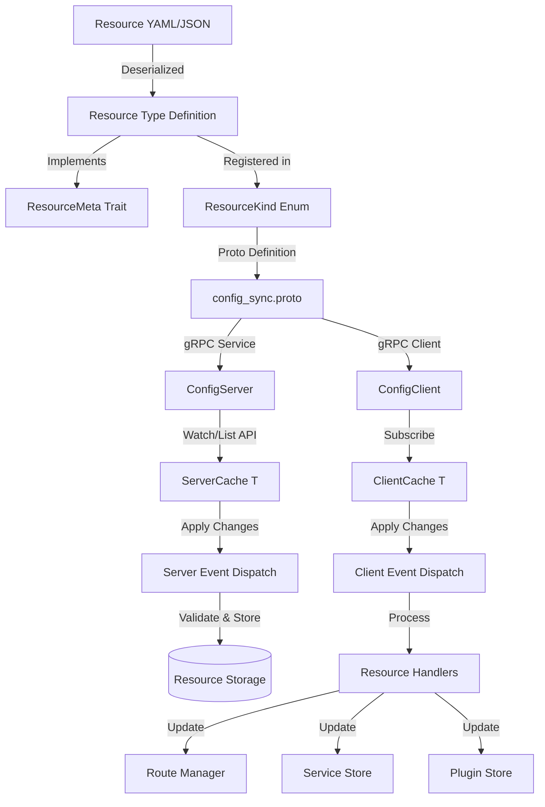
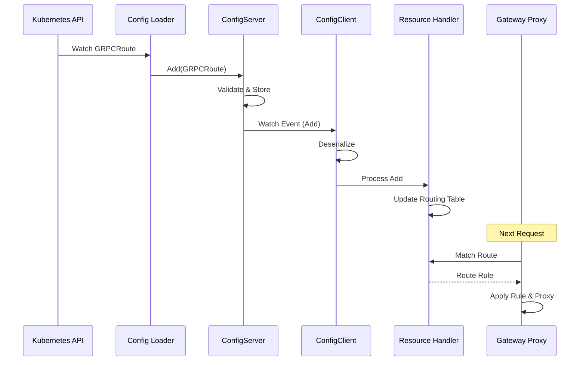
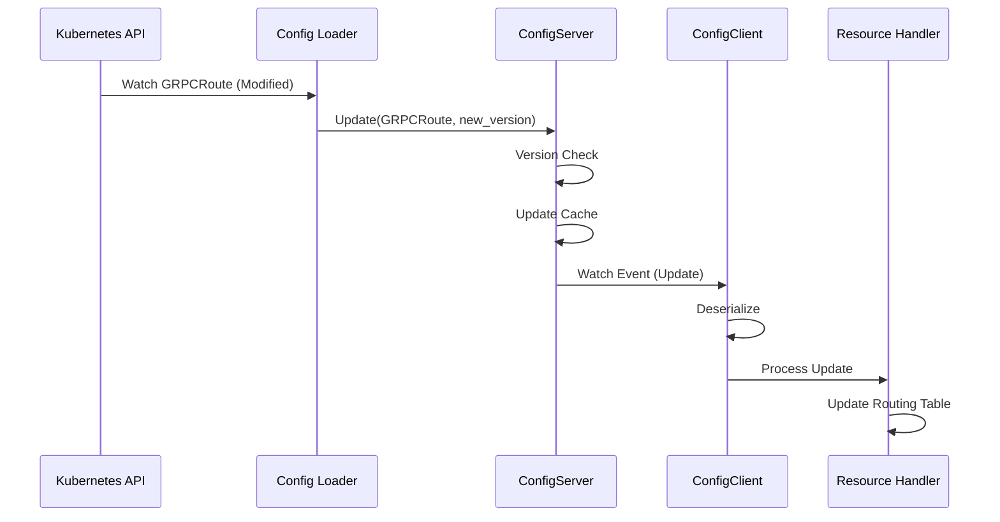
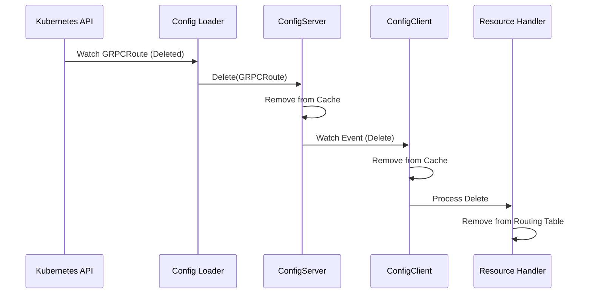

# Resource Architecture Overview

This document provides a comprehensive overview of Edgion's resource architecture, explaining how Kubernetes resources (like HTTPRoute, GRPCRoute, etc.) flow through the system from YAML definitions to runtime components.

## Architecture Diagram



## System Components

### 1. Resource Type Definition

**Location**: `src/types/resources/`

Each Kubernetes resource is defined as a Rust struct using the `kube::CustomResource` derive macro or standard Kubernetes API types.

**Example Structure** (using GRPCRoute):

```rust
#[derive(CustomResource, Deserialize, Serialize, Clone, Debug, JsonSchema)]
#[kube(
    group = "gateway.networking.k8s.io",
    version = "v1",
    kind = "GRPCRoute",
    plural = "grpcroutes",
    namespaced
)]
pub struct GRPCRouteSpec {
    pub parent_refs: Option<Vec<ParentReference>>,
    pub hostnames: Option<Vec<String>>,
    pub rules: Option<Vec<GRPCRouteRule>>,
}
```

**Key Features**:
- Serialization/deserialization support via serde
- JSON schema generation for validation
- Runtime-only fields marked with `#[serde(skip)]`
- Pre-parsing hooks for computed fields

### 2. ResourceMeta Trait

**Location**: `src/types/resource_meta_traits/traits.rs`

The `ResourceMeta` trait provides a unified interface for all resource types:

```rust
pub trait ResourceMeta: DeserializeOwned + Send + Sync + 'static {
    fn get_version(&self) -> u64;
    fn resource_kind() -> ResourceKind;
    fn kind_name() -> &'static str;
    fn key_name(&self) -> String;
    fn pre_parse(&mut self);
}
```

**Purpose**:
- **Version tracking**: For optimistic concurrency control
- **Type identification**: For routing and dispatching events
- **Unique keys**: For cache storage (namespace/name format)
- **Pre-parsing**: For populating runtime-only fields after deserialization

**Implementation Example**:

```rust
impl ResourceMeta for GRPCRoute {
    fn get_version(&self) -> u64 {
        extract_version(&self.metadata)
    }
    
    fn resource_kind() -> ResourceKind {
        ResourceKind::GRPCRoute
    }
    
    fn kind_name() -> &'static str {
        "GRPCRoute"
    }
    
    fn key_name(&self) -> String {
        if let Some(namespace) = &self.metadata.namespace {
            format!("{}/{}", namespace, self.metadata.name.as_deref().unwrap_or(""))
        } else {
            self.metadata.name.as_deref().unwrap_or("").to_string()
        }
    }
    
    fn pre_parse(&mut self) {
        self.preparse();
        self.parse_timeouts();
    }
}
```

### 3. ResourceKind Enum

**Location**: `src/types/resource_kind.rs`

A central enum that identifies all resource types in the system:

```rust
#[derive(Debug, Clone, Copy, PartialEq, Eq, Hash, ::prost::Enumeration)]
#[repr(i32)]
pub enum ResourceKind {
    Unspecified = 0,
    GatewayClass = 1,
    EdgionGatewayConfig = 2,
    Gateway = 3,
    HTTPRoute = 4,
    Service = 5,
    EndpointSlice = 6,
    EdgionTls = 7,
    Secret = 8,
    EdgionPlugins = 9,
    GRPCRoute = 10,
}
```

**Purpose**:
- Used in protobuf definitions for gRPC communication
- Enables type-safe dispatching in event handlers
- Supports dynamic type detection from YAML/JSON content

### 4. Protocol Buffer Definition

**Location**: `src/core/conf_sync/proto/config_sync.proto`

Defines the gRPC service for configuration synchronization:

```protobuf
service ConfigSync {
    rpc List(ListRequest) returns (ListResponse);
    rpc Watch(WatchRequest) returns (stream WatchResponse);
    rpc GetBaseConf(GetBaseConfRequest) returns (GetBaseConfResponse);
}

enum ResourceKind {
    RESOURCE_KIND_UNSPECIFIED = 0;
    RESOURCE_KIND_GATEWAY_CLASS = 1;
    // ... other kinds ...
    RESOURCE_KIND_GRPC_ROUTE = 10;
}
```

**Operations**:
- **List**: Fetch all resources of a specific kind
- **Watch**: Stream updates for resources (Add/Update/Delete)
- **GetBaseConf**: Fetch base configuration (GatewayClass, Gateway, EdgionGatewayConfig)

### 5. Server-Side Components

#### ConfigServer

**Location**: `src/core/conf_sync/conf_server/config_server.rs`

The server-side cache that stores all resources:

```rust
pub struct ConfigServer {
    pub base_conf: RwLock<GatewayBaseConf>,
    pub routes: ServerCache<HTTPRoute>,
    pub grpc_routes: ServerCache<GRPCRoute>,
    pub services: ServerCache<Service>,
    pub endpoint_slices: ServerCache<EndpointSlice>,
    pub edgion_tls: ServerCache<EdgionTls>,
    pub edgion_plugins: ServerCache<EdgionPlugins>,
    pub secrets: ServerCache<Secret>,
}
```

Each `ServerCache<T>` provides:
- Thread-safe storage with `RwLock`
- Version tracking for optimistic concurrency
- Event streaming to watching clients
- Ready state management

#### Server Event Dispatch

**Location**: `src/core/conf_sync/conf_server/event_dispatch.rs`

Handles incoming resource changes and applies them to caches:

```rust
fn apply_resource_change_with_resource_type(
    &self,
    change: ResourceChange,  // Add, Update, or Delete
    resource_type: ResourceKind,
    data: String,
) {
    match resource_type {
        ResourceKind::GRPCRoute => {
            if let Ok(resource) = serde_yaml::from_str::<GRPCRoute>(&data) {
                Self::execute_change_on_cache::<GRPCRoute>(change, &self.grpc_routes, resource);
            }
        }
        // ... other resource types ...
    }
}
```

**Validation Steps**:
1. Deserialize YAML/JSON to typed resource
2. Validate references (e.g., parent gateways must exist)
3. Apply change to appropriate cache
4. Notify watching clients

### 6. Client-Side Components

#### ConfigClient

**Location**: `src/core/conf_sync/conf_client/config_client.rs`

The client-side cache that subscribes to server updates:

```rust
pub struct ConfigClient {
    gateway_class_key: String,
    pub base_conf: RwLock<Option<GatewayBaseConf>>,
    routes: ClientCache<HTTPRoute>,
    grpc_routes: ClientCache<GRPCRoute>,
    services: ClientCache<Service>,
    endpoint_slices: ClientCache<EndpointSlice>,
    edgion_tls: ClientCache<EdgionTls>,
    edgion_plugins: ClientCache<EdgionPlugins>,
    secrets: ClientCache<Secret>,
}
```

Each `ClientCache<T>` provides:
- Local resource storage
- Event handlers for Add/Update/Delete
- Integration with domain-specific processors (RouteManager, ServiceStore, etc.)

#### Client Event Dispatch

**Location**: `src/core/conf_sync/conf_client/config_client.rs`

Processes incoming events from the server:

```rust
impl ConfigClientEventDispatcher for ConfigClient {
    fn apply_resource_change(
        &self,
        change: ResourceChange,
        resource_type: Option<ResourceKind>,
        data: String,
        _resource_version: Option<u64>,
    ) {
        match resource_type {
            ResourceKind::GRPCRoute => {
                if let Ok(resource) = serde_yaml::from_str::<GRPCRoute>(&data) {
                    Self::apply_change_to_cache(&self.grpc_routes, change, resource);
                }
            }
            // ... other resource types ...
        }
    }
}
```

### 7. Resource Handlers

**Purpose**: Process resource changes and update runtime components

**Examples**:
- **RouteManager** (`src/core/routes/`): Manages routing tables for HTTPRoute and GRPCRoute
- **ServiceStore** (`src/core/backends/`): Tracks Service resources
- **EpSliceHandler** (`src/core/backends/`): Manages endpoint slices for load balancing
- **PluginStore** (`src/core/plugins/`): Handles plugin configurations

**Integration**:

```rust
// In ConfigClient::new()
let routes_cache = ClientCache::new(gateway_class_key, client_id, client_name);
let route_handler = create_route_manager_handler();
routes_cache.set_conf_processor(route_handler);
```

When a route change occurs:
1. Cache receives the event
2. Cache calls the registered handler
3. Handler updates its internal state (e.g., routing table)
4. Gateway proxy uses updated state for request routing

## Data Flow

### Resource Addition Flow



### Resource Update Flow



### Resource Deletion Flow



## How to Add a New Resource Type

Follow these steps to add support for a new Kubernetes resource type:

### Step 1: Define Resource Type

Create a new file `src/types/resources/your_resource.rs`:

```rust
use kube::CustomResource;
use schemars::JsonSchema;
use serde::{Deserialize, Serialize};

pub const YOUR_RESOURCE_GROUP: &str = "gateway.networking.k8s.io";
pub const YOUR_RESOURCE_KIND: &str = "YourResource";

#[derive(CustomResource, Deserialize, Serialize, Clone, Debug, JsonSchema)]
#[kube(
    group = "gateway.networking.k8s.io",
    version = "v1",
    kind = "YourResource",
    plural = "yourresources",
    namespaced
)]
pub struct YourResourceSpec {
    // Your fields here
}
```

Export in `src/types/resources/mod.rs`:

```rust
pub mod your_resource;
pub use self::your_resource::*;
```

For the complete step-by-step guide, see [Adding New Resource Types Guide](./add-new-resource-guide.md).

## Cache Synchronization

### Version Management

Resources use Kubernetes' `resourceVersion` for optimistic concurrency control:

1. Server tracks the highest version seen
2. Clients store local versions
3. On reconnect, clients request updates from their last seen version
4. Server streams only newer versions

### Ready State

Caches have a "ready" state that indicates initial synchronization is complete:

1. Cache starts in "not ready" state
2. Server calls `set_ready()` after initial load
3. Clients check `is_ready()` before serving traffic
4. Gateway waits for all caches to be ready before accepting requests

### Event Ordering

Events are processed in order:
1. Server maintains event order per resource type
2. Watch streams guarantee ordered delivery
3. Clients apply changes sequentially

## Best Practices

### 1. Runtime-Only Fields

Use `#[serde(skip)]` and `#[schemars(skip)]` for fields that are computed at runtime:

```rust
#[serde(skip)]
#[schemars(skip)]
pub backend_finder: BackendSelector<GRPCBackendRef>,
```

### 2. Pre-Parsing

Implement `pre_parse()` to populate runtime fields after deserialization:

```rust
fn pre_parse(&mut self) {
    self.preparse();
    self.parse_timeouts();
}
```

### 3. Validation

Validate resources in server event dispatch before storing:

```rust
if !gateway_exists {
    tracing::warn!("GRPCRoute references non-existent Gateway, skipping");
    return;
}
```

### 4. Error Handling

Always handle deserialization errors gracefully:

```rust
match serde_yaml::from_str::<GRPCRoute>(&data) {
    Ok(resource) => { /* process */ }
    Err(e) => {
        tracing::error!("Failed to parse GRPCRoute: {}", e);
        return;
    }
}
```

### 5. Logging

Use structured logging with context:

```rust
tracing::info!(
    component = "config_server",
    change = ?change,
    kind = "GRPCRoute",
    route_name = ?resource.metadata.name,
    "Applying GRPCRoute resource change"
);
```

## Related Documentation

- [Adding New Resource Guide](./add-new-resource-guide.md)
- [Kubernetes Gateway API Specification](https://gateway-api.sigs.k8s.io/)
- [Load Balancing Algorithm Usage](../user-guide/http-route/lb-algorithms.md)

## Conclusion

This architecture provides a robust, type-safe way to sync Kubernetes resources from the API server to the gateway runtime. The pattern is consistent across all resource types, making it easy to add new resources while maintaining reliability and performance.

Key benefits:
- **Type Safety**: Compile-time guarantees through Rust's type system
- **Extensibility**: Easy to add new resource types
- **Efficiency**: Incremental updates via watch streams
- **Reliability**: Version tracking and validation at every step
- **Observability**: Structured logging throughout the pipeline
