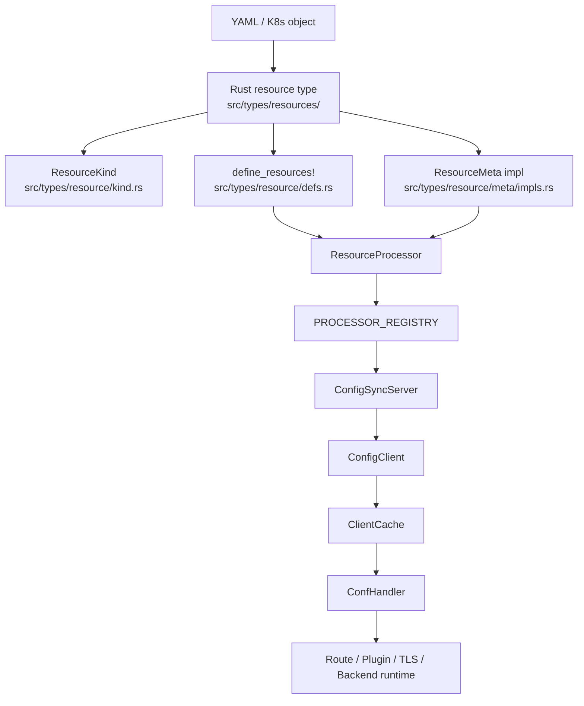

# Resource Architecture Overview

> This document explains how a resource moves through the current Edgion architecture, from type definition to controller processing, sync, and gateway runtime.

## End-to-End Flow

## 1. Type Definition and Registration

Every resource family is wired through four surfaces:

| Surface | Current path | Purpose |
|---------|--------------|---------|
| Rust type | `src/types/resources/` | Actual CRD or K8s object structure |
| Kind enum | `src/types/resource/kind.rs` | Exhaustive enum used across controller, sync, and gateway |
| Unified metadata | `src/types/resource/defs.rs` | `define_resources!` single source of truth for cache-field names, base-conf flags, registry visibility, endpoint behavior |
| Meta impl | `src/types/resource/meta/impls.rs` | `ResourceMeta` implementation, including `key_name()`, version access, and optional `pre_parse()` |

The `define_resources!` entry is where Edgion records metadata such as:

- `enum_value`
- `kind_name`
- `cache_field`
- `cluster_scoped`
- `is_base_conf`
- `in_registry`

## 2. Controller-Side Processing

Once a resource exists in file-system or Kubernetes storage, controller-side handling is driven by the config center and processor stack:

1. A `ConfCenter` implementation stores the raw object.
2. A per-kind `ResourceController` enqueues the object key.
3. `ResourceProcessor<T>` dequeues and invokes the matching `ProcessorHandler`.
4. The handler typically implements:
   - `validate`
   - `preparse`
   - `parse`
   - `on_change`
   - `update_status`
5. Reference managers and requeue helpers propagate dependent updates across resources.

This design is the reason current resource onboarding should follow the processor/handler model, not an old monolithic cache-server model.

## 3. Sync To Gateway

Gateway sync is now assembled from processors, not from a manually maintained resource list inside the sync server.

- Each processor exposes a watch object.
- `PROCESSOR_REGISTRY.all_watch_objs()` collects those watch objects.
- `ConfigSyncServer.register_all()` publishes them through gRPC `List` / `Watch`.
- `DEFAULT_NO_SYNC_KINDS` in `src/types/resource/defs.rs` defines controller-only kinds by default.

Examples:

- `ReferenceGrant` is controller-only by default.
- `Secret` follows related resources and is also excluded from the default sync set.

## 4. Gateway-Side Runtime Wiring

On the gateway side:

1. `ConfigClient` creates a `ClientCache<T>` per synced kind.
2. Each cache registers a domain-specific `ConfHandler`.
3. Incoming sync data updates the cache.
4. The handler updates runtime components.

Typical mappings:

| Kind family | Gateway runtime consumer |
|-------------|--------------------------|
| Route resources | route managers under `src/core/gateway/routes/` |
| `Service` / `EndpointSlice` / `Endpoint` | backend discovery and health components |
| `EdgionPlugins` / `EdgionStreamPlugins` | plugin stores under `src/core/gateway/plugins/` |
| `EdgionTls` / `BackendTLSPolicy` | TLS store and backend policy runtime |
| Base-conf resources | gateway config/runtime stores |

## 5. Common Resource Families

When reasoning about a new resource, classify it first:

| Family | Characteristics | Reference pattern |
|--------|-----------------|-------------------|
| Route-like | Attaches to Gateway, syncs to Gateway, participates in route runtime | `skills/02-development/references/add-resource-route-like.md` |
| Controller-only | Drives validation/requeue/status, but should not sync to Gateway | `skills/02-development/references/add-resource-controller-only.md` |
| Plugin-like | Resolves references and becomes reusable runtime config | `skills/02-development/references/add-resource-plugin-like.md` |
| Cluster-scoped base-conf | Feeds gateway base configuration or cluster-wide defaults | `skills/02-development/references/add-resource-cluster-scoped.md` |

## 6. When Adding a New Kind

Use this order:

1. Read [Adding New Resource Types Guide](./add-new-resource-guide.md).
2. Choose the closest pattern reference from the `skills/02-development/references/` set.
3. Wire type definition, kind enum, `define_resources!`, and `ResourceMeta`.
4. Wire controller `ProcessorHandler` and any requeue behavior.
5. Decide whether the kind syncs to Gateway or stays controller-only.
6. Wire gateway runtime only if the kind is synced.
7. Finish with integration tests and admin-API validation.

## Related Docs

- [Architecture Overview](./architecture-overview.md)
- [Resource Registry Guide](./resource-registry-guide.md)
- [Adding New Resource Types Guide](./add-new-resource-guide.md)
