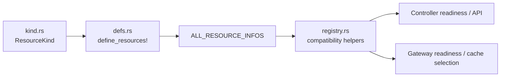

# Resource Registry Guide

> Human-facing explanation of the current unified resource registry model.

## Current Model

Edgion no longer uses a single handwritten `resource_registry.rs` file as the primary source of truth.
The current model is split into three layers:

1. `src/types/resource/kind.rs`
   - defines the exhaustive `ResourceKind` enum and conversions
2. `src/types/resource/defs.rs`
   - uses `define_resources!` as the single source of truth for resource metadata
3. `src/types/resource/registry.rs`
   - exposes compatibility helpers such as `RESOURCE_TYPES`, `all_resource_type_names()`, and `get_resource_metadata()`

## What Lives In `define_resources!`

Each resource entry in `src/types/resource/defs.rs` carries the metadata that the rest of the system depends on:

- `enum_value`
- `kind_name`
- `kind_aliases`
- `cache_field`
- `capacity_field`
- `default_capacity`
- `cluster_scoped`
- `is_base_conf`
- `in_registry`

That metadata is then reused by helper functions and registry views instead of being copied again in multiple places.

## Key APIs

| API | Current path | Purpose |
|-----|--------------|---------|
| `resource_kind_from_name()` | `src/types/resource/defs.rs` | Resolve a kind from CLI/API/user input |
| `get_resource_info()` | `src/types/resource/defs.rs` | Fetch metadata for a `ResourceKind` |
| `all_resource_kind_names()` | `src/types/resource/defs.rs` | List cache-field names for all defined kinds |
| `registry_resource_names()` | `src/types/resource/defs.rs` | List only registry-visible kinds |
| `all_resource_type_names()` | `src/types/resource/registry.rs` | Registry-visible names after endpoint-mode filtering |
| `base_conf_resource_names()` | `src/types/resource/registry.rs` | Registry-visible base-conf names |
| `get_resource_metadata()` | `src/types/resource/registry.rs` | Compatibility lookup for `RESOURCE_TYPES` |

## What `in_registry` Means

`in_registry` controls whether a kind appears in registry-facing helper views.

- `in_registry: true`: included in `RESOURCE_TYPES` and registry-based readiness logic
- `in_registry: false`: excluded from compatibility registry views

Current example:

- `Secret` is intentionally excluded from the registry-facing list because it follows related resources instead of being treated as a primary synced kind.

`all_resource_type_names()` also applies endpoint-mode filtering, so `Endpoint` and `EndpointSlice` visibility depends on the configured endpoint mode.

## Adding a New Resource

Adding a new resource is not “edit one registry file”.
The current flow is:

1. Add the Rust resource type under `src/types/resources/`.
2. Add the enum variant and conversions in `src/types/resource/kind.rs`.
3. Add the metadata entry to `define_resources!` in `src/types/resource/defs.rs`.
4. Add the `ResourceMeta` implementation in `src/types/resource/meta/impls.rs`.
5. Wire controller processing, sync behavior, and gateway runtime as needed.

For the full workflow, use [Adding New Resource Types Guide](./add-new-resource-guide.md).

## Anti-Patterns

Avoid these old assumptions:

- Do not re-introduce a new top-level handwritten registry file as the primary registry source.
- Do not treat `registry.rs` as the only place to register a new kind.
- Do not forget that registry visibility, sync visibility, and gateway caching are related but not identical concerns.

## Related Docs

- [Architecture Overview](./architecture-overview.md)
- [Resource Architecture Overview](./resource-architecture-overview.md)
- [Adding New Resource Types Guide](./add-new-resource-guide.md)
