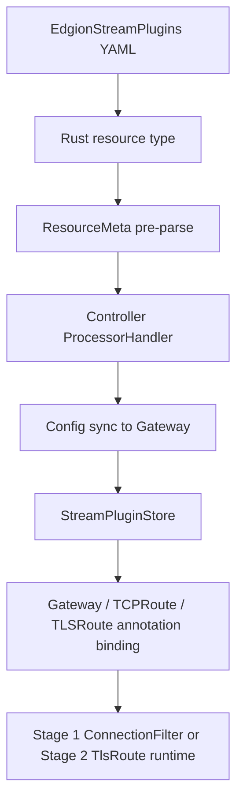

# Stream Plugin Development Guide

This document is for contributors who need to extend `EdgionStreamPlugins`. It explains where stream plugins fit in Edgion, how the two-stage runtime works, and which wiring points humans most often miss.

> The primary AI / agent workflow now lives in [../../../skills/02-development/02-stream-plugin-dev.md](../../../skills/02-development/02-stream-plugin-dev.md).
> This document remains the human-facing background guide, implementation boundary explanation, and manual review checklist.

## What This Plugin Family Is For

`EdgionStreamPlugins` is Edgion's connection-layer extension mechanism. It lets the gateway apply extra logic before HTTP parsing or after TLSRoute matching at the TCP/TLS layer.

Compared with HTTP plugins, stream plugins focus on different problems:

- they run earlier and can reject a connection before higher-layer processing
- they work with connection context such as client IP, listener port, SNI, and mTLS state
- failures usually terminate or reject the connection instead of returning an HTTP response

The most mature current implementation is IP restriction, with code under:

- `src/core/gateway/plugins/stream/ip_restriction/`

## The Current Two-Stage Model

Edgion currently splits stream plugins into two stages.

### Stage 1: ConnectionFilter

Characteristics:

- runs before TLS handshake and HTTP parsing
- only has access to client IP, listener port, and remote address style context
- best for early connection-level allow/deny decisions

Typical cases:

- IP allow/deny
- listener-specific connection gating

### Stage 2: TlsRoute

Characteristics:

- runs after TLS handshake and after `TLSRoute` matching
- can see SNI, matched route identity, and mTLS status
- best for policies that depend on TLS-specific context

Typical cases:

- policies based on SNI or mTLS state
- logic that should run only after a specific `TLSRoute` matches

## Key Architecture Path



The usual failure is not “forgot to implement a trait.” It is one of the middle segments:

- `ResourceMeta` pre-parse did not initialize the runtime
- Gateway did not actually cache and hot-reload `EdgionStreamPlugins`
- the `Gateway` / `TCPRoute` / `TLSRoute` annotation path never reached the runtime

## Resource-Side Code Locations

When adding or extending a stream plugin, start with:

- `src/types/resources/edgion_stream_plugins/mod.rs`
- `src/types/resources/edgion_stream_plugins/stream_plugins.rs`
- `src/types/resources/edgion_stream_plugins/tls_route_plugins.rs`
- `src/types/resource/meta/impls.rs`

These currently own:

- the CRD structure, status, and runtime fields
- the Stage 1 plugin enum
- the Stage 2 plugin enum
- runtime initialization during resource pre-processing

One important fact:

- runtime initialization currently happens in `ResourceMeta` pre-parse, not as an ad hoc controller-handler step

So changing only the handler is not enough. Gateway may receive the resource but still miss an executable runtime.

## Gateway Runtime Code Locations

The most important Gateway-side files are:

- `src/core/gateway/plugins/stream/stream_plugin_trait.rs`
- `src/core/gateway/plugins/stream/stream_plugin_runtime.rs`
- `src/core/gateway/plugins/stream/stream_plugin_store.rs`
- `src/core/gateway/runtime/server/listener_builder.rs`
- `src/core/gateway/routes/tcp/conf_handler_impl.rs`
- `src/core/gateway/routes/tls/proxy.rs`

A simple mental model:

- trait / runtime: how the plugin executes
- store: how Gateway hot-reloads the latest resource
- listener / route binding: which listener or route actually invokes the resource

## Annotation Binding Rule

The current primary key is:

```yaml
metadata:
  annotations:
    edgion.io/edgion-stream-plugins: "namespace/name"
```

It is currently used mainly on:

- `Gateway`
- `TCPRoute`
- `TLSRoute`

This is not just a documentation convention; it is the key the current implementation reads.
The repository historically had older forms such as `edgion.io/stream-plugins`. New work should not keep copying that legacy key forward.

## Recommended Development Order

1. Decide whether the plugin belongs in Stage 1, Stage 2, or both.
2. Decide whether the config can reuse an existing type instead of duplicating nearly identical schema.
3. Add the new type to `EdgionStreamPlugin` or `TlsRouteStreamPlugin`.
4. Register runtime construction in the matching runtime module.
5. Confirm `ResourceMeta` pre-parse initializes the runtime.
6. Confirm the referencing `Gateway` / `TCPRoute` / `TLSRoute` really resolves a store key.
7. Add tests and example YAML last.

If you want an AI tool to implement it, start from the skill entry instead:

- [../../../skills/02-development/02-stream-plugin-dev.md](../../../skills/02-development/02-stream-plugin-dev.md)

## Testing And Verification

At minimum, cover three layers.

### 1. Resource Layer

- controller accepts the resource and writes the expected status
- runtime fields are rebuilt correctly after updates

### 2. Reference Layer

- `Gateway` / `TCPRoute` / `TLSRoute` annotations resolve both `name` and `namespace/name`
- Gateway stops using stale objects after deletion

### 3. Runtime Layer

- behavior is correct when the plugin matches
- unrelated traffic is not blocked accidentally
- hot reload does not leave old config behind

Existing examples and integration fixtures are mainly under:

- `examples/test/conf/Gateway/StreamPlugins/`
- `examples/test/conf/TCPRoute/StreamPlugins/`
- `examples/test/conf/TLSRoute/StreamPlugins/`

## Manual Review Checklist

- is this really a Stage 1 plugin, a Stage 2 plugin, or both
- are enum, runtime, and module exports all wired
- does the annotation still use `edgion.io/edgion-stream-plugins`
- did the change reuse an existing config structure where appropriate
- does Gateway actually hot-reload after resource update / delete
- do tests cover add, update, and delete

## Related Docs

- [Annotations Guide](./annotations-guide.md)
- [AI Collaboration and Skill Usage Guide](./ai-agent-collaboration.md)
- [TCPRoute Stream Plugins User Guide](../user-guide/tcp-route/stream-plugins.md)
- [Knowledge Source Map and Maintenance Rules](./knowledge-source-map.md)
