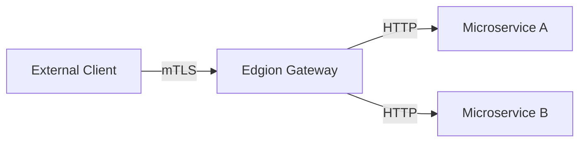

# EdgionTls User Guide

> **🔌 Edgion Extension**
> 
> `EdgionTls` is an Edgion custom CRD that provides richer TLS and mTLS configuration options than the standard Gateway API.

## What is EdgionTls?

EdgionTls is a TLS certificate management resource for Edgion Gateway, used to configure HTTPS server certificates and mTLS (Mutual TLS authentication) for the Gateway.

**Key Features**:
- **HTTPS Support**: Configure TLS certificates for domains to enable HTTPS
- **mTLS Authentication**: Support client certificate verification for mutual authentication
- **Wildcard Certificates**: Support `*.example.com` wildcard domain format
- **Hot Certificate Reload**: Update certificates without restart
- **Auto Validation**: Automatically check certificate expiry, SAN matching, etc.

---

## Quick Start

### Simplest HTTPS Configuration

```yaml
apiVersion: edgion.io/v1
kind: EdgionTls
metadata:
  name: example-tls
  namespace: default
spec:
  hosts:
    - example.com
  secretRef:
    name: example-tls-secret
    namespace: default
```

### Creating a TLS Secret

```bash
# Method 1: Create with kubectl (recommended)
kubectl create secret tls example-tls-secret \
  --cert=path/to/tls.crt \
  --key=path/to/tls.key \
  -n default

# Method 2: Using a YAML file
cat <<EOF | kubectl apply -f -
apiVersion: v1
kind: Secret
metadata:
  name: example-tls-secret
  namespace: default
type: kubernetes.io/tls
data:
  tls.crt: $(cat tls.crt | base64)
  tls.key: $(cat tls.key | base64)
EOF
```

### Verify Configuration

```bash
# View EdgionTls resources
kubectl get edgiontls -n default

# Test HTTPS access
curl https://example.com
```

---

## Configuration Parameters

### Basic Parameters

| Parameter | Type | Required | Default | Description |
|-----------|------|----------|---------|-------------|
| `parentRefs` | Array | Optional | - | List of bound Gateways |
| `hosts` | Array | **Required** | - | List of hostnames, supports wildcards (e.g., `*.example.com`) |
| `secretRef` | Object | **Required** | - | Server certificate Secret reference |
| `clientAuth` | Object | Optional | - | mTLS client authentication configuration |

### clientAuth Parameters (mTLS Configuration)

| Parameter | Type | Required | Default | Description |
|-----------|------|----------|---------|-------------|
| `mode` | String | Optional | `Terminate` | Auth mode: `Terminate` (one-way) / `Mutual` (mandatory mutual) / `OptionalMutual` (optional mutual) |
| `caSecretRef` | Object | Conditional* | - | Client CA certificate Secret reference |
| `verifyDepth` | Integer | Optional | `1` | Certificate chain verification depth (1-9), for intermediate CA scenarios |
| `allowedSans` | Array | Optional | - | Allowed client certificate SAN whitelist |
| `allowedCns` | Array | Optional | - | Allowed client certificate CN whitelist |

*`caSecretRef` is required when `mode` is `Mutual` or `OptionalMutual`

---

## Full Configuration Examples

### Example 1: One-Way TLS (Basic HTTPS)

```yaml
apiVersion: edgion.io/v1
kind: EdgionTls
metadata:
  name: basic-https
  namespace: edge
spec:
  parentRefs:
    - name: example-gateway
      namespace: edge
  hosts:
    - api.example.com
    - www.example.com
  secretRef:
    name: server-tls
    namespace: edge
```

**Use case**: Standard HTTPS website, only verifying the server certificate.

---

### Example 2: Mandatory Mutual TLS (Mutual)

```yaml
apiVersion: edgion.io/v1
kind: EdgionTls
metadata:
  name: mtls-mutual
  namespace: edge
spec:
  hosts:
    - api.example.com
  secretRef:
    name: server-tls
    namespace: edge
  clientAuth:
    mode: Mutual
    caSecretRef:
      name: client-ca
      namespace: edge
    verifyDepth: 1
```

**Use case**: API gateway connecting to microservices, all clients must provide a valid certificate.

**Creating the CA Secret**:
```bash
kubectl create secret generic client-ca \
  --from-file=ca.crt=path/to/client-ca.pem \
  -n edge
```

**Testing access**:
```bash
# Access with client certificate
curl --cert client.crt --key client.key https://api.example.com

# Access without certificate (will be rejected)
curl https://api.example.com
# Expected: TLS handshake failed
```

---

### Example 3: Optional Mutual TLS (OptionalMutual)

```yaml
apiVersion: edgion.io/v1
kind: EdgionTls
metadata:
  name: mtls-optional
  namespace: edge
spec:
  hosts:
    - secure.example.com
  secretRef:
    name: server-tls
    namespace: edge
  clientAuth:
    mode: OptionalMutual
    caSecretRef:
      name: client-ca
      namespace: edge
```

**Use case**: Mixed scenarios, allowing regular users while providing additional privileges for clients that present certificates.

**Characteristics**:
- Requests without certificates can still pass
- Requests with valid certificates will be identified (can be differentiated in upstream services)

---

### Example 4: mTLS + SAN Whitelist

```yaml
apiVersion: edgion.io/v1
kind: EdgionTls
metadata:
  name: mtls-san-whitelist
  namespace: edge
spec:
  hosts:
    - admin.example.com
  secretRef:
    name: server-tls
  clientAuth:
    mode: Mutual
    caSecretRef:
      name: client-ca
    verifyDepth: 1
    allowedSans:
      - "client1.example.com"
      - "*.internal.example.com"
```

**Use case**: Admin interfaces, allowing only specific clients.

**Validation logic**:
1. Client certificate must be issued by `client-ca`
2. Client certificate SAN must match the whitelist
3. Both conditions must be met to allow access

---

### Example 5: mTLS + CN Whitelist

```yaml
apiVersion: edgion.io/v1
kind: EdgionTls
metadata:
  name: mtls-cn-whitelist
  namespace: edge
spec:
  hosts:
    - admin.example.com
  secretRef:
    name: server-tls
  clientAuth:
    mode: Mutual
    caSecretRef:
      name: client-ca
    allowedCns:
      - "AdminClient"
      - "SuperUser"
```

**Use case**: Access control based on client certificate CN (Common Name).

---

### Example 6: Intermediate CA Certificate Chain (verifyDepth=2)

```yaml
apiVersion: edgion.io/v1
kind: EdgionTls
metadata:
  name: mtls-intermediate-ca
  namespace: edge
spec:
  hosts:
    - enterprise.example.com
  secretRef:
    name: server-tls
  clientAuth:
    mode: Mutual
    caSecretRef:
      name: root-ca
    verifyDepth: 2  # Support intermediate CA
```

**Certificate chain structure**:
```
[Client Certificate] <- [Intermediate CA] <- [Root CA]
```

**Details**:
- `verifyDepth: 1` - Verify direct issuance only (default)
- `verifyDepth: 2` - Support one intermediate CA
- `verifyDepth: 3` - Support two intermediate CAs

---

### Example 7: Wildcard Certificate + Multiple Hosts

```yaml
apiVersion: edgion.io/v1
kind: EdgionTls
metadata:
  name: wildcard-cert
  namespace: edge
spec:
  hosts:
    - "*.api.example.com"
    - "*.admin.example.com"
    - example.com
  secretRef:
    name: wildcard-tls
```

**Coverage**:
- `v1.api.example.com`
- `v2.api.example.com`
- `dashboard.admin.example.com`
- `example.com`
- `api.example.com` (wildcard does not cover the base domain)

---

### Example 8: Multi-Gateway Binding

```yaml
apiVersion: edgion.io/v1
kind: EdgionTls
metadata:
  name: multi-gateway-tls
  namespace: edge
spec:
  parentRefs:
    - name: public-gateway
      namespace: edge
    - name: internal-gateway
      namespace: edge
  hosts:
    - shared.example.com
  secretRef:
    name: shared-tls
```

**Use case**: Using the same certificate for a domain across multiple Gateways.

---

## Certificate Management Best Practices

### Development Environment: Generate Self-Signed Certificates

#### 1. Generate Server Certificate

```bash
# Generate private key
openssl genrsa -out server-key.pem 2048

# Generate Certificate Signing Request (CSR)
openssl req -new -key server-key.pem -out server.csr \
  -subj "/CN=example.com"

# Generate self-signed certificate (valid for 365 days)
openssl x509 -req -in server.csr -signkey server-key.pem \
  -out server-cert.pem -days 365 \
  -extensions v3_req -extfile <(cat <<EOF
[v3_req]
subjectAltName = DNS:example.com,DNS:*.example.com
EOF
)

# Create Secret
kubectl create secret tls server-tls \
  --cert=server-cert.pem \
  --key=server-key.pem \
  -n edge
```

#### 2. Generate Client Certificate (for mTLS)

```bash
# Generate CA certificate
openssl genrsa -out ca-key.pem 2048
openssl req -x509 -new -nodes -key ca-key.pem \
  -sha256 -days 365 -out ca.pem \
  -subj "/CN=Client CA"

# Generate client private key
openssl genrsa -out client-key.pem 2048

# Generate client CSR
openssl req -new -key client-key.pem -out client.csr \
  -subj "/CN=AdminClient"

# Sign client certificate with CA
openssl x509 -req -in client.csr -CA ca.pem -CAkey ca-key.pem \
  -CAcreateserial -out client-cert.pem -days 365 -sha256 \
  -extensions v3_req -extfile <(cat <<EOF
[v3_req]
subjectAltName = DNS:client1.example.com
EOF
)

# Create CA Secret
kubectl create secret generic client-ca \
  --from-file=ca.crt=ca.pem \
  -n edge
```

---

### Production Environment: Let's Encrypt Integration

It is recommended to use **cert-manager** for automatic Let's Encrypt certificate management:

```yaml
apiVersion: cert-manager.io/v1
kind: Certificate
metadata:
  name: example-com-cert
  namespace: edge
spec:
  secretName: server-tls
  issuerRef:
    name: letsencrypt-prod
    kind: ClusterIssuer
  dnsNames:
    - example.com
    - "*.example.com"
```

---

### Certificate Rotation Strategies

#### Method 1: Rolling Update (Recommended)

```bash
# 1. Create new certificate Secret
kubectl create secret tls server-tls-new \
  --cert=new-cert.pem \
  --key=new-key.pem \
  -n edge

# 2. Update EdgionTls reference
kubectl patch edgiontls example-tls -n edge \
  --type=merge -p '{"spec":{"secretRef":{"name":"server-tls-new"}}}'

# 3. Verify new certificate is active
curl -v https://example.com 2>&1 | grep "expire date"

# 4. Delete old certificate
kubectl delete secret server-tls -n edge
```

#### Method 2: In-Place Update

```bash
# Directly update Secret contents
kubectl create secret tls server-tls \
  --cert=new-cert.pem \
  --key=new-key.pem \
  -n edge \
  --dry-run=client -o yaml | kubectl apply -f -
```

---

### Secret Naming Conventions

Recommended format: `<domain>-tls` or `<service>-<env>-tls`

**Examples**:
- `api-example-com-tls`
- `admin-prod-tls`
- `wildcard-example-tls`
- `cert1`, `tls-secret` (not descriptive enough)

---

### Certificate Expiry Monitoring

Use Prometheus + Alertmanager to monitor certificate expiry:

```yaml
# Prometheus rule example
groups:
  - name: tls_expiry
    rules:
      - alert: TLSCertExpiringSoon
        expr: (edgion_tls_cert_expiry_seconds - time()) < 604800  # 7 days
        annotations:
          summary: "TLS certificate expiring soon"
          description: "Certificate {{ $labels.namespace }}/{{ $labels.name }} expires in less than 7 days"
```

---

## mTLS Use Cases

### 1. API Gateway to Microservices



**Configuration points**:
- Use `Mutual` mode to enforce client certificate verification
- Configure `allowedSans` to restrict allowed clients

---

### 2. B2B API Integration

**Scenario**: Issue different client certificates for different partners

```yaml
clientAuth:
  mode: Mutual
  caSecretRef:
    name: partner-ca
  allowedCns:
    - "PartnerA"
    - "PartnerB"
    - "PartnerC"
```

---

### 3. IoT Device Authentication

**Scenario**: Each IoT device holds a unique client certificate

```yaml
clientAuth:
  mode: Mutual
  caSecretRef:
    name: iot-device-ca
  allowedSans:
    - "device-*.iot.example.com"
```

---

### 4. Internal Admin Interface Protection

```yaml
clientAuth:
  mode: Mutual
  caSecretRef:
    name: admin-ca
  allowedCns:
    - "AdminUser"
  allowedSans:
    - "admin.internal.example.com"
```

---

## Troubleshooting

| Symptom | Possible Cause | Solution |
|---------|---------------|----------|
| **502 Bad Gateway** | Invalid or expired certificate | Check certificate validity: `openssl x509 -in cert.pem -noout -dates` |
| **TLS handshake failed** | SAN/CN mismatch | Check certificate SAN: `openssl x509 -in cert.pem -noout -text \| grep DNS` |
| **Client certificate required** | Client did not provide certificate in mTLS mode | Confirm client uses `--cert` and `--key` parameters |
| **Certificate chain too long** | `verifyDepth` insufficient | Increase `verifyDepth` value (e.g., 2 or 3) |
| **CA verification failed** | CA Secret does not exist or has wrong format | Check Secret: `kubectl get secret client-ca -n edge -o yaml` |
| **Secret not found** | Secret referenced by `secretRef` does not exist | Create the Secret or correct the reference |
| **Invalid SAN pattern** | `allowedSans` contains empty string | Remove blank SAN entries |
| **Certificate not taking effect** | EdgionTls not bound to Gateway | Check `parentRefs` configuration |

---

## Security Considerations

### 1. Private Key Protection

- Use **Kubernetes Secrets** to store private keys (automatically encrypted)
- **Configure RBAC**: Restrict Secret access permissions
- **Do not** commit private keys to Git repositories
- **Do not** print private key contents in logs

```yaml
# RBAC example: Allow only specific ServiceAccount to access Secrets
apiVersion: rbac.authorization.k8s.io/v1
kind: Role
metadata:
  name: tls-secret-reader
  namespace: edge
rules:
  - apiGroups: [""]
    resources: ["secrets"]
    resourceNames: ["server-tls", "client-ca"]
    verbs: ["get"]
```

---

### 2. Certificate Revocation

**Method 1: Delete CA Secret** (affects all clients)
```bash
kubectl delete secret client-ca -n edge
```

**Method 2: Update `allowedCns` whitelist** (fine-grained control)
```yaml
clientAuth:
  allowedCns:
    - "ValidClient"
    # Remove "RevokedClient"
```

---

### 3. TLS Version Recommendations

Edgion Gateway supports **TLS 1.2** and **TLS 1.3** by default, with insecure TLS 1.0/1.1 disabled.

---

### 4. Cipher Suite Selection

Recommended modern cipher suites (Edgion defaults):
- `TLS_ECDHE_RSA_WITH_AES_128_GCM_SHA256`
- `TLS_ECDHE_RSA_WITH_AES_256_GCM_SHA384`
- `TLS_AES_128_GCM_SHA256` (TLS 1.3)
- `TLS_RSA_WITH_3DES_EDE_CBC_SHA` (disabled)

---

## Performance Optimization

### 1. Certificate Caching

Edgion Gateway automatically caches validated certificates, no additional configuration needed.

---

### 2. Session Resumption

TLS session resumption is enabled by default, reducing handshake overhead.

---

### 3. OCSP Stapling

**Current status**: Planned for future versions.

### 11. TLS Version Control FAQ

**Q: How to allow only TLS 1.3 connections?**

A: Set both `minVersion` and `maxVersion` to `TLS1_3`:

```yaml
tlsVersions:
  minVersion: TLS1_3
  maxVersion: TLS1_3
```

**Q: What happens when a client using TLS 1.2 connects to a TLS 1.3-only service?**

A: The connection will be rejected, and the client will receive a TLS handshake failure error.

---

### 12. Cipher Suite Configuration FAQ

**Q: Why doesn't cipher suite configuration fully take effect currently?**

A: Due to limitations in the Pingora framework, cipher suites cannot be set during handshake in dynamic SNI scenarios. This requires Pingora API enhancements. The current configuration is recorded but not immediately applied.

**Q: Which cipher suite profile should I choose?**

A: 
- **Most scenarios**: Use `Intermediate` (default)
- **Modern clients only**: Use `Modern`
- **Must support legacy clients**: Use `Old` (not recommended)

---

### 13. SAN/CN Whitelist FAQ

**Q: What is the difference between SAN whitelist and CN whitelist?**

A: 
- **SAN (Subject Alternative Names)**: Modern standard, supports multiple domains/IPs, recommended
- **CN (Common Name)**: Legacy standard, supports only a single domain, deprecated

**Q: Why doesn't SAN whitelist validation fully take effect currently?**

A: Due to Pingora architecture limitations, SSL connections cannot be directly accessed at the HTTP request stage. Certificate information needs to be extracted at the TLS layer and passed to the application layer. This requires architecture enhancements.

**Q: How do wildcard whitelists work?**

A: `*.example.com` matches `sub.example.com`, but does not match `example.com` or `sub.sub.example.com` (single-level subdomain only).

---

## Advanced Configuration

### TLS Version Control

Set the minimum TLS version, similar to Cloudflare's Minimum TLS Version setting.

**Configuration example**:

```yaml
apiVersion: edgion.io/v1
kind: EdgionTls
metadata:
  name: tls-version-control
  namespace: default
spec:
  hosts:
    - secure.example.com
  secretRef:
    name: secure-tls-secret
    namespace: default
  minTlsVersion: TLS1_2  # Minimum TLS version
```

**Supported versions**:

| Value | Description | Recommendation |
|-------|-------------|----------------|
| `TLS1_0` | TLS 1.0 | Not recommended (deprecated) |
| `TLS1_1` | TLS 1.1 | Not recommended (deprecated) |
| `TLS1_2` | TLS 1.2 | Recommended |
| `TLS1_3` | TLS 1.3 | Most secure |

**Use cases**:
- **TLS 1.3 only**: Set `minTlsVersion: TLS1_3`, for modern clients
- **Compatibility mode**: Set `minTlsVersion: TLS1_2` (recommended)
- **Legacy client compatibility**: Set `minTlsVersion: TLS1_0` (not recommended)

Uses BoringSSL defaults when not configured.

---

### Cipher Suite Configuration

Control allowed encryption algorithms, similar to Nginx's `ssl_ciphers` directive.

**Configuration example**:

```yaml
apiVersion: edgion.io/v1
kind: EdgionTls
metadata:
  name: cipher-config
  namespace: default
spec:
  hosts:
    - secure.example.com
  secretRef:
    name: secure-tls-secret
    namespace: default
  ciphers:
    - ECDHE-RSA-AES256-GCM-SHA384
    - ECDHE-RSA-AES128-GCM-SHA256
    - ECDHE-RSA-CHACHA20-POLY1305
```

**Important notes**:

| TLS Version | Cipher configurable | Description |
|-------------|-------------------|-------------|
| TLS 1.0 | Yes | Via `ciphers` field |
| TLS 1.1 | Yes | Via `ciphers` field |
| TLS 1.2 | Yes | Via `ciphers` field |
| TLS 1.3 | No | Hardcoded by BoringSSL |

**TLS 1.3 uses the following fixed ciphers** (cannot be changed):
- `TLS_AES_128_GCM_SHA256`
- `TLS_AES_256_GCM_SHA384`
- `TLS_CHACHA20_POLY1305_SHA256`

**Recommended TLS 1.2 cipher list**:
```yaml
ciphers:
  - ECDHE-ECDSA-AES128-GCM-SHA256
  - ECDHE-RSA-AES128-GCM-SHA256
  - ECDHE-ECDSA-AES256-GCM-SHA384
  - ECDHE-RSA-AES256-GCM-SHA384
  - ECDHE-ECDSA-CHACHA20-POLY1305
  - ECDHE-RSA-CHACHA20-POLY1305
```

Uses BoringSSL default ciphers when not configured.

---

### SAN/CN Whitelist Validation

Whitelist validation for client certificate Subject Alternative Names (SAN) or Common Name (CN).

**Configuration example**:

```yaml
apiVersion: edgion.io/v1
kind: EdgionTls
metadata:
  name: mtls-san-whitelist
  namespace: default
spec:
  hosts:
    - api.example.com
  secretRef:
    name: api-tls-secret
    namespace: default
  clientAuth:
    mode: Mutual
    caSecretRef:
      name: client-ca
      namespace: default
    verifyDepth: 2
    allowedSans:
      - "client1.example.com"
      - "client2.example.com"
      - "*.internal.example.com"  # Supports wildcards
    allowedCns:
      - "TrustedClient"
      - "AdminUser"
```

**Field descriptions**:
- `allowedSans`: SAN whitelist, supports wildcards (`*.example.com`)
- `allowedCns`: CN whitelist, exact match

**Validation flow**:
1. Validate CA and certificate chain during TLS handshake
2. Extract client certificate information at the application layer
3. Check if SAN/CN is in the whitelist
4. Return 403 Forbidden if no match

**Notes**:
- SAN/CN whitelist validation currently requires architecture enhancements to be fully effective
- Certificate information needs to be extracted at the TLS layer and passed to the application layer
- SAN is recommended over CN (CN has been deprecated)

---

### Combined Configuration Example

A complete configuration combining multiple advanced features:

```yaml
apiVersion: edgion.io/v1
kind: EdgionTls
metadata:
  name: advanced-tls-config
  namespace: production
spec:
  hosts:
    - secure-api.example.com
  secretRef:
    name: api-tls-secret
    namespace: production
  # mTLS configuration
  clientAuth:
    mode: Mutual
    caSecretRef:
      name: client-ca
      namespace: production
    verifyDepth: 3
    allowedSans:
      - "*.trusted-clients.example.com"
  # TLS version control
  tlsVersions:
    minVersion: TLS1_2
    maxVersion: TLS1_3
  # Cipher suites
  cipherSuites:
    profile: Intermediate
```

---

## FAQ

### Q1: How to view certificate details?

```bash
# Extract certificate from Secret
kubectl get secret server-tls -n edge -o jsonpath='{.data.tls\.crt}' | base64 -d > cert.pem

# View certificate details
openssl x509 -in cert.pem -noout -text
```

---

### Q2: How many levels does a wildcard certificate cover?

The wildcard `*.example.com` covers only **one level** of subdomains:
- `api.example.com`
- `v1.api.example.com` (requires `*.*.example.com`)

---

### Q3: How to test mTLS configuration?

```bash
# Test mandatory mTLS
curl --cert client.crt --key client.key https://api.example.com

# View TLS handshake details
openssl s_client -connect api.example.com:443 \
  -cert client.crt -key client.key -showcerts
```

---

### Q4: Can I use a self-signed CA?

Yes! Self-signed CAs are recommended for development environments. For production, use a trusted CA (such as Let's Encrypt).

---

### Q5: How to implement automatic certificate renewal?

Use **cert-manager** + **Let's Encrypt** for fully automatic renewal:

```yaml
apiVersion: cert-manager.io/v1
kind: ClusterIssuer
metadata:
  name: letsencrypt-prod
spec:
  acme:
    server: https://acme-v02.api.letsencrypt.org/directory
    email: admin@example.com
    privateKeySecretRef:
      name: letsencrypt-prod
    solvers:
      - http01:
          ingress:
            class: nginx
```

---

**Need help?** Please visit [Edgion GitHub Issues](https://github.com/your-org/edgion/issues) to submit issues.
