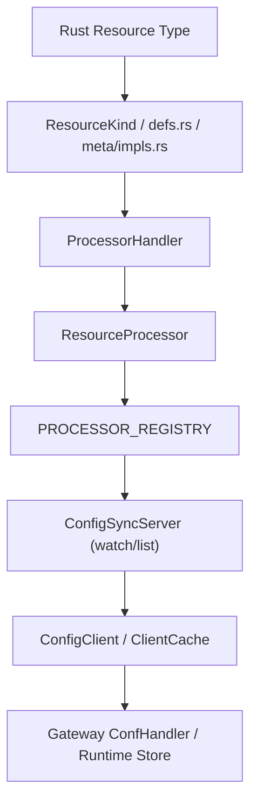

# Edgion 添加新资源类型完整指南

本文档记录如何在 Edgion 中添加一个新的 Kubernetes 资源类型。利用统一的宏系统，添加新资源变得更加简单。

> 面向 AI / Agent 的主 workflow 入口现在是 [../../../skills/02-development/00-add-new-resource.md](../../../skills/02-development/00-add-new-resource.md)。
> 本文档保留给人看的背景说明和手工检查点。
> 如果要按资源类型套模板，优先看该 workflow 下面的分类参考：`route-like`、`controller-only`、`plugin-like`、`cluster-scoped`。

## 概述

Edgion 采用**单一数据源 + 宏生成**的架构：

- `resource_defs.rs` - 所有资源类型的元数据定义（单一数据源）
- `impl_resource_meta!` 宏 - 自动生成 ResourceMeta trait 实现
- 辅助函数 - 统一处理资源的加载、列表、查询等操作

### 当前架构和旧文档的关键区别

- Controller 侧现在是 `ResourceProcessor<T> + ServerCache<T> + PROCESSOR_REGISTRY` 架构。
- `ConfigSyncServer` 不再手动为每个资源维护字段；资源由 processor 注册为 watch/list 对象。
- 因此，旧版“给 controller 的 ConfigServer 手动加字段”的做法不再适用于当前仓库。

### CRD 版本与兼容策略（务必遵循）

- 始终以"最新/最稳定版本"为存储版（storageVersion）。旧版只作为输入格式，统一向新版本/内部模型转换，禁止"降级"写回旧版。
- Gateway API 已 GA 的资源（Gateway/GatewayClass/HTTPRoute/GRPCRoute 等）保持 `v1`，除非上游发布新主版本并提供明确迁移路径。
- 处于 Alpha/Beta 的资源（如 BackendTLSPolicy 当前 `v1alpha3`，需兼容历史 `v1alpha2`）推荐：
  - CRD 多版本：storage = 最新，旧版标记为 served。
  - 有条件时使用 Conversion Webhook，由 API Server 统一转换；否则在控制器中同时 watch 多版本，转换为单一内部模型。
  - 新增字段在旧版转换时要有安全默认值；重命名/类型变化需显式映射并记录日志。
- 升级流程：先更新 CRD（新增新版本并设为 storage），再上线具备转换能力的控制器；保持旧版 served 一段时间，确认无旧对象后再考虑移除。

---

## 快速清单

添加新资源类型通常需要修改以下几个核心位置：

### 必须修改

1. **`src/types/resources/<resource>.rs`** - 定义资源结构体
2. **`src/types/resources/mod.rs`** - 导出新模块
3. **`src/types/resource/kind.rs`** - 添加 `ResourceKind` 变体和名称映射
4. **`src/types/resource/defs.rs`** - 在 `define_resources!` 中添加元数据
5. **`src/types/resource/meta/impls.rs`** - 使用 `impl_resource_meta!` 实现 `ResourceMeta`
6. **`src/core/controller/conf_mgr/sync_runtime/resource_processor/handlers/<resource>.rs`** - 实现 `ProcessorHandler`
7. **`src/core/controller/conf_mgr/sync_runtime/resource_processor/handlers/mod.rs`** - 导出新 handler
8. **`src/core/controller/conf_mgr/conf_center/file_system/controller.rs`** - 注册 FileSystem 模式 processor
9. **`src/core/controller/conf_mgr/conf_center/kubernetes/controller.rs`** - 注册 Kubernetes 模式 processor

### 按需修改

10. **`src/core/gateway/conf_sync/conf_client/config_client.rs`** - 如果要同步到 Gateway，添加 `ClientCache<T>` 和变更分发
11. **`src/core/gateway/.../conf_handler*.rs`** - 如果 Gateway 运行时需要消费该资源
12. **`src/core/controller/api/namespaced_handlers.rs`** 或 **`cluster_handlers.rs`** - 如果要支持 Controller Admin API CRUD
13. **`src/core/gateway/api/mod.rs`** - 如果要支持 Gateway Admin API 查询
14. **`src/core/controller/conf_mgr/conf_center/kubernetes/storage.rs`** - 如果要支持 Kubernetes 模式下的动态 CRUD
15. **`config/crd/`** - CRD 定义或上游 CRD 更新
16. **测试与示例配置** - `examples/test/`、测试 YAML、集成测试

---

## 详细步骤

### 步骤 1：先判断资源属于哪一类

在动代码前，先把资源归类：

- `route-like`：像 `TLSRoute` / `HTTPRoute`，会绑定 `Gateway`、引用 `Service`，并同步到 Gateway 运行时
- `controller-only`：像 `ReferenceGrant`，只在控制面参与校验、重排队或策略判断
- `plugin-like`：像 `EdgionPlugins`，是可复用运行时配置，常常还会依赖 `Secret`
- `cluster-scoped`：像 `GatewayClass` / `EdgionGatewayConfig`，属于全局 base-conf

如果你不确定，先按最接近的已有资源追链路，而不是从零猜。

### 步骤 2：定义资源类型并导出

通常要更新：

- `src/types/resources/<resource>.rs` 或 `src/types/resources/<resource>/mod.rs`
- `src/types/resources/mod.rs`

这一步要确认的重点是：

- `group / version / kind / plural`
- namespaced 还是 cluster-scoped
- status 类型
- 有没有运行时派生字段，需要 `serde(skip)` 或预处理逻辑

### 步骤 3：注册到统一资源系统

当前仓库里，这是新增资源最核心的一组文件：

- `src/types/resource/kind.rs`
- `src/types/resource/defs.rs`
- `src/types/resource/meta/impls.rs`

职责分工：

- `kind.rs`：`ResourceKind` 枚举、`as_str()`、`from_kind_name()` 等名称映射
- `defs.rs`：单一数据源，定义 cache field、capacity field、scope、registry/no-sync 行为
- `meta/impls.rs`：通过 `impl_resource_meta!` 接入 `ResourceMeta`

注意：

- 现在 `defs.rs` 用的是 `enum_value`、`cache_field`、`capacity_field`、`cluster_scoped` 这些字段，不是旧文档里的 `kind_id` / `is_namespaced`
- 如果资源默认不该同步到 Gateway，还要判断是否应加入 `DEFAULT_NO_SYNC_KINDS`

### 步骤 4：实现控制器侧处理链路

当前控制器架构的核心不是“给 ConfigServer 加字段”，而是：

- `ProcessorHandler<T>`
- `ResourceProcessor<T>`
- `PROCESSOR_REGISTRY`

通常要更新：

- `src/core/controller/conf_mgr/sync_runtime/resource_processor/handlers/<resource>.rs`
- `src/core/controller/conf_mgr/sync_runtime/resource_processor/handlers/mod.rs`
- `src/core/controller/conf_mgr/conf_center/file_system/controller.rs`
- `src/core/controller/conf_mgr/conf_center/kubernetes/controller.rs`

其中 handler 需要考虑：

- `filter()`
- `validate()`
- `preparse()`
- `parse()`
- `on_change()`
- `on_delete()`
- `update_status()`

如果 `parse()` 会查 `Gateway`、`Service`、`Secret`、`ReferenceGrant`，还要把对应的依赖注册和 requeue 补齐。

### 步骤 5：决定是否同步到 Gateway

这一步是分水岭。

如果资源需要进 Gateway：

- 更新 `src/core/gateway/conf_sync/conf_client/config_client.rs`
- 添加 `ClientCache<T>`
- 补 `get_dyn_cache()`、`list()`、`apply_resource_change()`
- 如果 Gateway 运行时需要它，再补对应的 `ConfHandler<T>`

常见位置：

- `src/core/gateway/routes/*/conf_handler_impl.rs`
- `src/core/gateway/plugins/http/conf_handler_impl.rs`
- `src/core/gateway/tls/store/conf_handler.rs`
- `src/core/gateway/config/*/conf_handler_impl.rs`

如果资源不需要进 Gateway：

- 不要加 Gateway cache wiring
- 需要明确让 Gateway 侧跳过它，而不是放成“未定义行为”

### 步骤 6：补 Controller / Gateway Admin API

这部分在当前仓库里也是显式 wiring，不是自动的。

Controller 侧：

- namespaced 资源：`src/core/controller/api/namespaced_handlers.rs`
- cluster-scoped 资源：`src/core/controller/api/cluster_handlers.rs`

Gateway 侧只读查询：

- `src/core/gateway/api/mod.rs`

如果不补这些位置，资源可能已经在运行，但你通过 Admin API 看不到它。

### 步骤 7：补 Kubernetes 动态写入路径

如果资源要支持 Kubernetes 模式下的 create/update/delete，需要更新：

- `src/core/controller/conf_mgr/conf_center/kubernetes/storage.rs`

这里要保证：

- `ApiResource` 的 `group/version/kind` 对
- scope 对
- namespaced / cluster-scoped 的动态 API 选择对

### 步骤 8：补 CRD / 上游 API 清单

Edgion 自定义资源通常放在：

- `config/crd/edgion-crd/`

Gateway API 标准或实验性资源，优先跟随：

- `config/crd/gateway-api/`

要保持一致的内容：

- group / version / kind
- scope
- schema 字段
- status 结构

### 步骤 9：补测试

至少要覆盖：

- Rust 单元测试
- `examples/test/` 下的集成测试
- 如果暴露了 API，补 controller / gateway admin API 的验证

对 route-like、plugin-like、依赖型资源来说，集成测试往往是最关键的安全网。

---

## 架构说明

### 当前新增资源的主链路

这个链路里最容易忘的是三段：

- `kind.rs + defs.rs + meta/impls.rs`
- controller 两种 mode 的 processor 注册
- Gateway sync 后的 `ClientCache<T>` / `ConfHandler<T>` wiring

### 当前关键扩展点

| 名称 | 位置 | 作用 |
|------|------|------|
| `ResourceKind` | `src/types/resource/kind.rs` | 新资源的枚举入口和名称映射 |
| `define_resources!` | `src/types/resource/defs.rs` | 单一数据源，定义 scope、cache field、capacity、registry 行为 |
| `impl_resource_meta!` | `src/types/resource/meta/impls.rs` | 把资源接入 `ResourceMeta` |
| `ProcessorHandler<T>` | `src/core/controller/conf_mgr/sync_runtime/resource_processor/handler.rs` | 定义控制器侧 filter / validate / parse / status / requeue 逻辑 |
| `ConfHandler<T>` | `src/core/common/conf_sync/traits.rs` | 定义 Gateway 侧 full_set / partial_update 逻辑 |
| `ConfigClient` | `src/core/gateway/conf_sync/conf_client/config_client.rs` | Gateway 侧 cache 和变更分发入口 |

---

## 编译期与运行期保护

当前仓库能帮你兜住一部分遗漏，但不是全部：

- 忘记 `kind.rs` 或 `defs.rs`：经常会直接编译失败
- 忘记某个 `match` 分支：很多地方会报非穷尽匹配
- 忘记 controller 的 spawn：通常不会编译报错，但运行时资源永远不会 ready
- 忘记 Gateway 的 cache wiring：控制器正常、Gateway 无数据，只有运行时或集成测试能发现

所以“能编译”并不等于“资源已经完整接好”。

---

## 常见问题

### Q: `enum_value` 怎么分配？

A: 看 `src/types/resource/kind.rs` 和 `src/types/resource/defs.rs` 当前最大的编号，保持二者一致地使用下一个可用值。

### Q: 什么时候需要 `preparse()`？

A: 当资源在进入运行时前需要提前构建派生结构或做昂贵校验时，例如：

- 插件运行时初始化
- 正则、查找表、索引构建
- 配置一致性校验

### Q: 怎么区分 namespaced 和 cluster-scoped？

A: 不只看 CRD：

- Rust 类型声明里 scope 要对
- `defs.rs` 里的 `cluster_scoped` 要对
- controller API 要走 `namespaced_handlers.rs` 或 `cluster_handlers.rs`
- Kubernetes storage 的动态 API 选择也要对

### Q: controller-only 资源是不是就不用管 Gateway 了？

A: 不是“什么都不用做”，而是要显式让 Gateway 跳过它，并保证依赖它的其他资源在控制器侧会正确重校验。

---

## 检查清单

提交前建议按这份表过一遍：

- [ ] 资源类型定义已完成，模块已导出
- [ ] `kind.rs`、`defs.rs`、`meta/impls.rs` 都已更新
- [ ] `ProcessorHandler<T>` 已实现
- [ ] FileSystem 和 Kubernetes 两条 controller 链路都已注册
- [ ] 如果需要同步到 Gateway，`ConfigClient` 和对应 `ConfHandler<T>` 已接好
- [ ] Controller / Gateway Admin API 已按需补齐
- [ ] Kubernetes storage 动态 CRUD 已按需补齐
- [ ] CRD / 上游 API 清单已更新
- [ ] 单元测试、集成测试至少覆盖一条主路径

---

## 参考资源

- [Kubernetes Custom Resources](https://kubernetes.io/docs/concepts/extend-kubernetes/api-extension/custom-resources/)
- [kube-rs Documentation](https://docs.rs/kube/latest/kube/)
- [Gateway API Specification](https://gateway-api.sigs.k8s.io/)
- [../../../skills/02-development/00-add-new-resource.md](../../../skills/02-development/00-add-new-resource.md)

---

**最后更新**: 2026-03-18  
**文档版本**: v3.0（对齐 ResourceProcessor / ConfigClient 架构）
