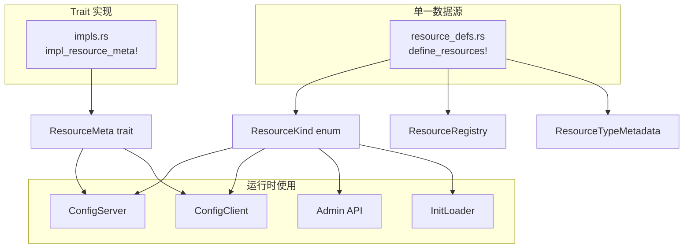

# Edgion 添加新资源类型完整指南

本文档记录如何在 Edgion 中添加一个新的 Kubernetes 资源类型。利用统一的宏系统，添加新资源变得更加简单。

## 概述

Edgion 采用**单一数据源 + 宏生成**的架构：

- `resource_defs.rs` - 所有资源类型的元数据定义（单一数据源）
- `impl_resource_meta!` 宏 - 自动生成 ResourceMeta trait 实现
- 辅助函数 - 统一处理资源的加载、列表、查询等操作

### CRD 版本与兼容策略（务必遵循）

- 始终以"最新/最稳定版本"为存储版（storageVersion）。旧版只作为输入格式，统一向新版本/内部模型转换，禁止"降级"写回旧版。
- Gateway API 已 GA 的资源（Gateway/GatewayClass/HTTPRoute/GRPCRoute 等）保持 `v1`，除非上游发布新主版本并提供明确迁移路径。
- 处于 Alpha/Beta 的资源（如 BackendTLSPolicy 当前 `v1alpha3`，需兼容历史 `v1alpha2`）推荐：
  - CRD 多版本：storage = 最新，旧版标记为 served。
  - 有条件时使用 Conversion Webhook，由 API Server 统一转换；否则在控制器中同时 watch 多版本，转换为单一内部模型。
  - 新增字段在旧版转换时要有安全默认值；重命名/类型变化需显式映射并记录日志。
- 升级流程：先更新 CRD（新增新版本并设为 storage），再上线具备转换能力的控制器；保持旧版 served 一段时间，确认无旧对象后再考虑移除。

---

## 快速清单

添加新资源类型只需修改以下几个核心位置：

### 必须修改

1. **`src/types/resources/your_resource/mod.rs`** - 定义资源结构体（CustomResource）
2. **`src/types/resources/mod.rs`** - 导出新模块
3. **`src/types/resource_defs.rs`** - 在 `define_resources!` 宏中添加资源定义
4. **`src/types/resource_meta_traits/impls.rs`** - 使用 `impl_resource_meta!` 宏实现 trait
5. **`src/core/conf_sync/conf_server/config_server.rs`** - 添加 `ServerCache<T>` 字段
6. **`src/core/conf_sync/conf_client/config_client.rs`** - 添加 `ClientCache<T>` 字段
7. **`src/core/cli/config/mod.rs`** - 添加容量配置字段和 `get_capacity()` 分支

### 按需修改

8. **`src/core/conf_mgr/conf_store/init_loader.rs`** - 添加加载分支
9. **`src/core/api/controller/common.rs`** - 更新辅助宏（如 `list_all_resources!`）
10. **`src/core/api/gateway/mod.rs`** - 更新 Gateway Admin API 宏
11. **配置文件** - CRD 定义、示例配置

---

## 详细步骤

### 步骤 1: 定义资源类型

#### 1.1 创建资源结构体

在 `src/types/resources/` 下创建新目录和模块：

```rust
// src/types/resources/your_resource/mod.rs
use kube::CustomResource;
use schemars::JsonSchema;
use serde::{Deserialize, Serialize};

#[derive(CustomResource, Serialize, Deserialize, Debug, Clone, JsonSchema)]
#[kube(
    group = "edgion.io",
    version = "v1",
    kind = "YourResource",
    plural = "yourresources",
    shortname = "yr",
    namespaced,  // 如果是 cluster-scoped 资源，移除此行
    status = "YourResourceStatus"
)]
#[serde(rename_all = "camelCase")]
pub struct YourResourceSpec {
    pub some_field: String,
    // ... 其他字段
}

#[derive(Serialize, Deserialize, Debug, Clone, JsonSchema, Default)]
pub struct YourResourceStatus {
    // 状态字段
}
```

#### 1.2 导出模块

```rust
// src/types/resources/mod.rs
pub mod your_resource;
pub use your_resource::*;
```

### 步骤 2: 注册到统一资源系统

#### 2.1 在 `resource_defs.rs` 中添加定义

这是**最关键的一步**，所有资源元数据都集中在这里：

```rust
// src/types/resource_defs.rs
define_resources! {
    // ... 现有资源 ...
    
    // 添加新资源（按类别分组）
    YourResource {
        kind_id: 20,                      // 使用下一个可用 ID
        kind_name: "YourResource",
        api_group: "edgion.io",
        api_version: "v1",
        plural: "yourresources",
        is_namespaced: true,              // 或 false（cluster-scoped）
        is_k8s_native: false,             // 是否为 k8s 原生资源
    }
}
```

#### 2.2 使用宏实现 ResourceMeta trait

```rust
// src/types/resource_meta_traits/impls.rs
use crate::types::resources::YourResource;

// 标准实现（适用于大多数资源）
impl_resource_meta!(YourResource);

// 如果需要自定义 pre_parse，使用带闭包的版本：
impl_resource_meta!(YourResource, |resource| {
    // 自定义预处理逻辑
    resource.init_runtime();
});
```

### 步骤 3: 配置同步层集成

#### 3.1 更新 ConfigServer

```rust
// src/core/conf_sync/conf_server_old/config_server.rs

pub struct ConfigServer {
    // ... 现有字段 ...
    pub your_resources: ServerCache<YourResource>,
}

impl ConfigServer {
    pub fn new(base_conf: GatewayBaseConf, conf_sync_config: &ConfSyncConfig) -> Self {
        Self {
            // ... 现有初始化 ...
            your_resources: ServerCache::new(
                conf_sync_config.get_capacity(ResourceKind::YourResource) as usize
            ),
        }
    }
    
    // 添加 list/watch 方法
    pub fn list_your_resources(&self) -> ListData<YourResource> {
        self.your_resources.list()
    }
    
    pub fn watch_your_resources(
        &self,
        client_id: String,
        client_name: String,
        from_version: u64,
    ) -> mpsc::Receiver<WatchResponse<YourResource>> {
        self.your_resources.watch(client_id, client_name, from_version)
    }
}
```

#### 3.2 更新 ConfigClient

```rust
// src/core/conf_sync/conf_client/config_client.rs

pub struct ConfigClient {
    // ... 现有字段 ...
    pub your_resources: ClientCache<YourResource>,
}
```

#### 3.3 添加容量配置

```rust
// src/core/cli/config/mod.rs

pub struct ConfSyncConfig {
    // ... 现有字段 ...
    
    #[arg(skip)]
    #[serde(default = "default_capacity")]
    pub your_resources_capacity: u32,
}

impl ConfSyncConfig {
    pub fn get_capacity(&self, kind: ResourceKind) -> u32 {
        match kind {
            // ... 现有分支 ...
            ResourceKind::YourResource => self.your_resources_capacity,
        }
    }
}
```

### 步骤 4: 添加加载逻辑

```rust
// src/core/conf_mgr/conf_store/init_loader.rs

// 对于简单资源，使用 load_simple 函数：
Some(ResourceKind::YourResource) => {
    load_simple::<YourResource>(
        content, name, "YourResource", 
        &config_server.your_resources, &mut stats
    );
}

// 对于需要验证的路由类资源，使用 load_route_with_validation：
Some(ResourceKind::YourRoute) => {
    load_route_with_validation::<YourRoute, _>(
        content, name, "YourRoute", 
        &config_server.your_routes, &mut stats,
        |r| validate_your_route_if_enabled(r),
    );
}
```

### 步骤 5: 更新 Admin API 宏

#### 5.1 Controller Admin API

```rust
// src/core/api/controller/common.rs

#[macro_export]
macro_rules! list_all_resources {
    ($server:expr, $kind:expr) => {{
        match $kind {
            // ... 现有分支 ...
            ResourceKind::YourResource => list_to_json!($server.your_resources.list().data),
        }
    }};
}

// 同样更新其他宏：list_namespaced_resources!, get_namespaced_resource!, resource_exists_namespaced!
```

#### 5.2 Gateway Admin API

```rust
// src/core/api/gateway/mod.rs

macro_rules! list_client_resources {
    ($client:expr, $kind:expr) => {{
        match $kind {
            // ... 现有分支 ...
            ResourceKind::YourResource => to_json_vec($client.your_resources.list()),
        }
    }};
}

// 同样更新 get_client_resource! 宏
```

### 步骤 6: 配置文件

#### 6.1 Kubernetes CRD

```yaml
# config/crd/edgion-crd/your_resource_crd.yaml
apiVersion: apiextensions.k8s.io/v1
kind: CustomResourceDefinition
metadata:
  name: yourresources.edgion.io
spec:
  group: edgion.io
  names:
    kind: YourResource
    plural: yourresources
    shortNames:
    - yr
  scope: Namespaced
  versions:
  - name: v1
    served: true
    storage: true
    schema:
      openAPIV3Schema:
        type: object
        properties:
          spec:
            type: object
            # ... schema 定义
```

#### 6.2 示例配置

```yaml
# examples/conf/YourResource_default_example.yaml
apiVersion: edgion.io/v1
kind: YourResource
metadata:
  name: example
  namespace: default
spec:
  someField: "value"
```

#### 6.3 控制器配置

```toml
# config/edgion-controller.toml
[conf_sync]
your_resources_capacity = 200
```

---

## 架构说明

### 资源元数据流转



### 关键宏和函数

| 名称 | 位置 | 作用 |
|------|------|------|
| `define_resources!` | `resource_defs.rs` | 定义所有资源元数据 |
| `impl_resource_meta!` | `resource_meta_traits/impls.rs` | 自动实现 ResourceMeta trait |
| `load_simple()` | `init_loader.rs` | 加载简单资源 |
| `load_route_with_validation()` | `init_loader.rs` | 加载需验证的路由资源 |
| `list_all_resources!` | `api/controller/common.rs` | 列出所有资源 |
| `list_client_resources!` | `api/gateway/mod.rs` | 从 ConfigClient 列出资源 |

---

## 编译时保护

添加新资源后，如果遗漏了某些 `match` 分支，编译器会报错：

```
error[E0004]: non-exhaustive patterns: `ResourceKind::YourResource` not covered
```

这确保了新资源类型在所有需要处理的地方都被正确处理。

---

## 常见问题

### Q: ResourceKind 的 kind_id 如何分配？

A: 查看 `resource_defs.rs` 中现有资源的最大 ID，使用下一个数字。ID 用于序列化和枚举值。

### Q: 何时需要自定义 pre_parse()？

A: 当资源需要在加载后进行预处理时：
- 初始化运行时对象（如插件运行时）
- 构建查找表或索引
- 验证配置的一致性

使用带闭包的 `impl_resource_meta!` 宏版本：

```rust
impl_resource_meta!(YourResource, |resource| {
    resource.init_something();
});
```

### Q: 如何区分 namespaced 和 cluster-scoped 资源？

A: 在 `resource_defs.rs` 中设置 `is_namespaced`:
- `true` - 资源属于特定 namespace
- `false` - 资源是集群级别的（如 GatewayClass）

### Q: 忘记修改某个文件会怎样？

A: Rust 编译器会在大多数情况下报错：
- 忘记 `resource_defs.rs` → `ResourceKind` 缺少变体
- 忘记 `impls.rs` → ResourceMeta trait 未实现
- 忘记 `match` 分支 → 非穷尽模式匹配错误

---

## 检查清单

提交前确认：

- [ ] `src/types/resources/your_resource/mod.rs` - 资源定义
- [ ] `src/types/resources/mod.rs` - 模块导出
- [ ] `src/types/resource_defs.rs` - `define_resources!` 宏
- [ ] `src/types/resource_meta_traits/impls.rs` - `impl_resource_meta!` 宏
- [ ] `src/core/conf_sync/conf_server/config_server.rs` - ServerCache 字段
- [ ] `src/core/conf_sync/conf_client/config_client.rs` - ClientCache 字段
- [ ] `src/core/cli/config/mod.rs` - 容量配置和 `get_capacity()`
- [ ] `src/core/conf_mgr/conf_store/init_loader.rs` - 加载分支
- [ ] Admin API 宏更新（如需要）
- [ ] `cargo build` 编译通过
- [ ] `cargo test` 测试通过
- [ ] 集成测试通过

---

## 参考资源

- [Kubernetes Custom Resources](https://kubernetes.io/docs/concepts/extend-kubernetes/api-extension/custom-resources/)
- [kube-rs Documentation](https://docs.rs/kube/latest/kube/)
- [Gateway API Specification](https://gateway-api.sigs.k8s.io/)

---

**最后更新**: 2026-01-11  
**文档版本**: v2.0（统一宏系统）
