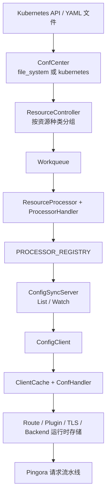

# Edgion 架构概览

> 面向贡献者的当前架构总览。
> 如果是 AI 工具协作，请先从仓库根的 `AGENTS.md` 和 `skills/SKILL.md` 进入。

## 系统全景

Edgion 采用 Controller / Gateway 分离架构：

- **Controller** 负责监听配置源、校验资源、构建控制面状态，并通过 gRPC 下发。
- **Gateway** 负责接收同步数据、构建运行时存储，并通过 Pingora 处理流量。

## 模块边界

### `src/types/`

这里存放跨二进制共享的数据定义。

- `src/types/resources/`：具体资源结构体，如 `Gateway`、`HTTPRoute`、`EdgionTls`、`EdgionPlugins`
- `src/types/resource/`：资源系统核心，包括 `kind.rs`、`defs.rs`、`meta/`、`registry.rs`
- `src/types/ctx.rs`：请求级上下文 `EdgionHttpContext`
- `src/types/constants/`：注解、标签、Header、Secret Key 等常量

### `src/core/controller/`

这里是控制面逻辑。

- `conf_mgr/conf_center/`：文件系统模式和 Kubernetes 模式
- `conf_mgr/sync_runtime/workqueue.rs`：按资源种类拆分的队列与重试
- `conf_mgr/sync_runtime/resource_processor/`：各资源 handler 和跨资源 requeue
- `conf_mgr/processor_registry.rs`：全局 processor 注册表
- `conf_sync/conf_server/`：gRPC 配置同步服务，底层由已注册的 watch object 支撑
- `api/`：Controller Admin API

### `src/core/gateway/`

这里是数据面逻辑。

- `conf_sync/conf_client/`：gRPC 配置同步客户端
- `conf_sync/cache_client/`：按资源种类拆分的 `ClientCache<T>`
- `routes/`：HTTP/gRPC/TCP/TLS/UDP 运行时
- `plugins/`：HTTP 和 stream 插件运行时
- `tls/`：证书存储和 TLS 运行时
- `backends/`：服务发现、健康检查、后端策略
- `api/`：Gateway Admin API

### `src/core/common/`

跨二进制共享的模块。

- `common/conf_sync/`：proto、共享 trait、同步类型
- `common/config/`：启动期共享配置
- `common/matcher/`：主机名/IP 匹配工具
- `common/utils/`：metadata、duration、network、request 等工具

## 控制面配置处理链路

当前 Controller 侧的处理模型是：

1. `ConfCenter` 监听配置源，并把对象持久化到 center storage。
2. 每种资源有一个 `ResourceController`，负责把 key 推入 `Workqueue`。
3. `ResourceProcessor<T>` 从队列取 key，驱动对应的 `ProcessorHandler`。
4. Handler 负责校验、preparse、parse、注册引用、触发 requeue、更新 status。
5. 每个 processor 都会暴露一个 `WatchObj`。
6. `PROCESSOR_REGISTRY` 汇总所有已注册 processor 及其 watch object。
7. `ConfigSyncServer` 基于这些 watch object 提供 `List` / `Watch`。

这也是为什么当前架构已经不再依赖“给一个巨大的 controller-side server struct 手动加一个资源字段”的旧模式。

## 数据面运行链路

当前 Gateway 侧的处理模型是：

1. `ConfigClient` 为每个需要同步的 kind 创建一个 `ClientCache<T>`。
2. 每个 cache 绑定一个领域专属 `ConfHandler`。
3. `List` / `Watch` 数据反序列化后进入对应 cache。
4. Handler 再更新 route manager、plugin store、TLS store、backend store、base-conf store 等运行时结构。
5. Pingora 在以下阶段读取这些运行时结构：
   - listener 和 TLS 选择
   - 路由匹配
   - 插件执行
   - 后端选择与负载均衡
   - access log 输出

## 排障时最有用的入口

- Controller CRUD 和 server cache：
  - `src/core/controller/api/namespaced_handlers.rs`
  - `src/core/controller/api/cluster_handlers.rs`
  - `src/core/controller/api/configserver_handlers.rs`
- Controller 处理链路：
  - `src/core/controller/conf_mgr/sync_runtime/resource_processor/`
  - `src/core/controller/conf_mgr/processor_registry.rs`
- Gateway 同步和运行时：
  - `src/core/gateway/conf_sync/conf_client/config_client.rs`
  - `src/core/common/conf_sync/traits.rs`
- CLI 检查：
  - `edgion-ctl --target center`
  - `edgion-ctl --target server`
  - `edgion-ctl --target client`

实际排障时，先比对 `server` 和 `client` 两侧视图，通常最快就能判断问题是在 controller 解析、同步链路，还是 gateway 运行时。

## 相关文档

- [资源架构总览](./resource-architecture-overview.md)：单个资源从类型注册到运行时的完整链路
- [资源注册指南](./resource-registry-guide.md)：`src/types/resource/` 下的统一注册模型
- [添加新资源类型指南](./add-new-resource-guide.md)：贡献者新增资源的落地流程
- [AI 协作与 Skills 使用指南](./ai-agent-collaboration.md)：人和 AI 如何进入这棵知识树
