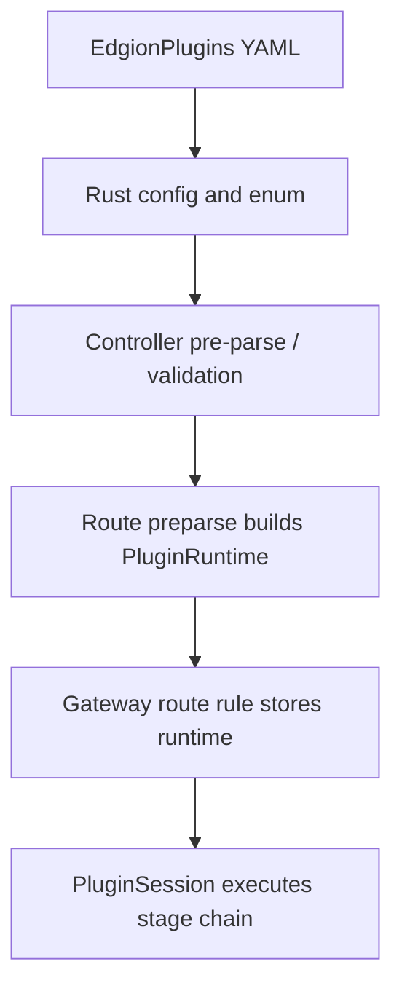

# HTTP 插件开发指南

本文档面向需要扩展 `EdgionPlugins` 的贡献者，解释 HTTP 插件在 Edgion 中的执行阶段、资源到运行时的接线方式，以及实现时最常漏掉的几段。

> 面向 AI / Agent 的主 workflow 入口现在是 [../../../skills/development/01-edgion-plugin-dev.md](../../../skills/development/01-edgion-plugin-dev.md)。
> 本文档保留给人看的背景说明、实现边界和人工审查清单。

## 这类插件解决什么问题

`EdgionPlugins` 是 Edgion 的 HTTP 层扩展机制，主要服务于 `HTTPRoute` / `GRPCRoute` 这类七层流量处理场景。

和 stream plugin 相比，它的特点是：

- 运行在 HTTP 请求/响应生命周期里
- 能访问请求头、路径、cookie、ctx 变量、上游响应等 richer session 上下文
- 可以返回 HTTP 错误、直接终止请求、或者修改上下游读写行为

如果你的需求依赖：

- Header / Cookie / Query
- 鉴权、限流、重写、镜像
- 上游响应头或响应体处理

通常它属于 HTTP 插件，而不是 stream plugin。

## 当前执行模型

Edgion 目前保留四个主要插件阶段：

1. `RequestFilter`
2. `UpstreamResponseFilter`
3. `UpstreamResponseBodyFilter`
4. `UpstreamResponse`

可以把它简单理解为：

- 请求发到上游前
- 上游响应头回来时
- 上游响应体流经时
- 上游响应完整结束后

其中最常见的仍然是 `RequestFilter`。  
如果需求只需要在请求进入上游前处理，优先用这个阶段，不要默认往更晚的阶段塞。

## 当前架构里的关键链路

最容易漏掉的点通常是：

- 只加了配置结构，没有把 plugin variant 接到 runtime 构造逻辑
- 只写了 plugin 实现，没有让路由预解析时真正构建 `PluginRuntime`
- 插件本身可运行，但条件执行、ctx 变量传递、PluginLog 没接好

## 相关代码位置

如果你要新增或扩展 HTTP 插件，通常会碰到这几块：

### 资源与配置

- `src/types/resources/edgion_plugins/`
- `src/types/resources/edgion_plugins/plugin_configs/`
- `src/types/resources/edgion_plugins/edgion_plugin.rs`

这里负责：

- 配置 schema
- plugin enum
- 资源导出与重用类型

### 运行时与 trait

- `src/core/gateway/plugins/runtime/traits/`
- `src/core/gateway/plugins/runtime/plugin_runtime.rs`
- `src/core/gateway/plugins/runtime/conditional_filter.rs`
- `src/core/gateway/plugins/runtime/log.rs`

这里负责：

- 不同阶段的 trait
- `PluginRuntime` 的构造和执行
- `skip` / `run` 条件包装
- PluginLog 记录

### 插件实现

- `src/core/gateway/plugins/http/`

每个插件通常一个独立目录，例如：

- `basic_auth/`
- `rate_limit/`
- `jwt_auth/`
- `real_ip/`

## 插件阶段怎么选

### `RequestFilter`

适合：

- 认证
- 限流
- 路径/主机重写
- 请求镜像
- 在去上游前直接拒绝

这是默认起点。

### `UpstreamResponseFilter`

适合：

- 改响应头
- 基于已返回的响应头做快速判断

### `UpstreamResponseBodyFilter`

适合：

- 对流式 body 做节流或检查
- 需要按 chunk 处理的逻辑

### `UpstreamResponse`

适合：

- 依赖完整响应结束后的处理

当前这一阶段在仓库里不是最常见入口，除非需求真的需要它，否则先不要默认使用。

## 条件执行与跨插件传值

当前实现不是“裸执行插件列表”，而是会通过条件包装器做额外判断：

- `ConditionalRequestFilter`
- `ConditionalUpstreamResponseFilter`
- 其他对应阶段的 conditional wrapper

这意味着：

- 插件是否执行，不只取决于它是否存在
- 还取决于 route/plugin entry 上的 `skip` / `run` 条件

另一个常见能力是通过 `PluginSession` 的 ctx 变量传值。  
典型模式是前一个插件写入上下文，后一个插件读取，例如：

- RealIp 写入真实客户端信息
- RateLimit 或 Auth 相关插件读取这些上下文

如果你的插件依赖前置插件结果，优先走 ctx 变量，不要重复重新解析整份请求。

## 预解析与运行时构建

一个关键事实是：

- `PluginRuntime` 不是在每个请求到来时临时拼装的
- 它是在 route 预解析阶段根据 `EdgionPlugins` / Gateway API filters 一次性构建的

这意味着实现新插件时，除了写 trait，还要确认：

- plugin enum 能被 runtime 创建
- 配置变更后 runtime 会随路由重新构建
- validation error 能在预解析阶段暴露出来

## 开发时建议顺序

1. 先决定阶段，通常从 `RequestFilter` 开始。
2. 定义配置结构，并确认哪些字段是用户配置、哪些字段是 runtime 派生。
3. 把类型接入 `EdgionPlugin` enum。
4. 在 `src/core/gateway/plugins/http/<plugin>/` 下实现插件。
5. 在 `PluginRuntime` 的构造逻辑里注册这个新类型。
6. 确认是否需要条件执行、ctx 变量传递、PluginLog 输出。
7. 最后补测试和用户文档。

如果你是让 AI 来做，直接从 skill 入口开始更稳：

- [../../../skills/development/01-edgion-plugin-dev.md](../../../skills/development/01-edgion-plugin-dev.md)

## 测试与验证

至少建议覆盖四类：

### 1. 配置与预解析

- 配置是否合法
- validation error 是否能暴露到 status / parse 阶段

### 2. 运行时行为

- 插件命中时是否按预期修改请求或响应
- 错误分支是否会返回正确的终止结果

### 3. 条件执行

- `skip` / `run` 条件是否按预期生效

### 4. 组合行为

- 与已有插件一起执行时，顺序和 ctx 变量传递是否正确

## 人工审查清单

- 插件阶段选得对不对
- config、enum、runtime、module export 是否都接齐
- 是否正确使用 `PluginSession` API，而不是绕过统一抽象
- 是否需要 PluginLog 记录关键结果
- 是否有条件执行或跨插件 ctx 依赖
- 测试是否覆盖成功、失败、跳过和组合场景

## 相关文档

- [插件系统架构](./architecture-overview.md)
- [Stream Plugin 开发指南](./stream-plugin-development.md)
- [HTTPRoute Filters 用户文档](../user-guide/http-route/filters/overview.md)
- [AI 协作与 Skills 使用指南](./ai-agent-collaboration.md)
- [知识来源映射与维护规则](./knowledge-source-map.md)
