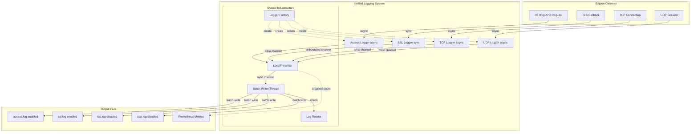

# Edgion 日志系统架构

本文档介绍 Edgion 的统一日志系统架构，包括 Access Log、SSL Log、TCP Log 和 UDP Log 的设计与实现。

## 概览

Edgion 提供了统一的日志基础设施，支持四种日志类型：
- **Access Log**：记录所有 HTTP/HTTPS/gRPC 请求（默认启用）
- **SSL Log**：记录所有 TLS 握手和证书回调事件（默认启用）
- **TCP Log**：记录所有 TCP 连接和数据传输（默认禁用）
- **UDP Log**：记录所有 UDP 会话和数据传输（默认禁用）

### 核心特性

- **统一配置**：所有日志类型使用相同的配置模式（enabled + output + rotation）
- **批处理写入**：减少系统调用，提升性能
- **日志轮转**：按时间或大小自动轮转
- **多种输出**：本地文件、Elasticsearch、Kafka（未来支持）
- **Metrics 集成**：记录丢弃日志数量
- **灵活控制**：每种日志可独立启用/禁用

## 架构设计

### 整体架构



### 日志类型对比

| 日志类型 | 默认状态 | API 类型 | 用途 | 典型场景 |
|---------|---------|---------|------|---------|
| **Access Log** | ✅ Enabled | Async | HTTP/gRPC 流量分析 | 请求追踪、性能分析、审计 |
| **SSL Log** | ✅ Enabled | Sync | TLS 握手诊断 | 证书问题排查、mTLS 调试 |
| **TCP Log** | ❌ Disabled | Async | TCP 连接分析 | 低级网络调试、连接问题排查 |
| **UDP Log** | ❌ Disabled | Async | UDP 会话分析 | DNS/QUIC 等 UDP 协议调试 |

**默认启用策略**：
- Access Log 和 SSL Log 默认启用，因为它们对于生产环境的可观测性至关重要
- TCP Log 和 UDP Log 默认禁用，因为它们是低级协议日志，仅在需要深度网络调试时启用

### 关键特性

#### 1. 非阻塞保证

- **Access/TCP/UDP Log**：使用 async API，不阻塞 tokio runtime
- **SSL Log**：使用 unbounded channel 桥接，保证 TLS callback 永不阻塞（TLS callback 必须是同步的）

```rust
// SSL Log - 同步 API，内部使用 unbounded channel
#[inline]
pub fn log_ssl(entry: &SslLogEntry) {
    if let Some(logger) = SSL_LOGGER.get() {
        // UnboundedSender::send() 永不阻塞
        let _ = logger.tx.send(entry.to_json());
    }
}
```

#### 2. 批处理写入

LocalFileWriter 实现批处理写入逻辑：

```rust
// 阻塞等待第一条日志
while let Ok(first_line) = rx.recv() {
    let _ = writeln!(file, "{}", first_line);
    
    // 批量处理剩余日志（最多 999 条，总共 1000 条）
    for _ in 0..999 {
        match rx.try_recv() {
            Ok(line) => {
                let _ = writeln!(file, "{}", line);
            }
            Err(_) => break,
        }
    }
    
    // 一次性 flush
    file.flush();
}
```

**性能优势**：
- 减少约 1000 倍的 `write()` 系统调用
- 减少约 1000 倍的 `flush()` 系统调用
- 显著降低 I/O 压力

#### 3. 日志轮转

支持三种轮转策略：

| 策略 | 说明 | 适用场景 |
|------|------|----------|
| `Size` | 按文件大小轮转 | 高流量场景，避免单文件过大 |
| `Daily` | 每日轮转（午夜） | 按日归档，便于分析 |
| `Hourly` | 每小时轮转 | 高频归档，便于实时分析 |
| `Never` | 不轮转 | 开发测试环境 |

轮转文件命名规则：
- **时间轮转**：`access.log.2025-01-05` 或 `access.log.2025-01-05-14`
- **大小轮转**：`access.log.1`, `access.log.2`, `access.log.3`

自动清理旧文件，保留最近 N 个（可配置 `max_files`）。

#### 4. Metrics 集成

当队列满导致日志丢弃时，自动记录 metrics：

```rust
async fn send(&self, data: String) -> Result<()> {
    if let Some(sender) = &self.sender {
        if sender.try_send(data).is_err() {
            // 记录丢弃指标
            global_metrics().access_log_dropped();
        }
    }
    Ok(())
}
```

可通过 Prometheus 监控 `access_log_dropped` 指标，及时发现问题。

## 模块详解

### Access Logger

**位置**：`src/core/observe/access_log/`

**架构**：

```rust
pub struct AccessLogger {
    senders: Vec<Box<dyn DataSender<String>>>,
}
```

- 支持多个输出目标（当前使用第一个健康的 sender）
- 插件化设计，便于扩展新的输出类型

**初始化流程**：

1. 读取配置 `AccessLogConfig`
2. 根据 `StringOutput` 类型创建相应的 `DataSender`
3. 调用 `sender.init()` 初始化（创建文件、连接数据库等）
4. 注册到全局 `AccessLogger`

### SSL Logger

**位置**：`src/core/observe/ssl_log.rs`

**架构**：

```rust
pub struct SslLogger {
    // 使用 unbounded channel 桥接异步 LocalFileWriter
    tx: mpsc::UnboundedSender<String>,
}
```

**设计要点**：

1. **同步 API**：`log_ssl()` 是同步函数，可在 TLS callback 中安全调用
2. **异步桥接**：内部使用 tokio unbounded channel 转发到异步 `LocalFileWriter`
3. **向后兼容**：保留 `SslLogEntry` 结构体，API 不变

**初始化流程**：

```rust
// 1. 创建 LocalFileWriter
let writer = LocalFileWriter::new(ssl_cfg);

// 2. 初始化 SSL Logger（内部启动 tokio task）
init_ssl_logger(writer).await?;

// 3. 在 TLS callback 中使用
log_ssl(&entry);  // 同步调用，永不阻塞
```

### TCP Logger

**位置**：`src/core/observe/tcp_log.rs`

**架构**：

```rust
static TCP_LOGGER: OnceLock<Arc<AccessLogger>> = OnceLock::new();

pub struct TcpLogEntry {
    pub ts: i64,
    pub listener_port: u16,
    pub client_addr: String,
    pub client_port: u16,
    pub upstream_addr: Option<String>,
    pub duration_ms: u64,
    pub bytes_sent: u64,
    pub bytes_received: u64,
    pub status: String,
    pub connection_established: bool,
}
```

**使用方式**：

```rust
// 在 TCP 连接结束时记录
let log_entry = TcpLogEntry::from_context(&tcp_context);
log_tcp(&log_entry).await;
```

**记录时机**：
- 仅当连接成功建立后（`connection_established = true`）才记录日志
- 记录完整的连接生命周期信息：建立、数据传输、关闭

**日志内容**：
- 客户端信息（地址、端口）
- 上游信息（地址、端口）
- 连接时长
- 字节传输统计（发送/接收）
- 连接状态（Success, UpstreamConnectionFailed, ReadError, WriteError 等）

### UDP Logger

**位置**：`src/core/observe/udp_log.rs`

**架构**：

```rust
static UDP_LOGGER: OnceLock<Arc<AccessLogger>> = OnceLock::new();

pub struct UdpLogEntry {
    pub ts: i64,
    pub listener_port: u16,
    pub client_addr: String,
    pub client_port: u16,
    pub upstream_addr: Option<String>,
    pub session_duration_ms: u64,
    pub packets_sent: u64,
    pub packets_received: u64,
    pub bytes_sent: u64,
    pub bytes_received: u64,
}
```

**使用方式**：

```rust
// 在 UDP session 超时清理时记录
let log_entry = UdpLogEntry::new(
    listener_port,
    client_addr,
    client_port,
    upstream_addr,
    session_start,
).with_stats(packets_sent, packets_received, bytes_sent, bytes_received);

log_udp(&log_entry).await;
```

**记录时机**：
- Session 超时（默认 60 秒无活动）时自动记录
- 记录整个 session 的统计信息

**日志内容**：
- 客户端信息（地址、端口）
- 上游信息（地址、端口）
- Session 时长
- 包传输统计（发送/接收包数）
- 字节传输统计（发送/接收字节数）

**Session 管理**：
- 每个客户端地址维护独立的 session
- 使用原子变量（`AtomicU64`）进行线程安全的统计更新
- 后台任务定期清理超时 session 并记录日志

### LocalFileWriter

**位置**：`src/core/link_sys/local_file/`

**职责**：
- 管理日志文件的打开、写入、关闭
- 实现批处理写入
- 实现日志轮转
- 记录 metrics

**配置**：

```rust
pub struct LocalFileWriterConfig {
    pub path: String,              // 相对路径（相对于 work_dir）
    pub queue_size: Option<usize>, // 队列大小，默认 cores * 10000
    pub rotation: RotationConfig,  // 轮转配置
}

pub struct RotationConfig {
    pub strategy: RotationStrategy,      // 轮转策略
    pub max_files: usize,                // 保留文件数
    pub check_interval_secs: u64,        // 检查间隔
}
```

**关键方法**：

- `init()` - 初始化，创建目录和后台线程
- `send()` - 发送日志（非阻塞）
- `healthy()` - 检查健康状态

## 配置示例

### Access Log 配置

```toml
[access_log.output.localFile]
path = "logs/edgion_access.log"
queue_size = 100000  # 可选，默认 cores * 10000

[access_log.output.localFile.rotation]
strategy = "daily"  # 或 "hourly", "never", { size = 104857600 }
max_files = 10
check_interval_secs = 30
```

### SSL Log 配置

```toml
[ssl_log]
enabled = true

[ssl_log.output.localFile]
path = "logs/ssl.log"
queue_size = 100000

[ssl_log.output.localFile.rotation]
strategy = { size = 104857600 }  # 100MB per file
max_files = 10
check_interval_secs = 30
```

### TCP Log 配置

```toml
[tcp_log]
enabled = false  # 默认禁用，按需启用

[tcp_log.output.localFile]
path = "logs/tcp.log"
queue_size = 50000

[tcp_log.output.localFile.rotation]
strategy = "daily"  # 推荐按日轮转
max_files = 10
check_interval_secs = 30
```

### UDP Log 配置

```toml
[udp_log]
enabled = false  # 默认禁用，按需启用

[udp_log.output.localFile]
path = "logs/udp.log"
queue_size = 50000

[udp_log.output.localFile.rotation]
strategy = "daily"  # 推荐按日轮转
max_files = 10
check_interval_secs = 30
```

### 统一配置模式

所有日志类型都遵循相同的配置结构：

```toml
[<log_type>]
enabled = true/false  # 启用/禁用日志

[<log_type>.output.localFile]
path = "logs/<log_type>.log"
queue_size = <optional>

[<log_type>.output.localFile.rotation]
strategy = "daily" | "hourly" | "never" | { size = <bytes> }
max_files = <number>
check_interval_secs = <seconds>
```

**配置优先级**：
1. `enabled` 标志（false 则不初始化）
2. `output` 配置（LocalFile/Elasticsearch/Kafka）
3. `queue_size`（可选，默认 cores * 10000）
4. `rotation`（可选，默认 100MB 按大小轮转）

## 日志格式示例

所有日志都以 JSON 格式输出，每行一条记录。以下是各类日志的格式示例：

### Access Log（HTTP/gRPC）

```json
{
  "ts": 1704470400123,
  "request_info": {
    "method": "GET",
    "path": "/api/v1/users",
    "status": 200,
    "x_trace_id": "abc123-def456",
    "host": "example.com",
    "user_agent": "curl/7.88.0"
  },
  "match_info": {
    "route_name": "user-api",
    "route_namespace": "default"
  },
  "backend_context": {
    "upstreams": [{
      "ip": "10.0.1.5",
      "port": 8080,
      "response_time_ms": 45
    }]
  },
  "errors": [],
  "plugin_logs": [],
  "conn_est": true
}
```

### SSL Log（TLS 握手）

```json
{
  "ts": 1704470400456,
  "sni": "example.com",
  "cert": "default/example-cert",
  "mtls": false
}
```

**错误示例**：
```json
{
  "ts": 1704470400789,
  "sni": "unknown.com",
  "error": "Certificate not found for SNI: unknown.com"
}
```

### TCP Log（TCP 连接）

```json
{
  "ts": 1704470401000,
  "listener_port": 9000,
  "client_addr": "192.168.1.100",
  "client_port": 54321,
  "upstream_addr": "10.0.1.10:8000",
  "duration_ms": 5432,
  "bytes_sent": 1024000,
  "bytes_received": 2048000,
  "status": "Success",
  "connection_established": true
}
```

**连接失败示例**：
```json
{
  "ts": 1704470402000,
  "listener_port": 9000,
  "client_addr": "192.168.1.101",
  "client_port": 54322,
  "upstream_addr": null,
  "duration_ms": 10,
  "bytes_sent": 0,
  "bytes_received": 0,
  "status": "UpstreamConnectionFailed",
  "connection_established": false
}
```

### UDP Log（UDP 会话）

```json
{
  "ts": 1704470403000,
  "listener_port": 53,
  "client_addr": "192.168.1.200",
  "client_port": 12345,
  "upstream_addr": "8.8.8.8:53",
  "session_duration_ms": 60000,
  "packets_sent": 25,
  "packets_received": 25,
  "bytes_sent": 1280,
  "bytes_received": 2560
}
```

**说明**：
- `ts`：Unix 时间戳（毫秒）
- 所有字段使用 camelCase 命名
- 可选字段在为空时不会序列化（`skip_serializing_if`）
- 所有日志都是单行 JSON，便于解析和处理

## Metrics 监控

每种日志类型都有独立的 dropped 指标，用于监控队列满导致的日志丢失：

| Metric 名称 | 说明 | 触发条件 |
|------------|------|---------|
| `edgion_access_log_dropped_total` | Access 日志丢弃数 | Access 日志队列满 |
| `edgion_ssl_log_dropped_total` | SSL 日志丢弃数 | SSL 日志队列满 |
| `edgion_tcp_log_dropped_total` | TCP 日志丢弃数 | TCP 日志队列满 |
| `edgion_udp_log_dropped_total` | UDP 日志丢弃数 | UDP 日志队列满 |

**监控示例**：

```promql
# 查看最近 5 分钟各类日志的丢弃速率
rate(edgion_access_log_dropped_total[5m])
rate(edgion_ssl_log_dropped_total[5m])
rate(edgion_tcp_log_dropped_total[5m])
rate(edgion_udp_log_dropped_total[5m])

# 设置告警（任何日志丢弃都应该告警）
sum(rate(edgion_*_log_dropped_total[5m])) > 0
```

## 性能考虑

### 队列大小

默认队列大小 = `CPU 核心数 * 10000`

- **4 核**：40000 条日志
- **8 核**：80000 条日志
- **16 核**：160000 条日志

根据流量调整 `queue_size`：
- **高流量**（10K+ RPS）：增大到 200000+
- **低流量**（<1K RPS）：默认值足够
- **调试模式**：可减小到 10000

### 内存占用

估算公式：
```
内存 ≈ queue_size * avg_log_size
```

示例：
- 队列大小：100000
- 平均日志：200 字节
- 内存占用：≈ 20MB

### 批处理效果

| 场景 | 无批处理 | 批处理（1000） | 提升 |
|------|---------|---------------|------|
| RPS | 10000 | 10000 | - |
| write/s | 10000 | 10 | 1000x |
| CPU | 15% | 2% | 7.5x |

## 扩展新的输出类型

### 1. 实现 DataSender trait

```rust
use async_trait::async_trait;
use crate::core::link_sys::DataSender;

pub struct ElasticsearchSender {
    client: EsClient,
    index: String,
}

#[async_trait]
impl DataSender<String> for ElasticsearchSender {
    async fn init(&mut self) -> Result<()> {
        // 初始化连接
        self.client.connect().await
    }
    
    fn healthy(&self) -> bool {
        self.client.is_connected()
    }
    
    async fn send(&self, data: String) -> Result<()> {
        self.client.index(&self.index, data).await
    }
    
    fn name(&self) -> &str {
        "elasticsearch"
    }
}
```

### 2. 添加配置类型

```rust
// src/types/link_sys.rs
#[derive(Debug, Clone, Serialize, Deserialize, JsonSchema)]
#[serde(rename_all = "camelCase")]
pub enum StringOutput {
    LocalFile(LocalFileWriterCfg),
    Elasticsearch(ElasticsearchCfg),  // 新增
}
```

### 3. 更新初始化逻辑

```rust
// src/core/observe/access_log/mod.rs
match &config.output {
    StringOutput::LocalFile(cfg) => { /* ... */ }
    StringOutput::Elasticsearch(cfg) => {
        let sender = ElasticsearchSender::new(cfg);
        logger.register(Box::new(sender));
    }
}
```

## 故障排查

### 日志丢失

**症状**：日志文件中缺少某些请求记录

**原因**：
1. 队列满，日志被丢弃
2. 磁盘空间不足
3. 文件权限问题

**排查**：
1. 检查 metrics：`access_log_dropped` 是否增长
2. 检查磁盘空间：`df -h`
3. 检查文件权限：`ls -la logs/`
4. 增大 `queue_size` 配置

### 日志延迟

**症状**：日志写入延迟较大

**原因**：
1. 批处理导致的正常延迟（最多 1 秒）
2. 磁盘 I/O 慢
3. 队列积压

**排查**：
1. 检查磁盘 I/O：`iostat -x 1`
2. 检查队列深度（需添加 metrics）
3. 调整 `check_interval_secs` 减少轮转检查频率

### SSL 日志为空

**症状**：`ssl.log` 文件不存在或为空

**原因**：
1. `ssl_log.enabled = false`
2. 没有 TLS 流量
3. TLS 配置错误

**排查**：
1. 检查配置：`cat config/edgion-gateway.toml | grep ssl_log`
2. 检查启动日志：`grep "SSL logger initialized" logs/*.log`
3. 使用 `curl -k https://...` 测试 TLS

## 相关文件

### 核心实现

- `src/core/observe/access_log/` - Access Log 实现
- `src/core/observe/ssl_log.rs` - SSL Log 实现
- `src/core/link_sys/local_file/` - LocalFileWriter 实现
- `src/core/link_sys/data_sender_trait.rs` - DataSender trait 定义

### 配置

- `src/core/cli/edgion_gateway/config.rs` - Gateway 配置结构
- `src/types/link_sys.rs` - 日志输出配置类型
- `config/edgion-gateway.toml` - 配置示例

### 用户文档

- `docs/zh-CN/ops-guide/observability/access-log.md` - Access Log 运维指南
- `docs/zh-CN/ops-guide/gateway/tls/edgion-tls.md` - TLS 配置指南（包含 SSL Log 说明）

## 最佳实践

### 生产环境

1. **启用日志轮转**
   ```toml
   [access_log.output.localFile.rotation]
   strategy = { size = 104857600 }  # 100MB
   max_files = 30  # 保留 30 个文件（约 3GB）
   ```

2. **适当的队列大小**
   ```toml
   queue_size = 200000  # 高流量场景
   ```

3. **监控 metrics**
   - 配置 Prometheus 抓取 `/metrics`
   - 设置告警：`access_log_dropped > 0`

4. **定期归档**
   - 使用 logrotate 或自定义脚本
   - 压缩旧日志：`gzip logs/*.log.*`
   - 上传到对象存储

### 开发环境

1. **禁用日志轮转**
   ```toml
   [access_log.output.localFile.rotation]
   strategy = "never"
   ```

2. **减小队列大小**
   ```toml
   queue_size = 10000
   ```

3. **启用 SSL 日志**
   ```toml
   [ssl_log]
   enabled = true  # 调试 TLS 问题
   ```

## 未来计划

### 短期（v0.2）

- [ ] 添加 Elasticsearch 输出支持
- [ ] 添加 Kafka 输出支持
- [ ] 支持自定义日志格式
- [ ] 支持日志采样（高流量场景）

### 长期（v1.0）

- [ ] 支持结构化日志（JSON）
- [ ] 支持日志压缩
- [ ] 支持远程 syslog
- [ ] 支持日志脱敏

---

**最后更新**：2025-01-05  
**版本**：Edgion v0.1.0
