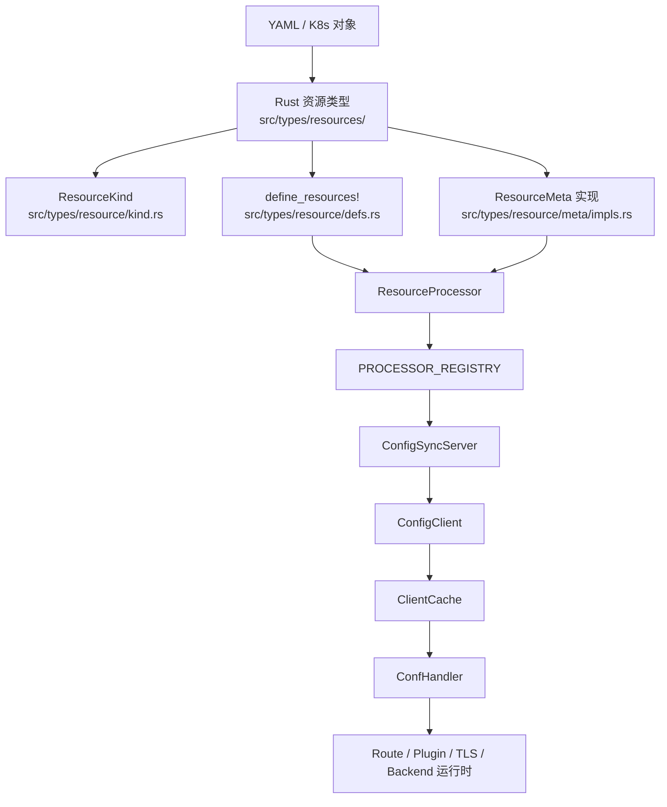

# 资源架构总览

> 本文档说明当前 Edgion 中一个资源如何从类型定义一路走到控制面处理、配置同步，再进入 Gateway 运行时。

## 端到端链路

## 1. 类型定义与注册

每一种资源都需要穿过 4 个注册面：

| 面向 | 当前路径 | 作用 |
|------|----------|------|
| Rust 类型 | `src/types/resources/` | 资源本体结构，定义 CRD 或 K8s 对象字段 |
| Kind 枚举 | `src/types/resource/kind.rs` | 控制面、同步层、网关运行时共用的穷举枚举 |
| 统一元数据 | `src/types/resource/defs.rs` | `define_resources!` 单一事实源，维护 cache 名、base-conf 标记、registry 可见性、endpoint 行为 |
| Meta 实现 | `src/types/resource/meta/impls.rs` | `ResourceMeta` 实现，包括 `key_name()`、版本读取、可选 `pre_parse()` |

`define_resources!` 条目里最关键的元数据通常包括：

- `enum_value`
- `kind_name`
- `cache_field`
- `cluster_scoped`
- `is_base_conf`
- `in_registry`

## 2. Controller 侧处理

当资源进入文件系统或 Kubernetes 存储后，Controller 侧的处理链路由 config center 和 processor 栈驱动：

1. `ConfCenter` 实现先把原始对象放进存储。
2. 每个 kind 对应一个 `ResourceController`，负责把 key 推入队列。
3. `ResourceProcessor<T>` 出队后调用对应的 `ProcessorHandler`。
4. Handler 常见实现点包括：
   - `validate`
   - `preparse`
   - `parse`
   - `on_change`
   - `update_status`
5. 引用管理器和 requeue 机制负责把依赖资源重新校验起来。

这也是为什么现在新增资源必须走 processor / handler 模式，而不是沿用旧的“单体 cache server 手工挂字段”思路。

## 3. 配置同步到 Gateway

现在的 Gateway 配置同步，是从 processors 动态组装出来的，而不是在 sync server 里手工维护一张资源清单。

- 每个 processor 都会暴露一个 watch object。
- `PROCESSOR_REGISTRY.all_watch_objs()` 把这些 watch object 汇总起来。
- `ConfigSyncServer.register_all()` 通过 gRPC `List` / `Watch` 对外发布。
- `src/types/resource/defs.rs` 里的 `DEFAULT_NO_SYNC_KINDS` 定义了默认 controller-only 资源。

例子：

- `ReferenceGrant` 默认只在 Controller 侧处理。
- `Secret` 作为关联资源跟随其他资源变化，也默认不直接进入常规同步集合。

## 4. Gateway 侧运行时接线

Gateway 侧的工作方式是：

1. `ConfigClient` 为每个需要同步的 kind 创建一个 `ClientCache<T>`。
2. 每个 cache 绑定一个领域专属 `ConfHandler`。
3. 同步过来的数据进入 cache。
4. Handler 再去更新对应的运行时组件。

常见映射关系：

| 资源家族 | Gateway 运行时消费者 |
|----------|----------------------|
| Route 类资源 | `src/core/gateway/routes/` 下的 route manager |
| `Service` / `EndpointSlice` / `Endpoint` | 后端发现和健康检查组件 |
| `EdgionPlugins` / `EdgionStreamPlugins` | `src/core/gateway/plugins/` 下的插件存储 |
| `EdgionTls` / `BackendTLSPolicy` | TLS store 和后端 TLS policy 运行时 |
| Base-conf 资源 | Gateway 配置和运行时 store |

## 5. 常见资源家族

分析一个新资源时，先做分类最稳：

| 家族 | 特征 | 参考模式 |
|------|------|----------|
| route-like | 绑定 Gateway、要同步到 Gateway、进入路由运行时 | `skills/development/references/add-resource-route-like.md` |
| controller-only | 主要负责校验 / requeue / status，不应同步到 Gateway | `skills/development/references/add-resource-controller-only.md` |
| plugin-like | 负责解析引用并成为可复用运行时配置 | `skills/development/references/add-resource-plugin-like.md` |
| cluster-scoped base-conf | 提供 Gateway 基础配置或集群级默认值 | `skills/development/references/add-resource-cluster-scoped.md` |

## 6. 新增一种资源时

建议按这个顺序：

1. 先看 [添加新资源类型指南](./add-new-resource-guide.md)。
2. 再从 `skills/development/references/` 里选最接近的模式。
3. 接上类型定义、kind 枚举、`define_resources!`、`ResourceMeta`。
4. 接上 Controller `ProcessorHandler` 和必要的 requeue 逻辑。
5. 明确它是否需要同步到 Gateway。
6. 只有需要同步时，才继续补 Gateway 运行时。
7. 最后用集成测试和 Admin API 验证闭环。

## 相关文档

- [架构概览](./architecture-overview.md)
- [资源注册指南](./resource-registry-guide.md)
- [添加新资源类型指南](./add-new-resource-guide.md)
