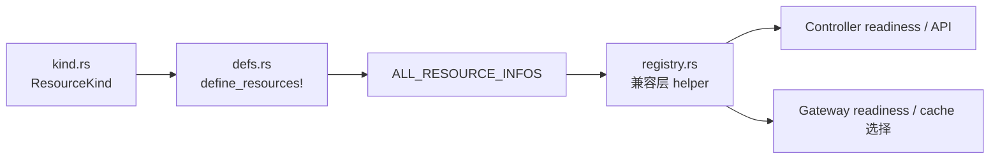

# 资源注册指南

> 面向贡献者解释当前统一资源注册模型的文档。

## 当前模型

Edgion 已经不再使用一个手写的 `resource_registry.rs` 文件作为唯一事实源。
当前模型分成 3 层：

1. `src/types/resource/kind.rs`
   - 定义穷举的 `ResourceKind` 枚举及其转换逻辑
2. `src/types/resource/defs.rs`
   - 通过 `define_resources!` 维护资源元数据的单一事实源
3. `src/types/resource/registry.rs`
   - 对外暴露兼容层 API，例如 `RESOURCE_TYPES`、`all_resource_type_names()`、`get_resource_metadata()`

## `define_resources!` 里到底放什么

`src/types/resource/defs.rs` 里的每一个资源条目都承载了系统后续会复用的关键元数据：

- `enum_value`
- `kind_name`
- `kind_aliases`
- `cache_field`
- `capacity_field`
- `default_capacity`
- `cluster_scoped`
- `is_base_conf`
- `in_registry`

这些信息会被 helper 函数和 registry 视图复用，而不是在多个地方重复维护。

## 核心 API

| API | 当前路径 | 用途 |
|-----|----------|------|
| `resource_kind_from_name()` | `src/types/resource/defs.rs` | 从 CLI/API/用户输入解析 kind |
| `get_resource_info()` | `src/types/resource/defs.rs` | 获取某个 `ResourceKind` 的元数据 |
| `all_resource_kind_names()` | `src/types/resource/defs.rs` | 列出所有已定义 kind 的 cache-field 名 |
| `registry_resource_names()` | `src/types/resource/defs.rs` | 只列出 registry 可见的 kind |
| `all_resource_type_names()` | `src/types/resource/registry.rs` | 在 endpoint mode 过滤后返回 registry 可见名称 |
| `base_conf_resource_names()` | `src/types/resource/registry.rs` | 返回 registry 可见的 base-conf 名称 |
| `get_resource_metadata()` | `src/types/resource/registry.rs` | 面向 `RESOURCE_TYPES` 的兼容查询 |

## `in_registry` 的含义

`in_registry` 决定某个 kind 是否会出现在 registry-facing 的 helper 视图中。

- `in_registry: true`：会进入 `RESOURCE_TYPES` 以及基于 registry 的 readiness 逻辑
- `in_registry: false`：不会进入兼容层 registry 视图

当前例子：

- `Secret` 被刻意排除在 registry-facing 列表之外，因为它更像关联资源，跟随其他资源变化，而不是一个独立的主同步种类。

另外，`all_resource_type_names()` 还会结合 endpoint mode 做过滤，所以 `Endpoint` 和 `EndpointSlice` 的可见性也依赖当前配置。

## 新增资源时怎么接入

新增资源并不是“只改一个注册表文件”。
当前正确流程是：

1. 在 `src/types/resources/` 下添加 Rust 资源类型。
2. 在 `src/types/resource/kind.rs` 里添加枚举 variant 和转换。
3. 在 `src/types/resource/defs.rs` 的 `define_resources!` 里添加元数据条目。
4. 在 `src/types/resource/meta/impls.rs` 里补上 `ResourceMeta` 实现。
5. 再按需要接上 controller 处理、同步行为和 gateway 运行时。

完整流程见 [添加新资源类型指南](./add-new-resource-guide.md)。

## 反模式

避免这几种旧假设：

- 不要重新引入一个新的顶层手写注册表文件作为主注册来源。
- 不要把 `registry.rs` 当作新增 kind 时唯一需要改的地方。
- 不要把 registry 可见性、同步可见性、gateway cache 可见性混为一谈，它们相关但不完全等价。

## 相关文档

- [架构概览](./architecture-overview.md)
- [资源架构总览](./resource-architecture-overview.md)
- [添加新资源类型指南](./add-new-resource-guide.md)
