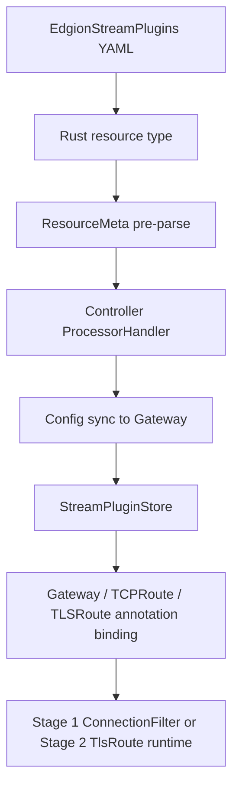

# Stream Plugin 开发指南

本文档面向需要扩展 `EdgionStreamPlugins` 的贡献者，解释 stream plugin 在 Edgion 中的定位、两阶段运行模型，以及人类开发时最容易漏掉的接线点。

> 面向 AI / Agent 的主 workflow 入口现在是 [../../../skills/development/02-stream-plugin-dev.md](../../../skills/development/02-stream-plugin-dev.md)。
> 本文档保留给人看的背景说明、实现边界和手工核对清单。

## 这类插件解决什么问题

`EdgionStreamPlugins` 是 Edgion 的连接层扩展机制，用来在 HTTP 解析之前或 TLSRoute 匹配之后，对 TCP/TLS 连接做额外处理。

和 HTTP 插件相比，它的关注点不同：

- 作用层级更早，可以在握手前直接拒绝连接
- 主要处理 IP、监听端口、SNI、mTLS 这类连接上下文
- 失败动作通常不是返回 HTTP 响应，而是直接拒绝或终止连接

当前最成熟的实现是 IP 限制插件，代码入口在：

- `src/core/gateway/plugins/stream/ip_restriction/`

## 当前两阶段模型

Edgion 现在把 stream plugin 分成两个阶段：

### Stage 1：ConnectionFilter

特点：

- 运行在 TLS 握手和 HTTP 解析之前
- 只有客户端 IP、监听端口、远端地址等信息
- 适合做尽早拒绝的连接级判断

典型场景：

- IP allow/deny
- 对特定监听端口的连接门禁

### Stage 2：TlsRoute

特点：

- 运行在 TLS 握手完成、`TLSRoute` 已匹配之后
- 可以看到 SNI、匹配到的 Route、mTLS 状态等
- 适合依赖 TLS 上下文的策略判断

典型场景：

- 按 SNI 或 mTLS 状态做限制
- 只在某条 `TLSRoute` 命中后执行策略

## 当前架构里的关键链路



最容易漏的不是“写 trait”，而是中间这几段：

- `ResourceMeta` 预处理是否初始化 runtime
- Gateway 是否真的缓存并热更新了 `EdgionStreamPlugins`
- `Gateway` / `TCPRoute` / `TLSRoute` 的注解引用是否真正接到运行时

## 和资源定义相关的代码位置

如果你要新增或扩展 stream plugin，通常先看这些文件：

- `src/types/resources/edgion_stream_plugins/mod.rs`
- `src/types/resources/edgion_stream_plugins/stream_plugins.rs`
- `src/types/resources/edgion_stream_plugins/tls_route_plugins.rs`
- `src/types/resource/meta/impls.rs`

这里分别负责：

- CRD 结构、status 和 runtime 字段
- Stage 1 插件枚举
- Stage 2 插件枚举
- 资源预处理时初始化 runtime

一个重要事实是：

- 当前 runtime 初始化是在 `ResourceMeta` 预处理里做的，不是在 controller handler 里临时构造

所以如果只改了 handler，但没让 pre-parse 初始化正确发生，Gateway 侧可能同步到了资源，却拿不到可执行 runtime。

## 和 Gateway 运行时相关的代码位置

Gateway 侧最关键的是这几块：

- `src/core/gateway/plugins/stream/stream_plugin_trait.rs`
- `src/core/gateway/plugins/stream/stream_plugin_runtime.rs`
- `src/core/gateway/plugins/stream/stream_plugin_store.rs`
- `src/core/gateway/runtime/server/listener_builder.rs`
- `src/core/gateway/routes/tcp/conf_handler_impl.rs`
- `src/core/gateway/routes/tls/proxy.rs`

理解方式可以简单记成：

- trait / runtime：定义“插件怎么执行”
- store：定义“Gateway 怎么热更新拿到最新资源”
- listener / route：定义“哪条监听器或路由会调用这个资源”

## 注解绑定规则

当前主键是：

```yaml
metadata:
  annotations:
    edgion.io/edgion-stream-plugins: "namespace/name"
```

它目前主要出现在三类位置：

- `Gateway`
- `TCPRoute`
- `TLSRoute`

这不是一个纯文档约定，而是当前实现真正会读取的键。
仓库里历史上出现过 `edgion.io/stream-plugins` 这种旧写法，新改动不应该继续沿用。

## 开发时建议的顺序

1. 先决定插件属于 Stage 1、Stage 2，还是两个阶段都要支持。
2. 决定配置结构是否可以复用已有配置，而不是复制一份近似类型。
3. 把新类型接入 `EdgionStreamPlugin` 或 `TlsRouteStreamPlugin`。
4. 在对应 runtime 中补插件对象构造逻辑。
5. 确认 `ResourceMeta` 预处理能初始化 runtime。
6. 确认引用该资源的 `Gateway` / `TCPRoute` / `TLSRoute` 真正能取到 store key。
7. 最后再补测试和样例 YAML。

如果你是让 AI 来做，直接从 skill 入口开始更稳：

- [../../../skills/development/02-stream-plugin-dev.md](../../../skills/development/02-stream-plugin-dev.md)

## 测试与验证

至少建议覆盖三类验证：

### 1. 资源层

- 资源能被 controller 接收并写出正确 status
- 更新后 runtime 字段能重新初始化

### 2. 引用层

- `Gateway` / `TCPRoute` / `TLSRoute` 上的注解能正确解析 `name` 或 `namespace/name`
- 删除资源后，Gateway 不会继续引用旧对象

### 3. 运行层

- 命中插件时行为正确
- 未命中时不会误伤其他连接
- 热更新后旧配置不会残留

现成样例和集成测试配置主要在：

- `examples/test/conf/Gateway/StreamPlugins/`
- `examples/test/conf/TCPRoute/StreamPlugins/`
- `examples/test/conf/TLSRoute/StreamPlugins/`

## 人工审查清单

- 这个插件到底应该运行在 Stage 1 还是 Stage 2
- enum、runtime、module export 是否都接齐
- 注解键是否仍然使用 `edgion.io/edgion-stream-plugins`
- 是否复用了已有配置结构
- 资源更新 / 删除后 Gateway store 是否真的热更新
- 测试是否覆盖了“新增、更新、删除”三个阶段

## 相关文档

- [Annotations 指南](./annotations-guide.md)
- [AI 协作与 Skills 使用指南](./ai-agent-collaboration.md)
- [TCPRoute Stream Plugins 用户文档](../user-guide/tcp-route/stream-plugins.md)
- [知识来源映射与维护规则](./knowledge-source-map.md)
