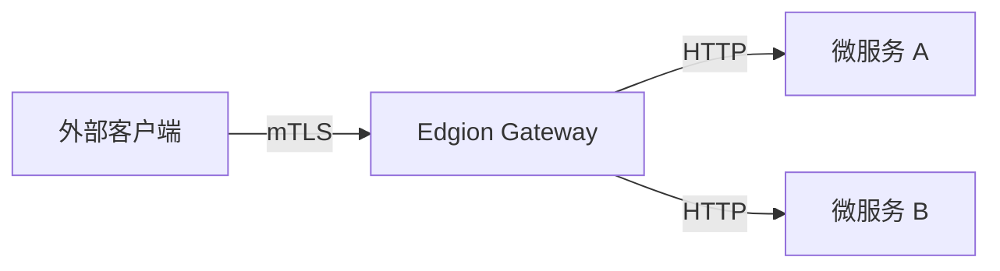

# EdgionTls 用户指南

> **🔌 Edgion 扩展**
> 
> `EdgionTls` 是 Edgion 自定义 CRD，提供比标准 Gateway API 更丰富的 TLS 和 mTLS 配置选项。

## 什么是 EdgionTls？

EdgionTls 是 Edgion Gateway 的 TLS 证书管理资源，用于为 Gateway 配置 HTTPS 服务器证书和 mTLS（双向 TLS 认证）。

**主要功能**：
- 🔒 **HTTPS 支持**：为域名配置 TLS 证书，启用 HTTPS
- 🔐 **mTLS 认证**：支持客户端证书验证，实现双向认证
- 🌐 **通配符证书**：支持 `*.example.com` 格式的通配符域名
- 🔄 **证书热更新**：无需重启即可更新证书
- ✅ **自动验证**：自动检查证书有效期、SAN 匹配等

---

## 快速开始

### 最简单的 HTTPS 配置

```yaml
apiVersion: edgion.io/v1
kind: EdgionTls
metadata:
  name: example-tls
  namespace: default
spec:
  hosts:
    - example.com
  secretRef:
    name: example-tls-secret
    namespace: default
```

### 创建 TLS Secret

```bash
# 方式 1：使用 kubectl 创建（推荐）
kubectl create secret tls example-tls-secret \
  --cert=path/to/tls.crt \
  --key=path/to/tls.key \
  -n default

# 方式 2：使用 YAML 文件
cat <<EOF | kubectl apply -f -
apiVersion: v1
kind: Secret
metadata:
  name: example-tls-secret
  namespace: default
type: kubernetes.io/tls
data:
  tls.crt: $(cat tls.crt | base64)
  tls.key: $(cat tls.key | base64)
EOF
```

### 验证配置

```bash
# 查看 EdgionTls 资源
kubectl get edgiontls -n default

# 测试 HTTPS 访问
curl https://example.com
```

---

## 配置参数详解

### 基础参数

| 参数 | 类型 | 必填 | 默认值 | 说明 |
|------|------|------|--------|------|
| `parentRefs` | Array | 可选 | - | 绑定的 Gateway 列表 |
| `hosts` | Array | **必填** | - | 主机名列表，支持通配符（如 `*.example.com`） |
| `secretRef` | Object | **必填** | - | 服务器证书 Secret 引用 |
| `clientAuth` | Object | 可选 | - | mTLS 客户端认证配置 |

### clientAuth 参数（mTLS 配置）

| 参数 | 类型 | 必填 | 默认值 | 说明 |
|------|------|------|--------|------|
| `mode` | String | 可选 | `Terminate` | 认证模式：`Terminate`（单向）/ `Mutual`（强制双向）/ `OptionalMutual`（可选双向） |
| `caSecretRef` | Object | 条件必填* | - | 客户端 CA 证书 Secret 引用 |
| `verifyDepth` | Integer | 可选 | `1` | 证书链验证深度（1-9），用于中间 CA 场景 |
| `allowedSans` | Array | 可选 | - | 允许的客户端证书 SAN 白名单 |
| `allowedCns` | Array | 可选 | - | 允许的客户端证书 CN 白名单 |

*当 `mode` 为 `Mutual` 或 `OptionalMutual` 时，`caSecretRef` 必填

---

## 完整配置示例

### 示例 1：单向 TLS（基础 HTTPS）

```yaml
apiVersion: edgion.io/v1
kind: EdgionTls
metadata:
  name: basic-https
  namespace: edge
spec:
  parentRefs:
    - name: example-gateway
      namespace: edge
  hosts:
    - api.example.com
    - www.example.com
  secretRef:
    name: server-tls
    namespace: edge
```

**使用场景**：标准 HTTPS 网站，只验证服务器证书。

---

### 示例 2：强制双向 TLS（Mutual）

```yaml
apiVersion: edgion.io/v1
kind: EdgionTls
metadata:
  name: mtls-mutual
  namespace: edge
spec:
  hosts:
    - api.example.com
  secretRef:
    name: server-tls
    namespace: edge
  clientAuth:
    mode: Mutual
    caSecretRef:
      name: client-ca
      namespace: edge
    verifyDepth: 1
```

**使用场景**：API 网关对接微服务，所有客户端必须提供有效证书。

**创建 CA Secret**：
```bash
kubectl create secret generic client-ca \
  --from-file=ca.crt=path/to/client-ca.pem \
  -n edge
```

**测试访问**：
```bash
# 带客户端证书访问
curl --cert client.crt --key client.key https://api.example.com

# 不带证书访问（会被拒绝）
curl https://api.example.com
# 预期：TLS handshake failed
```

---

### 示例 3：可选双向 TLS（OptionalMutual）

```yaml
apiVersion: edgion.io/v1
kind: EdgionTls
metadata:
  name: mtls-optional
  namespace: edge
spec:
  hosts:
    - secure.example.com
  secretRef:
    name: server-tls
    namespace: edge
  clientAuth:
    mode: OptionalMutual
    caSecretRef:
      name: client-ca
      namespace: edge
```

**使用场景**：混合场景，允许普通用户访问，但为提供证书的客户端提供额外权限。

**特点**：
- ✅ 不带证书的请求也能通过
- ✅ 带有效证书的请求会被识别（可在上游服务中区分）

---

### 示例 4：mTLS + SAN 白名单

```yaml
apiVersion: edgion.io/v1
kind: EdgionTls
metadata:
  name: mtls-san-whitelist
  namespace: edge
spec:
  hosts:
    - admin.example.com
  secretRef:
    name: server-tls
  clientAuth:
    mode: Mutual
    caSecretRef:
      name: client-ca
    verifyDepth: 1
    allowedSans:
      - "client1.example.com"
      - "*.internal.example.com"
```

**使用场景**：管理接口，只允许特定客户端访问。

**验证逻辑**：
1. 客户端证书必须由 `client-ca` 签发 ✅
2. 客户端证书的 SAN 必须匹配白名单 ✅
3. 两个条件都满足才允许访问

---

### 示例 5：mTLS + CN 白名单

```yaml
apiVersion: edgion.io/v1
kind: EdgionTls
metadata:
  name: mtls-cn-whitelist
  namespace: edge
spec:
  hosts:
    - admin.example.com
  secretRef:
    name: server-tls
  clientAuth:
    mode: Mutual
    caSecretRef:
      name: client-ca
    allowedCns:
      - "AdminClient"
      - "SuperUser"
```

**使用场景**：基于客户端证书 CN（Common Name）进行访问控制。

---

### 示例 6：中间 CA 证书链（verifyDepth=2）

```yaml
apiVersion: edgion.io/v1
kind: EdgionTls
metadata:
  name: mtls-intermediate-ca
  namespace: edge
spec:
  hosts:
    - enterprise.example.com
  secretRef:
    name: server-tls
  clientAuth:
    mode: Mutual
    caSecretRef:
      name: root-ca
    verifyDepth: 2  # 支持中间 CA
```

**证书链结构**：
```
[客户端证书] <- [中间 CA] <- [Root CA]
```

**说明**：
- `verifyDepth: 1` - 只验证直接签发（默认）
- `verifyDepth: 2` - 支持一层中间 CA
- `verifyDepth: 3` - 支持两层中间 CA

---

### 示例 7：通配符证书 + 多主机

```yaml
apiVersion: edgion.io/v1
kind: EdgionTls
metadata:
  name: wildcard-cert
  namespace: edge
spec:
  hosts:
    - "*.api.example.com"
    - "*.admin.example.com"
    - example.com
  secretRef:
    name: wildcard-tls
```

**覆盖范围**：
- ✅ `v1.api.example.com`
- ✅ `v2.api.example.com`
- ✅ `dashboard.admin.example.com`
- ✅ `example.com`
- ❌ `api.example.com`（通配符不覆盖基础域名）

---

### 示例 8：多 Gateway 绑定

```yaml
apiVersion: edgion.io/v1
kind: EdgionTls
metadata:
  name: multi-gateway-tls
  namespace: edge
spec:
  parentRefs:
    - name: public-gateway
      namespace: edge
    - name: internal-gateway
      namespace: edge
  hosts:
    - shared.example.com
  secretRef:
    name: shared-tls
```

**使用场景**：同一个域名在多个 Gateway 上使用相同的证书。

---

## 证书管理最佳实践

### 开发环境：生成自签名证书

#### 1. 生成服务器证书

```bash
# 生成私钥
openssl genrsa -out server-key.pem 2048

# 生成证书签名请求（CSR）
openssl req -new -key server-key.pem -out server.csr \
  -subj "/CN=example.com"

# 生成自签名证书（有效期 365 天）
openssl x509 -req -in server.csr -signkey server-key.pem \
  -out server-cert.pem -days 365 \
  -extensions v3_req -extfile <(cat <<EOF
[v3_req]
subjectAltName = DNS:example.com,DNS:*.example.com
EOF
)

# 创建 Secret
kubectl create secret tls server-tls \
  --cert=server-cert.pem \
  --key=server-key.pem \
  -n edge
```

#### 2. 生成客户端证书（用于 mTLS）

```bash
# 生成 CA 证书
openssl genrsa -out ca-key.pem 2048
openssl req -x509 -new -nodes -key ca-key.pem \
  -sha256 -days 365 -out ca.pem \
  -subj "/CN=Client CA"

# 生成客户端私钥
openssl genrsa -out client-key.pem 2048

# 生成客户端 CSR
openssl req -new -key client-key.pem -out client.csr \
  -subj "/CN=AdminClient"

# 使用 CA 签发客户端证书
openssl x509 -req -in client.csr -CA ca.pem -CAkey ca-key.pem \
  -CAcreateserial -out client-cert.pem -days 365 -sha256 \
  -extensions v3_req -extfile <(cat <<EOF
[v3_req]
subjectAltName = DNS:client1.example.com
EOF
)

# 创建 CA Secret
kubectl create secret generic client-ca \
  --from-file=ca.crt=ca.pem \
  -n edge
```

---

### 生产环境：Let's Encrypt 集成

推荐使用 **cert-manager** 自动管理 Let's Encrypt 证书：

```yaml
apiVersion: cert-manager.io/v1
kind: Certificate
metadata:
  name: example-com-cert
  namespace: edge
spec:
  secretName: server-tls
  issuerRef:
    name: letsencrypt-prod
    kind: ClusterIssuer
  dnsNames:
    - example.com
    - "*.example.com"
```

---

### 证书轮换策略

#### 方式 1：滚动更新（推荐）

```bash
# 1. 创建新证书 Secret
kubectl create secret tls server-tls-new \
  --cert=new-cert.pem \
  --key=new-key.pem \
  -n edge

# 2. 更新 EdgionTls 引用
kubectl patch edgiontls example-tls -n edge \
  --type=merge -p '{"spec":{"secretRef":{"name":"server-tls-new"}}}'

# 3. 验证新证书生效
curl -v https://example.com 2>&1 | grep "expire date"

# 4. 删除旧证书
kubectl delete secret server-tls -n edge
```

#### 方式 2：原地更新

```bash
# 直接更新 Secret 内容
kubectl create secret tls server-tls \
  --cert=new-cert.pem \
  --key=new-key.pem \
  -n edge \
  --dry-run=client -o yaml | kubectl apply -f -
```

---

### Secret 命名规范

推荐命名格式：`<domain>-tls` 或 `<service>-<env>-tls`

**示例**：
- ✅ `api-example-com-tls`
- ✅ `admin-prod-tls`
- ✅ `wildcard-example-tls`
- ❌ `cert1`, `tls-secret`（不够描述性）

---

### 证书过期监控

使用 Prometheus + Alertmanager 监控证书过期时间：

```yaml
# Prometheus 规则示例
groups:
  - name: tls_expiry
    rules:
      - alert: TLSCertExpiringSoon
        expr: (edgion_tls_cert_expiry_seconds - time()) < 604800  # 7 days
        annotations:
          summary: "TLS certificate expiring soon"
          description: "Certificate {{ $labels.namespace }}/{{ $labels.name }} expires in less than 7 days"
```

---

## mTLS 使用场景

### 1. API 网关对接微服务



**配置要点**：
- 使用 `Mutual` 模式，强制验证客户端证书
- 配置 `allowedSans` 限制允许的客户端

---

### 2. B2B API 集成

**场景**：为不同的合作伙伴颁发不同的客户端证书

```yaml
clientAuth:
  mode: Mutual
  caSecretRef:
    name: partner-ca
  allowedCns:
    - "PartnerA"
    - "PartnerB"
    - "PartnerC"
```

---

### 3. IoT 设备认证

**场景**：每个 IoT 设备持有唯一的客户端证书

```yaml
clientAuth:
  mode: Mutual
  caSecretRef:
    name: iot-device-ca
  allowedSans:
    - "device-*.iot.example.com"
```

---

### 4. 内部管理接口保护

```yaml
clientAuth:
  mode: Mutual
  caSecretRef:
    name: admin-ca
  allowedCns:
    - "AdminUser"
  allowedSans:
    - "admin.internal.example.com"
```

---

## 故障排查

| 问题现象 | 可能原因 | 解决方法 |
|----------|----------|----------|
| **502 Bad Gateway** | 证书无效或过期 | 检查证书有效期：`openssl x509 -in cert.pem -noout -dates` |
| **TLS handshake failed** | SAN/CN 不匹配 | 检查证书 SAN：`openssl x509 -in cert.pem -noout -text \| grep DNS` |
| **Client certificate required** | mTLS 模式下客户端未提供证书 | 确认客户端使用 `--cert` 和 `--key` 参数 |
| **Certificate chain too long** | `verifyDepth` 不足 | 增大 `verifyDepth` 值（如 2 或 3） |
| **CA verification failed** | CA Secret 不存在或格式错误 | 检查 Secret：`kubectl get secret client-ca -n edge -o yaml` |
| **Secret not found** | `secretRef` 引用的 Secret 不存在 | 创建 Secret 或修正引用 |
| **Invalid SAN pattern** | `allowedSans` 包含空字符串 | 移除空白的 SAN 配置 |
| **证书不生效** | EdgionTls 未绑定到 Gateway | 检查 `parentRefs` 配置 |

---

## 安全注意事项

### 1. 私钥保护

- ✅ **使用 Kubernetes Secret** 存储私钥（自动加密）
- ✅ **配置 RBAC**：限制 Secret 访问权限
- ❌ **不要**将私钥提交到 Git 仓库
- ❌ **不要**在日志中打印私钥内容

```yaml
# RBAC 示例：只允许特定 ServiceAccount 访问 Secret
apiVersion: rbac.authorization.k8s.io/v1
kind: Role
metadata:
  name: tls-secret-reader
  namespace: edge
rules:
  - apiGroups: [""]
    resources: ["secrets"]
    resourceNames: ["server-tls", "client-ca"]
    verbs: ["get"]
```

---

### 2. 证书吊销

**方式 1：删除 CA Secret**（影响所有客户端）
```bash
kubectl delete secret client-ca -n edge
```

**方式 2：更新 `allowedCns` 白名单**（精细控制）
```yaml
clientAuth:
  allowedCns:
    - "ValidClient"
    # 移除 "RevokedClient"
```

---

### 3. TLS 版本建议

Edgion Gateway 默认支持 **TLS 1.2** 和 **TLS 1.3**，已禁用不安全的 TLS 1.0/1.1。

---

### 4. 密码套件选择

推荐使用现代密码套件（Edgion 默认配置）：
- ✅ `TLS_ECDHE_RSA_WITH_AES_128_GCM_SHA256`
- ✅ `TLS_ECDHE_RSA_WITH_AES_256_GCM_SHA384`
- ✅ `TLS_AES_128_GCM_SHA256` (TLS 1.3)
- ❌ `TLS_RSA_WITH_3DES_EDE_CBC_SHA`（已禁用）

---

## 性能优化

### 1. 证书缓存

Edgion Gateway 自动缓存已验证的证书，无需额外配置。

---

### 2. Session 复用

TLS Session 复用默认启用，可减少握手开销。

---

### 3. OCSP Stapling

**当前状态**：规划中，未来版本将支持。

### 11. TLS 版本控制相关问题

**Q: 如何只允许 TLS 1.3 连接？**

A: 设置 `minVersion` 和 `maxVersion` 都为 `TLS1_3`：

```yaml
tlsVersions:
  minVersion: TLS1_3
  maxVersion: TLS1_3
```

**Q: 客户端使用 TLS 1.2 连接 TLS 1.3 only 的服务会怎样？**

A: 连接会被拒绝，客户端收到 TLS 握手失败错误。

---

### 12. 密码套件配置相关问题

**Q: 密码套件配置当前为什么不完全生效？**

A: 由于 Pingora 框架的限制，动态 SNI 场景下无法在握手时设置密码套件。这需要 Pingora API 增强。当前配置会被记录但不会立即应用。

**Q: 应该选择哪个密码套件配置文件？**

A: 
- **大多数场景**: 使用 `Intermediate`（默认）
- **仅现代客户端**: 使用 `Modern`
- **必须支持旧客户端**: 使用 `Old`（不推荐）

---

### 13. SAN/CN 白名单相关问题

**Q: SAN 白名单和 CN 白名单有什么区别？**

A: 
- **SAN (Subject Alternative Names)**: 现代标准，支持多个域名/IP，推荐使用
- **CN (Common Name)**: 旧标准，仅支持单个域名，已被废弃

**Q: SAN 白名单验证当前为什么不完全生效？**

A: 由于 Pingora 架构限制，无法在 HTTP 请求阶段直接访问 SSL 连接。需要在 TLS 层提取证书信息并传递到应用层。这需要架构增强。

**Q: 通配符白名单如何工作？**

A: `*.example.com` 匹配 `sub.example.com`，但不匹配 `example.com` 或 `sub.sub.example.com`（仅一级子域名）。

---

## 参考资源

- [Gateway API 标准](https://gateway-api.sigs.k8s.io/)
- [Kubernetes TLS Secret 规范](https://kubernetes.io/docs/concepts/configuration/secret/#tls-secrets)
- [OpenSSL 命令参考](https://www.openssl.org/docs/man1.1.1/man1/openssl.html)
- [Let's Encrypt 文档](https://letsencrypt.org/docs/)
- [cert-manager 文档](https://cert-manager.io/docs/)

---

## 高级配置

### TLS 版本控制

设置最小 TLS 版本，类似 Cloudflare 的 Minimum TLS Version 设置。

**配置示例**：

```yaml
apiVersion: edgion.io/v1
kind: EdgionTls
metadata:
  name: tls-version-control
  namespace: default
spec:
  hosts:
    - secure.example.com
  secretRef:
    name: secure-tls-secret
    namespace: default
  minTlsVersion: TLS1_2  # 最小 TLS 版本
```

**支持的版本**：

| 值 | 说明 | 推荐度 |
|-----|------|--------|
| `TLS1_0` | TLS 1.0 | ⚠️ 不推荐（已废弃） |
| `TLS1_1` | TLS 1.1 | ⚠️ 不推荐（已废弃） |
| `TLS1_2` | TLS 1.2 | ✅ 推荐 |
| `TLS1_3` | TLS 1.3 | ✅ 最安全 |

**使用场景**：
- 🔒 **仅 TLS 1.3**: 设置 `minTlsVersion: TLS1_3`，适用于现代客户端
- 🔄 **兼容模式**: 设置 `minTlsVersion: TLS1_2`（推荐）
- ⚠️ **旧客户端兼容**: 设置 `minTlsVersion: TLS1_0`（不推荐）

不配置时使用 BoringSSL 默认值。

---

### 密码套件配置

控制允许的加密算法，类似 Nginx 的 `ssl_ciphers` 指令。

**配置示例**：

```yaml
apiVersion: edgion.io/v1
kind: EdgionTls
metadata:
  name: cipher-config
  namespace: default
spec:
  hosts:
    - secure.example.com
  secretRef:
    name: secure-tls-secret
    namespace: default
  ciphers:
    - ECDHE-RSA-AES256-GCM-SHA384
    - ECDHE-RSA-AES128-GCM-SHA256
    - ECDHE-RSA-CHACHA20-POLY1305
```

**重要说明**：

| TLS 版本 | cipher 是否可配置 | 说明 |
|---------|------------------|------|
| TLS 1.0 | ✅ 可配置 | 通过 `ciphers` 字段配置 |
| TLS 1.1 | ✅ 可配置 | 通过 `ciphers` 字段配置 |
| TLS 1.2 | ✅ 可配置 | 通过 `ciphers` 字段配置 |
| TLS 1.3 | ❌ 不可配置 | BoringSSL 硬编码 |

**TLS 1.3 固定使用以下 cipher**（无法更改）：
- `TLS_AES_128_GCM_SHA256`
- `TLS_AES_256_GCM_SHA384`
- `TLS_CHACHA20_POLY1305_SHA256`

**推荐的 TLS 1.2 cipher 列表**：
```yaml
ciphers:
  - ECDHE-ECDSA-AES128-GCM-SHA256
  - ECDHE-RSA-AES128-GCM-SHA256
  - ECDHE-ECDSA-AES256-GCM-SHA384
  - ECDHE-RSA-AES256-GCM-SHA384
  - ECDHE-ECDSA-CHACHA20-POLY1305
  - ECDHE-RSA-CHACHA20-POLY1305
```

不配置时使用 BoringSSL 默认 cipher

---

### SAN/CN 白名单验证

对客户端证书的 Subject Alternative Names (SAN) 或 Common Name (CN) 进行白名单验证。

**配置示例**：

```yaml
apiVersion: edgion.io/v1
kind: EdgionTls
metadata:
  name: mtls-san-whitelist
  namespace: default
spec:
  hosts:
    - api.example.com
  secretRef:
    name: api-tls-secret
    namespace: default
  clientAuth:
    mode: Mutual
    caSecretRef:
      name: client-ca
      namespace: default
    verifyDepth: 2
    allowedSans:
      - "client1.example.com"
      - "client2.example.com"
      - "*.internal.example.com"  # 支持通配符
    allowedCns:
      - "TrustedClient"
      - "AdminUser"
```

**字段说明**：
- `allowedSans`: SAN 白名单，支持通配符（`*.example.com`）
- `allowedCns`: CN 白名单，精确匹配

**验证流程**：
1. TLS 握手时验证 CA 和证书链
2. 应用层提取客户端证书信息
3. 检查 SAN/CN 是否在白名单中
4. 不匹配返回 403 Forbidden

**注意事项**：
- ⚠️ SAN/CN 白名单验证当前需要架构增强才能完全生效
- 📝 需要在 TLS 层提取证书信息并传递到应用层
- 🔄 推荐使用 SAN 而非 CN（CN 已被废弃）

---

### 组合配置示例

结合多个高级功能的完整配置：

```yaml
apiVersion: edgion.io/v1
kind: EdgionTls
metadata:
  name: advanced-tls-config
  namespace: production
spec:
  hosts:
    - secure-api.example.com
  secretRef:
    name: api-tls-secret
    namespace: production
  # mTLS 配置
  clientAuth:
    mode: Mutual
    caSecretRef:
      name: client-ca
      namespace: production
    verifyDepth: 3
    allowedSans:
      - "*.trusted-clients.example.com"
  # TLS 版本控制
  tlsVersions:
    minVersion: TLS1_2
    maxVersion: TLS1_3
  # 密码套件
  cipherSuites:
    profile: Intermediate
```

---

## 常见问题 (FAQ)

### Q1: 如何查看证书详细信息？

```bash
# 从 Secret 中提取证书
kubectl get secret server-tls -n edge -o jsonpath='{.data.tls\.crt}' | base64 -d > cert.pem

# 查看证书详情
openssl x509 -in cert.pem -noout -text
```

---

### Q2: 通配符证书能覆盖多少层级？

通配符 `*.example.com` 只覆盖**一层**子域名：
- ✅ `api.example.com`
- ❌ `v1.api.example.com`（需要 `*.*.example.com`）

---

### Q3: 如何测试 mTLS 配置？

```bash
# 测试强制 mTLS
curl --cert client.crt --key client.key https://api.example.com

# 查看 TLS 握手详情
openssl s_client -connect api.example.com:443 \
  -cert client.crt -key client.key -showcerts
```

---

### Q4: 可以使用自签名 CA 吗？

可以！在开发环境中推荐使用自签名 CA。生产环境建议使用受信任的 CA（如 Let's Encrypt）。

---

### Q5: 如何实现证书自动续期？

使用 **cert-manager** + **Let's Encrypt**，可实现全自动续期：

```yaml
apiVersion: cert-manager.io/v1
kind: ClusterIssuer
metadata:
  name: letsencrypt-prod
spec:
  acme:
    server: https://acme-v02.api.letsencrypt.org/directory
    email: admin@example.com
    privateKeySecretRef:
      name: letsencrypt-prod
    solvers:
      - http01:
          ingress:
            class: nginx
```

---

**需要帮助？** 请访问 [Edgion GitHub Issues](https://github.com/your-org/edgion/issues) 提交问题。

